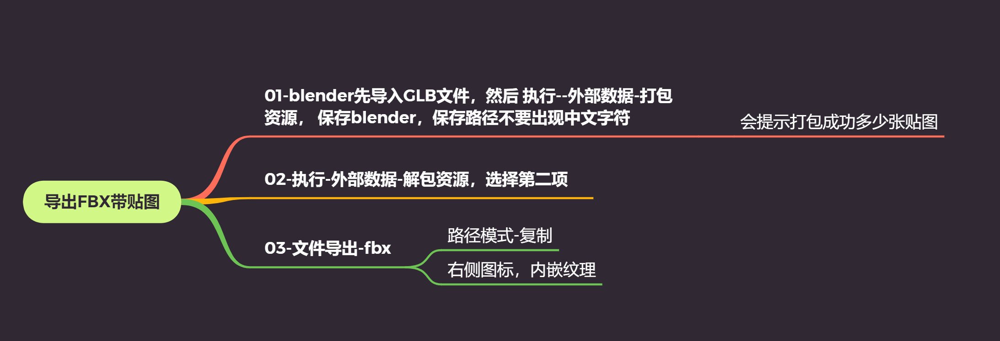
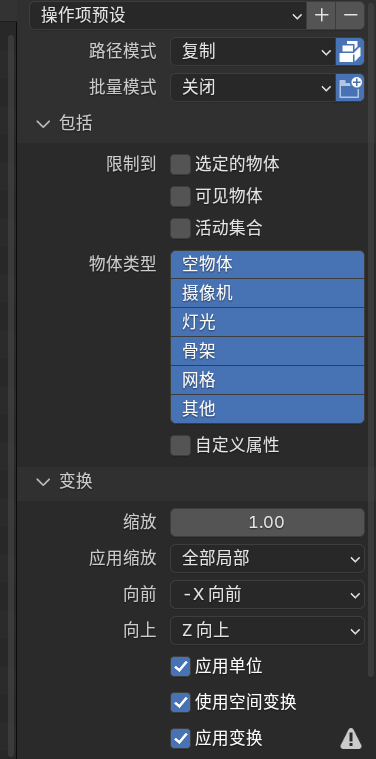
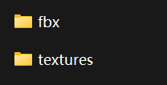
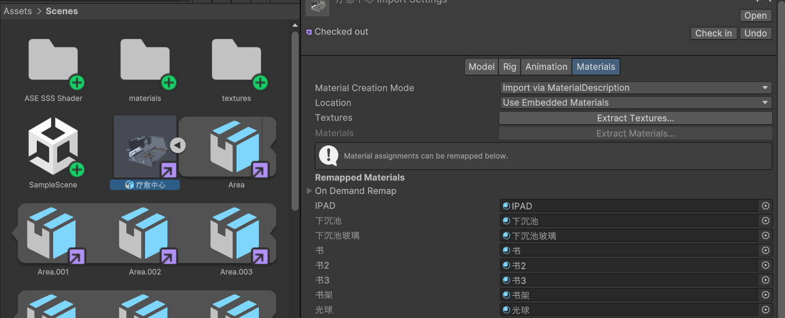

首先先搬上链接：

[【教程】关于blender模型导入unity的问题解答_哔哩哔哩_bilibili](https://www.bilibili.com/video/BV1Ba4y1D7fQ/?spm_id_from=..search-card.all.click&vd_source=30f07a01a885038de48c259c5cfe892d)

[Blender中导出带贴图的FBX_哔哩哔哩_bilibili](https://www.bilibili.com/video/BV1384y1j7wt?spm_id_from=333.788.recommend_more_video.0&vd_source=30f07a01a885038de48c259c5cfe892d)

因为发现太少有关于这个资料了所以我试错试了很久。。。（下面的图是Blender的大致步骤，Unity还有）

## Blender处理
### 解包对应的材质
Blender有“打包功能”和“解包功能”。顾名思义，由于blender的保存文件是.blend文件，所以材质贴图可以一起打包进去。Blender的材质管理有三种模式：

1. 索引模式：Blender建模默认执行的材质管理格式。在这种情况下，就算你点击“导入图像”或者是将图像/纹理拖入到Blender窗口，它的本质是**读取这张图像的文件索引（类似于Latex未提供图床的图像添加）**，不生成额外文件。
2. 打包模式：左上角的“文件”——外部数据——“打包资源”/“自动打包资源”。**就是将所有在项目里索引过的文件（图像、SDF图、糙度图）全部打包进入.blend文件中**。所有文件打包进入一个文件中，最适合进行文件的传输和保存。
3. 解包模式：**将所有索引过的文件（图像、SDF图、糙度图）在指定文件夹后自动分类命名。**方便其他未适配.blend文件而使用.fbx文件的导入导出（比如Unity）

**点击左上角的文件——外部数据——解包资源——“将文件写至当前目录（覆盖目前现有文件）****（不是将文件写至源目录！）****”,这会在之后的导出生成对应的纹理文件夹。**

### 导出设置
如左图所示，一定要设置坐标轴**“-X向前”“Z向上”**。这是由于.fbx文件和blender默认的坐标轴定义不一致导致的，要手动更改，还要点击**“应用变换”（曾经的Transform全部归零以免坐标鬼畜）**；**路径模式选择“复制”，激活右边的“内嵌纹理”图标。**

导出完成后会有一个textures文件夹。fbx文件夹是我自己创建的不用管。

## Unity处理
## 直接拉入.fbx
没啥好说的直接拉进去就行了。这时候显示的还都是白模状态。

## 拉入先前准备的.texture文件夹
这时候Unity会自动处理并匹配对应名字的所有texture图像（因为blender已经为我们重新命名好了）。但是目前隶属于"Checkin"状态，材质不可更改。

进入Project的Inspector选项进行更改，选中“Materials”，"extract textures "和“extract materials”都进行导出，选择你想要导出的文件夹就可以了。

在这之后在Hierarchy内的inspector就可以更改材质/shader了

## 问：
### 为什么在做完一些还有一些属于白模状态？
这是由于Blender的着色器节点导致的。除了Blender默认的原理化BSDF可以被解析，其他非原理化着色器比如玻璃BSDF、透明BSDF不可被解析。需要你自己去匹配Unity对应的Shader（也就是说你要重写了，悲）。

### 我的灯好亮啊
那就调低点；这是由于Blender对于灯光定义的亮度和Unity自带的灯光定义亮度不一致。

****

