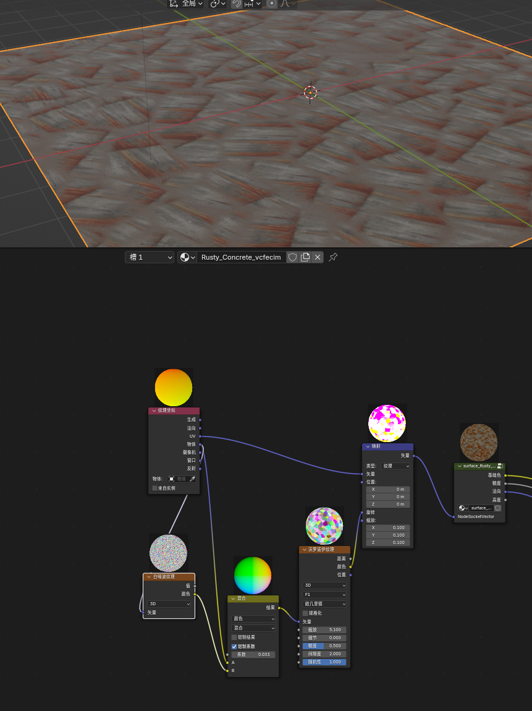

在创建虚拟环境中的草地或者使用混凝土/路面的纹理时，我们常常面临的一个挑战是如何避免纹理重复带来的不真实感。为了解决这个问题可以有两种方法：一个快速的方法是基于沃罗诺伊噪声的旋转；二是利用砖块纹理进行分区旋转。

首先，添加沃罗诺伊纹理节点来引入沃罗诺伊噪声。什么是沃洛诺伊噪声？[沃罗诺伊纹理 - Blender 4.4 Manual](https://docs.blender.org/manual/zh-hans/dev/render/shader_nodes/textures/voronoi.html)

这种类型的噪声以其随机分布的点和区域而闻名，非常适合模拟自然界中的非规律性模式。这个噪波很适合打乱由于缩放造成的重复性，原理是在纹理坐标层面进行打乱，使重新映射过的坐标发生变化，进而造成“没有重复性”的假象。

但是这样造成的边缘比较明显怎么办？有一个小技巧是在从物体的纹理坐标传递到沃罗洛伊噪声的时候再引入白噪声节点与纹理坐标进行颜色混合，将颜色混合的强度调低一些；白噪声可以让坐标边缘起到类似于模糊的效果。

最后的节点图如下（只是对于坐标层面的改变所以很容易）

另一种方法是利用砖块纹理进行分区旋转。砖块纹理具有天然的分区特性，恰好blender/maya/C4D中都可以对每一个砖块进行随机化，非常适合用来划分对于不同草地的不同区域。这个步骤同样可以通过映射节点完成，这次的原理是使用了砖块纹理的输出来驱动旋转值的变化，而不是单纯的使用噪声打乱纹理坐标。优点是可以由于只是对坐标进行旋转处理，而不是用噪声打乱坐标，从而实现了更加真实的效果。

[【中字】Blender 材质教程：无缝贴图, PBR随机化无缝衔接 -修复初学者在着色方面的主要错误！_哔哩哔哩_bilibili](https://www.bilibili.com/video/BV1HLcmewEj9/?spm_id_from=333.1387.favlist.content.click&vd_source=30f07a01a885038de48c259c5cfe892d)

