现代很多的PBR游戏，大家首先关注的是PBR的材质，但是实际上PBR( Physically-Based Rendering )流程除了基于物理的材质模型，还由另外两部分组成，一个是物理光照，另外一个是物理相机。

在很多引擎中虽然早已是走的PBR的渲染流程，但是开放给开发者的光照参数依然是一个无单位的值。这可能是为了降低一些开发的门槛。这同时也带来一些局限，无单位的值只能通过艺术家们的感觉和经验进行判断。

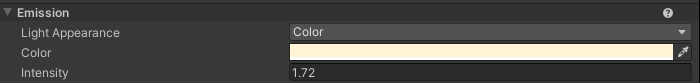

unity在HDRP上引入了物理相机/灯光/的概念，本质上是游戏引擎从经验驱动转向物理驱动的结果，游戏和电影开发者能够通过现实中的光测数据以及相机数据，精准的控制画面的表现，同时也引入了很多物理单位，下面让我们来了解一下曝光的整个流程。

## 原理
HDRP中，官方很贴心的给了我们一张表，告诉我们哪个环境下使用什么样的曝光值。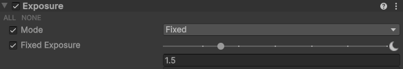

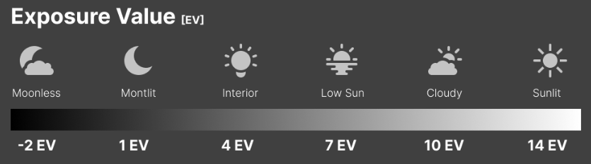

那么这些曝光值是从哪来的呢？现代相机中存在三个参数影响了曝光：ISO，ShutterSpeed，Aperture。

+ 光圈(Aperture)：通常称为f值，表示镜头的焦距与镜头开口直径的比率。开口越大，进入相机并被传感器捕获的光线就越多。常用值为 f/1.4、f/2.0、f/2.8、f/4.0等。

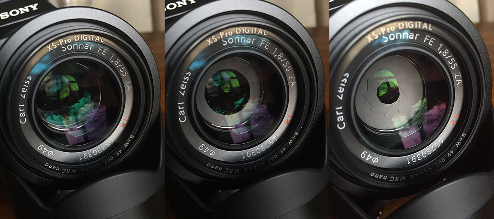

+ 快门速度(shutter speed) : 快门速度表示相机的传感器或胶片主动收集光线的时间，通常以秒的分数（1/60s、1/200s）表示。
+ ISO：传感器对入射光的 ISO 或灵敏度。通常，ISO 值从 100 开始，成倍增长。

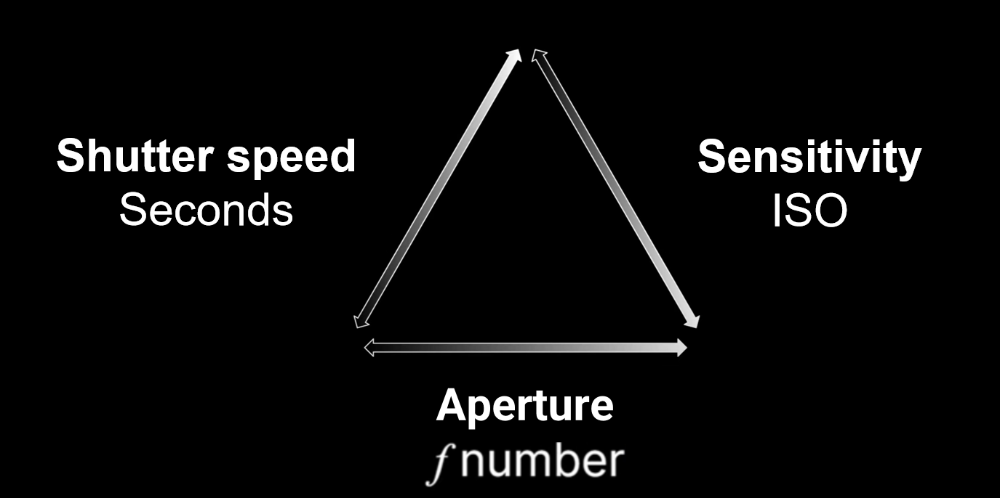

EV（Exposure Value）则是通过这三个参数计算得出的。我们常见的EV100 时，就是以 ISO 100 作为标准感光度来计算曝光值的。厂商通过测光表实测不同天气下的光照强度，结合标准EV表（基于ISO 100的光圈/快门组合）生成推荐值。

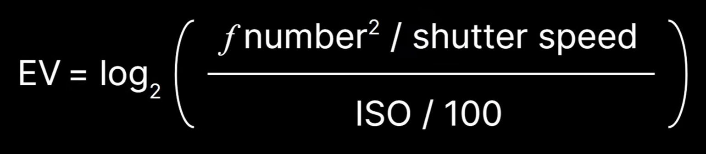

HDRP的相机开启物理相机后，就能设置对应的ISO，ShutterSpeed，Aperture数据了，这些数据会根据公式计算出EV值。

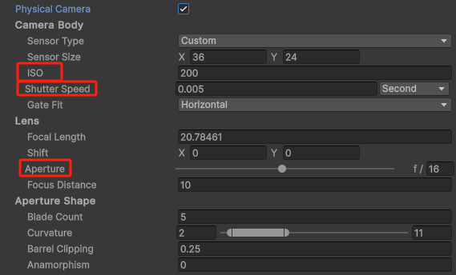

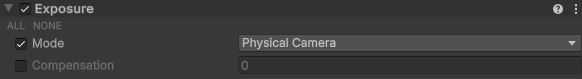

结合设置物理灯光亮度，我们能得到一个和现实中拍摄一样的画面表现。

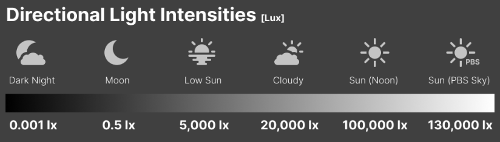

虽然对于我们[光栅化流程](https://www.yuque.com/shuangfeidu/txwa8w/ixp5ze7hg1infbbm)（详见我的另一个Blog提到的渲染管线）来说，实际上是没有相机建模的，最终还是用计算出一个EV值给到渲染管线中去进行渲染。但是通过对相机参数的设置，我们能够确定一个基于现实中的曝光基调，再通过这个基调进行实际的调整。

相比于照片，游戏的曝光的复杂度在于不同的光照环境下, 我们需要不同的曝光度，即使是有了现实中EV值的参考，但是依旧是需要为特定的游戏环境来微调不同的EV值，这也是不小的工作量，还有就是，场景中可能同时存在室内+室外的场景，以及玩家视角的不断移动，我们需要正确的曝光过渡才能正确的渲染出画面。

自动曝光就是来解决这个问题的，同样的模仿了现实中的相机的测光策略：


游戏中最常见的是重点测光模式：更多的考虑画面中心的亮度，因为游戏的焦点以及主角的位置通常是画面的中心。

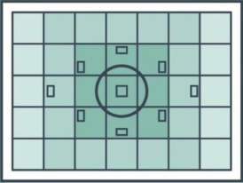

自动曝光做的事情就是，采样整个画面的亮度，根据不同权重计算出平均值，再通过曝光调整将画面拉到一个合适的亮度。

而这个亮度的标准叫中度灰：


有意思的是，但是由于我们人眼对于灰阶的感知并不是线性的，所以中间的灰调并不是50%，根据前人的规律总结，有几种常见的中度灰色:

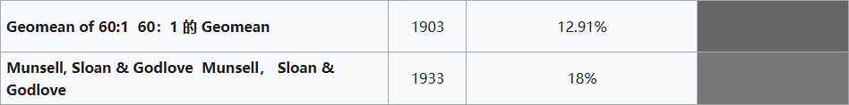

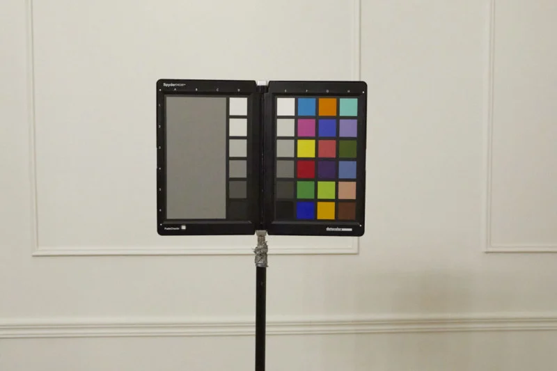

黑手党1中的自动曝光：[Mafia_ Definitive Edition 2025-03-08 20-05-57.mp4](https://www.yuque.com/attachments/yuque/0/2025/mp4/48487597/1751970439740-4fb6351a-ea51-4e9f-92ac-3dd3ebb77d73.mp4)

## 自动曝光实现
在后效的第一个Pass中就开始自动曝光的处理工作，在**Bloom/ColorGrading**这些之前，因为正确的曝光是其他后处理效果的前置条件。

```plain
CPU：
TextureHandle RenderPostProcess(） {
    var source = inputColor;
    ....
    source = DynamicExposurePass(renderGraph, hdCamera, source);
    
    TextureHandle bloomTexture = BloomPass(renderGraph, hdCamera, source, m_LensFlareScreenSpace.bloomMip.value, out screenSpaceLensFlareBloomMipTexture);
    TextureHandle logLutOutput = ColorGradingPass(renderGraph, hdCamera);
    ....
}
```

可以看到用三个Pass完成了渲染。

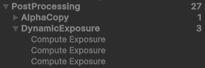

第一个pass：主要作用是降采样整个屏幕像素的亮度并转换为EV100值，以及计算权重。

```cpp
float SampleLuminance(float2 uv)
{
    // 这里获取了上一帧的平均亮度信息，单位是cd/m^2
    // prevExposure 为亮度值的倒数
    float prevExposure = ConvertEV100ToExposure(GetPreviousExposureEV100(), LensImperfectionExposureScale);
    float3 color = SAMPLE_TEXTURE2D_X_LOD(_SourceTexture, s_linear_clamp_sampler, uv, 0.0).xyz;

    // 根据上一帧的曝光还原原始辐射值，再转换为亮度输出
    return Luminance(color / prevExposure);
}

float WeightSample(uint2 pixel, float2 sourceSize, float luminance) {
    // 经典的Center-weighted，中心画面权重高
    float screenDiagonal = 0.5f * (sourceSize.x + sourceSize.y);
    const float2 kCenter = sourceSize * 0.5f;
    return 1.0 - saturate(pow(length(kCenter - pixel) / screenDiagonal, 1.0));
}

// CPU端传入 这里unity是直接将中度灰定义为12.5
float MeterCalibrationConstant = 12.5f;

// 根据EV = log2 (LS / K) 这里 L 是亮度， S是100 ISO 以及中间灰作为矫正常数
// 计算出矫正后的EV100值。
float ComputeEV100FromAvgLuminance(float avgLuminance, float calibrationConstant)
{
    const float K = calibrationConstant;
    return log2(avgLuminance * 100.0 / K);
}

[numthreads(8,8,1)]
    void KPrePass(uint2 dispatchThreadId : SV_DispatchThreadID)
{
    。。。
    float2 uv = GetScreenUV();
    float luma = SampleLuminance(uv);

    float weight = WeightSample(dispatchThreadId, PREPASS_TEX_SIZE.xx, luma);


    float logLuma = ComputeEV100FromAvgLuminance(max(luma, 1e-4), MeterCalibrationConstant);

    //最终输出两数值，一个是像素的亮度转换而成的EV100值，一个是权重
    _OutputTexture[posInputs.positionSS] = float2(logLuma, weight);
}
```

第二个Pass：将1024x1024的(EV100值, 权重)图进行均值计算，分为32x32个线程组，每个组32个线程。

```cpp
[numthreads(REDUCTION_GROUP_SIZE,REDUCTION_GROUP_SIZE,1)]
void KReduction(uint2 groupId : SV_GroupID, uint2 groupThreadId : SV_GroupThreadID) {
    // 每个线程处理2x2像素块
    uint2 sampleIdx = (groupId.xy * REDUCTION_GROUP_SIZE + groupThreadId.xy) * 2u;
    float2 p1 = _InputTexture[sampleIdx + uint2(0u, 0u)].xy;  
    float2 p2 = _InputTexture[sampleIdx + uint2(1u, 0u)].xy;  
    float2 p3 = _InputTexture[sampleIdx + uint2(0u, 1u)].xy;  
    float2 p4 = _InputTexture[sampleIdx + uint2(1u, 1u)].xy;  
    
    // 分解亮度和权重
    float4 smp = float4(p1.x, p2.x, p3.x, p4.x);     
    float4 weights = float4(p1.y, p2.y, p3.y, p4.y); 
    
    // 乘积并存入groupSharedMemory
    gs_luminances[threadIdx] = smp * weights;  
    gs_weights[threadIdx] = dot(weights, 1.0); 
    
    // 组内完成同步，确保同group内的线程都计算完成
    GroupMemoryBarrierWithGroupSync();
    
    //并行归约 （4像素->2像素->像素）
    //合并组内全部像素的亮度和权重
    for(uint s = REDUCTION_TOTAL_THREADS / 2u; s > 0u; s >>= 1u)
    {
        if(threadIdx < s)
        {
            gs_luminances[threadIdx] += gs_luminances[threadIdx + s];
            gs_weights[threadIdx] += gs_weights[threadIdx + s];
        }
    
        GroupMemoryBarrierWithGroupSync();
    }
    
    //组内第一个线程去操作，将所有结果输出
    if(threadIdx == 0u)
    {
        _OutputTexture[groupId.xy] = float2(avgLuminance, gs_weights[0]);
    }
}
```

第三个Pass实际上就是又执行了一遍，将32x32平均到1x1，最终转换为(曝光值, EV100值)

```cpp
{
    。。。
    
    if(threadIdx == 0u) {
        float avgLuminance = dot(gs_luminances[0], 0.25);
    
        if (IsNaN(avgLuminance) || IsInf(avgLuminance))
            avgLuminance = 1.0;
    
        if (gs_weights[0] > 0.0)
            avgLuminance /= (gs_weights[0] * 0.25);
        
        //取上一帧的rt进行lerp，防止曝光突变。
        float exposure = AdaptExposure(avgLuminance - ParamExposureCompensation);
        exposure = clamp(exposure, ParamExposureLimitMin, ParamExposureLimitMax);
        _OutputTexture[groupId.xy] = float2(ConvertEV100ToExposure(exposure, LensImperfectionExposureScale), exposure);
    }
}
```

最终在渲染下一帧的时候，光照计算读取最终曝光值做乘积。

```cpp
//在下一帧中
diffuseLighting *= GetCurrentExposureMultiplier();
specularLighting *= GetCurrentExposureMultiplier();
```

## 其他问题
当整个画面的动态范围(画面中“最亮”到“最暗”的比值)非常大的时候，会出现的问题就是如果亮部曝光正确，则暗部细节丢失，如果拉高曝光，则亮部信息丢失。例如从山洞中走出。由于中心加权特性，导致外面曝光正常，但是主角的暗部细节完全丢失了。

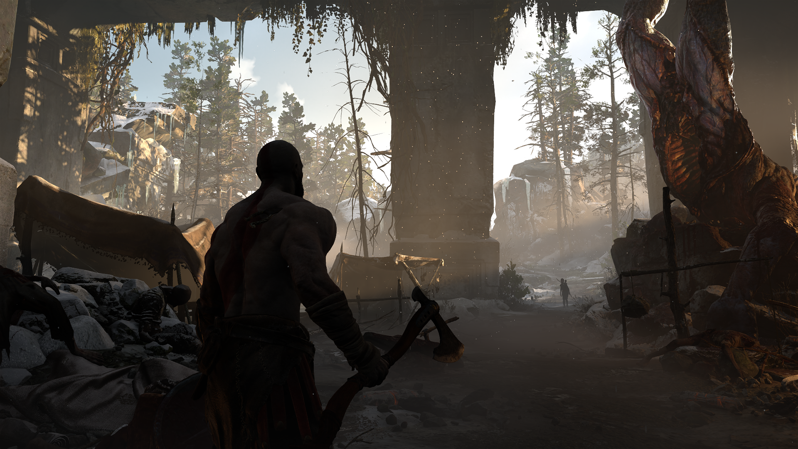

拉高曝光，则天空整个过曝了。

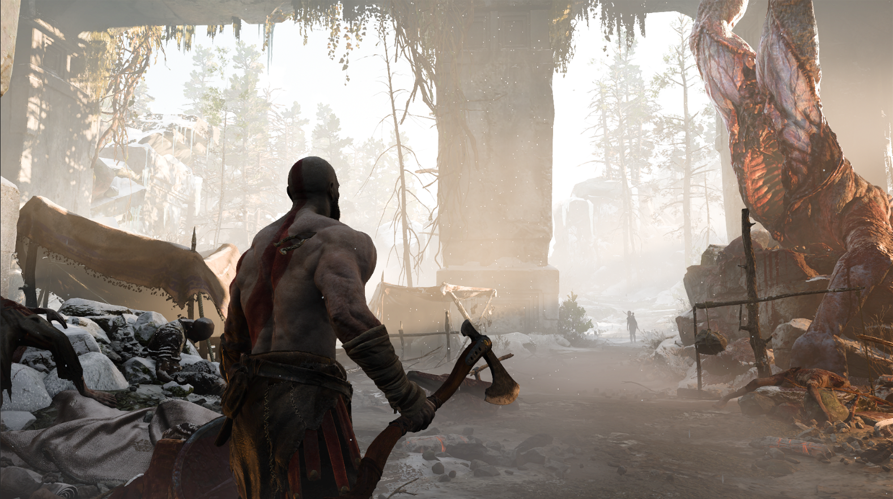

通过直方图也很简单的能看出信息丢失的情况。

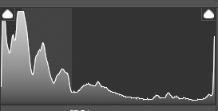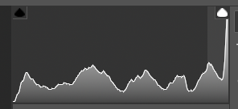

**tonemapping在一定程度上能缓和过曝的区域**，但是如果原始数据已经过曝严重，tonemapping也无法恢复丢失的细节。如果不想改Tonemapping的话可以和美术沟通加一个LUTs（虽然这会违背物理正确）


解决方式：一般来说只能从场景设计方面去规避，一方面是避免制作巨大亮度差异的场景，另外一个方法就是和现实中的摄影一样，对场景进行补光：

例如下图，正常情况下，屋顶下应该是死黑，但是通过补光来弥补暗处的信息，虽然这不物理，但是work了。


还有一些游戏的做法是在角色身上挂点光源 例如黑猴子：


## 引用
https://docs.unity3d.com/Packages/com.unity.render-pipelines.high-definition@17.0/manual/Physical-Light-Units.html

https://placeholderart.wordpress.com/2014/11/16/implementing-a-physically-based-camera-understanding-exposure/

https://photo.stackexchange.com/questions/62307/why-is-18-grey-considered-to-be-in-the-middle-for-photography

https://en.wikipedia.org/wiki/Middle_gray

https://knarkowicz.wordpress.com/2016/01/06/aces-filmic-tone-mapping-curve/

https://bartwronski.com/2016/09/01/dynamic-range-and-evs/

https://en.wikipedia.org/wiki/Exposure_(photography)

