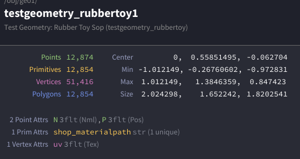

当fbx模型导入到Houdini的时候，会产生最基本的四个Class（或者说来自于fbx本身就是这四个Class）：

+ Points
+ Primitives
+ Vertices
+ Polygons

我们在这里就拿RubberToy举例。



## 基本几何组件
**Points（点）** 是最基础的几何元素，每个点在3D空间中有一个位置坐标(x,y,z)。点可以独立存在，也可以作为其他几何元素的组成部分。

**Vertices（顶点）** 是连接点和图元的桥梁。一个顶点引用一个特定的点，但同一个点可以被多个顶点引用。顶点主要用于定义图元中点的顺序和连接关系。

**Primitives（图元）** 是由顶点组成的几何形状，比如多边形、曲线、体积等。每个图元包含一系列顶点，这些顶点定义了图元的形状和拓扑结构。

对于**Polygons（多边形）**，一般情况下我们可以就认为是Primitives（即面）。在最后我再讨论一下Polygons和Primitives的不同之处。

## 属性系统
Houdini使用强大的属性系统来存储数据。属性可以附加到不同的几何组件上：

**Point属性** 存储在点上，比如位置(P)、颜色(Cd)、法线(N)等。这些属性会在点之间进行插值。

**Vertex属性** 存储在顶点上，常用于UV坐标、顶点颜色等需要在同一个点的不同面上有不同值的情况。

**Primitive属性** 存储在图元上，比如材质ID、面的类型等。整个图元共享同一个属性值。

**Detail属性** 是全局属性，存储在整个几何体上，比如总的点数量、时间信息等。


我用一个简单的例子来解释这三者的区别：

## 想象一个立方体
**Points（点）** 就像是立方体的8个角。每个角在空间中有一个固定的坐标位置，比如(0,0,0)、(1,0,0)等等。

**Primitives（图元）** 就是立方体的6个面。每个面都是一个四边形，需要4个点来定义。比如底面可能由点1、2、3、4组成。

**Vertices（顶点）** 是连接点和面的"引用"。因为同一个点（比如立方体的一个角）会被3个不同的面共享，所以需要3个不同的顶点来分别引用这个点。

## 关键区别
想象立方体的一个角点，这个角点的坐标是固定的（比如原点），但是：

+ 这个**点**只有一个位置坐标
+ 但有**3个顶点**分别属于3个不同的面，都指向这同一个点
+ 这样每个面（图元）就可以给自己的顶点设置不同的属性

## 为什么需要这样设计？
比如你想给立方体贴纹理，同一个角点在不同面上的UV坐标是不同的：

+ 在正面，这个点的UV可能是(0,0)
+ 在右面，这个点的UV可能是(1,0)  
+ 在顶面，这个点的UV可能是(0,1)

如果没有顶点这个中间层，就无法实现同一个点在不同面上有不同的属性值。

**<u><font style="color:#DF2A3F;">简单说：点定义位置，图元(Primitives)定义形状，顶点让同一个点在不同图元中可以有不同属性。</font></u>**

这就引申到了对于Vertices的表示方式。还是拿我们之前的立方体。简单来说，我们可以这么理解：

一个Point连接着三个面

+ 被第一个面的Vertices引用，序号为2
+ 被第二个面的Vertices引用，序号为3
+ 被第三个面的Vertices引用，序号为1

Vertices存在的最大意义就是可以对每一个面进行单独的控制（比如Temp，比如TTL，比如Gravity）。因为如果单独为Point赋值，那么每一个被链接的面都会被赋予同一个颜色。

## Vertices的双重身份
Vertices有两个编号可选。分别是全局编号和复合标识。

**全局编号**：每个vertex有一个全局唯一的编号（@vtxnum），从0开始递增。

**复合标识**：vertex同时可以用`<primnum>:<vertex_in_prim>`的格式来标识，也就是”面编号+顶点编号“，表示"某个图元中的第几个顶点"。

对，这是正确的！在Houdini中，vertex确实有一个复合标识系统：

## Vertex的双重标识
**全局编号**：每个vertex有一个全局唯一的编号（@vtxnum），从0开始递增。

**复合标识**：vertex同时可以用`<primnum>:<vertex_in_prim>`的格式来标识，表示"某个图元中的第几个顶点"。

假设有在一个一个四边形（quad）：

+ 这个四边形是0号图元（@primnum = 0）
+ 它有4个顶点，在这个图元内的编号是0,1,2,3
+ 所以这4个顶点可以表示为：0:0, 0:1, 0:2, 0:3

## VEX
```plain
// 获取图元中的顶点数量
primvertexcount(0, @primnum)

// 获取图元中第i个顶点的全局编号
primvertex(0, @primnum, i)

// 获取顶点在其所属图元中的局部编号
primvertexindex(0, @vtxnum)
```

## 实际应用
```plain
// 在primitive wrangle中遍历当前图元的所有顶点
int vtx_count = primvertexcount(0, @primnum);
for(int i = 0; i < vtx_count; i++) {
    int vtx = primvertex(0, @primnum, i);  // 获取第i个顶点的全局编号
    // 现在可以操作这个顶点
    setvertexattrib(0, "Cd", vtx, {1,0,0});//归零color
}
```

所以vertex既有全局的线性编号，也有基于图元的层次化标识，这让在不同上下文中引用顶点变得很灵活。


在VEX中有多种方式来操作和引用vertex，这里是主要的写法：

**从图元获取顶点**：

```plain
// 获取当前图元的第0个顶点
int vtx = primvertex(0, @primnum, 0);

// 获取图元的所有顶点
int vtx_count = primvertexcount(0, @primnum);
for(int i = 0; i < vtx_count; i++) {
    int vtx = primvertex(0, @primnum, i);
}
```

**从点获取顶点**：

```plain
// 获取点的第一个顶点
int vtx = pointvertex(0, @ptnum);

// 获取点的所有顶点
int vtx_array[] = pointvertices(0, @ptnum);
```

## 获取和设置Vertex属性
**读取vertex属性**：

```plain
// 直接在vertex wrangle中
vector uv = @uv;
vector color = @Cd;

// 从其他地方读取特定vertex的属性
vector uv = vertex(0, "uv", vtx_num);
vector color = vertex(0, "Cd", vtx_num);
```

**设置vertex属性**：

```plain
// 在vertex wrangle中直接设置
@uv = {0.5, 0.5};
@Cd = {1, 0, 0};

// 从其他地方设置特定vertex的属性
setvertexattrib(0, "uv", vtx_num, {0.5, 0.5});
setvertexattrib(0, "Cd", vtx_num, {1, 0, 0});
```

## Vertex与Point/Primitive的转换
```plain
// vertex到point
int pt = vertexpoint(0, @vtxnum);

// vertex到primitive
int prim = vertexprim(0, @vtxnum);

// vertex在primitive中的局部索引
int local_idx = primvertexindex(0, @vtxnum);
```

## 实际应用例子
**为每个面的顶点设置不同UV**：

```plain
// 在primitive wrangle中
int vtx_count = primvertexcount(0, @primnum);
for(int i = 0; i < vtx_count; i++) {
    int vtx = primvertex(0, @primnum, i);
    vector uv = {float(i)/vtx_count, 0.5};
    setvertexattrib(0, "uv", vtx, uv);
}
```

**创建硬边效果**：

```plain
// 在vertex wrangle中，根据所属面设置颜色
int prim = vertexprim(0, @vtxnum);
@Cd = rand(prim);  // 同一面的所有顶点颜色相同
```

这些方法让你能够在VEX中灵活地操作vertex属性，实现各种复杂的几何处理效果。


但是说实话，在一般情况下，Point和Vertex（Vertices）其实是差不多的东西。但Houdini会在颜色处理中处理这些比较微小的差异：

**Point Cd**：颜色在面之间平滑插值

+ 适合：渐变效果、基于位置的着色

**Vertex Cd**：可以产生硬边界

+ 适合：每个面不同材质、硬边光照、UV接缝处。

比如说我们如果创建一个立方体，给其中一个角点设置红色：

+ 用Point Cd：这个角的红色会在3个相邻面间平滑混合。即颜色会在每个面之间做平滑的渐变。
+ 用Vertex Cd：可以让这个角在3个面上显示完全不同的颜色

所以说，**在简单模型上看起来差别不大**，但vertex Cd的灵活性在于能打破point的颜色约束，实现更复杂的着色需求。大部分时候point Cd就够用了。


## Houdini的Polygons和Primitives之间有什么不同？
虽然说在日常的使用中，可以看到在大部分的情况下，Houdini就是将Primitives等价于Polygons；选择的时候，选中了面则会提醒你这是Primitives；比如说PolyExtrude，PolyBevel这种，直接将Primitive等价于Polygons。所以在一般的口头交流中，**这几乎是等价的，并且通常不会产生歧义**。

### 为什么不一定完全精确？
从Houdini的底层几何结构来看，“Primitive”是一个更广泛、更基础的**类别（Class）**，而“Polygon”只是这个类别下的一个**具体类型（Type）**。将它们等同，就像说“轿车等同于车辆”一样，虽然轿车是最常见的车辆，但车辆还包括卡车、公交车、摩托车等。

**Primitive（基元）是Houdini几何体的基本组成单位之一，它定义了点是如何被连接和解释的。**

Houdini支持多种Primitive类型，远不止多边形一种。主要包括：

+ **Polygon（多边形）**：由一系列顶点定义的闭合或开放的面。这是最常见的类型。
+ **Polyline（多边形线）**：其实是开放的多边形，本质上也是Polygon类型，但通常用来表示曲线。 
+ **Packed Primitives（打包基元）**：这是一个非常特殊的“指针”或“引用”型基元。它本身只包含极少的信息（如变换信息），但指向了另一份完整的几何体数据（可能在内存中或硬盘上）。这对于处理海量实例或复杂场景至关重要，因为它们内存占用极低。
+ **Polygon Soup（多边形汤）**：一种内存优化存储方式，将大量多边形数据紧凑地存放在一起，读取和显示速度快，但编辑性较差。
+ **Volume（体积）/ VDB**：用于表示烟、火、云、雾等体积数据的基元。
+ **NURBS/Bezier Curves and Surfaces**：通过数学公式定义的平滑曲线和曲面。
+ **Metaballs（融球）**：可以相互融合的球状场。
+ **Quadratic Primitives**：由数学定义的简单形状，如“原始球体”（Primitive Sphere），它可能只由一个点和半径值定义，非常轻量。

#### 为什么区分这两者至关重要？
在进行程序化操作和高级开发时，精确区分Primitive的类型是必需的。

**程序化判断**：在使用VEX或Python时，你经常需要判断一个基元的具体类型，然后执行不同的逻辑。例如，你不能对一个Volume基元执行`PolyExtrude`操作。通过`primintrinsic`函数在VEX中可以获取基元的`typename`，从而判断它是"Poly"、"Volume"还是"Packed"等。

1. vex複製

```plain
// 在Wrangle节点中判断基元类型
string prim_type = primintrinsic(0, "typename", @primnum);

if (prim_type == "Poly") {
    // 执行针对多边形的操作
    v@Cd = {1, 0, 0}; // 设为红色
} else if (prim_type == "Volume") {
    // 执行针对体积的操作
    v@Cd = {0, 0, 1}; // 设为蓝色
}
```

2. **性能优化**：理解Packed Primitives和Polygon Soups的特性，是优化复杂场景性能的关键。 [[2]](https://www.sidefx.com/docs/houdini/model/primitives.html) 如果你错误地将一个Packed Primitive当作普通Polygon来处理（例如，尝试编辑它的点），将无法得到预期的结果，甚至会破坏其性能优势。
3. **工作流程**：不同的Primitive类型对应完全不同的工作流程。处理曲线使用`Resample`、`Carve`等节点；处理体积则使用`Volume VOP`或`Volume Wrangle`。

