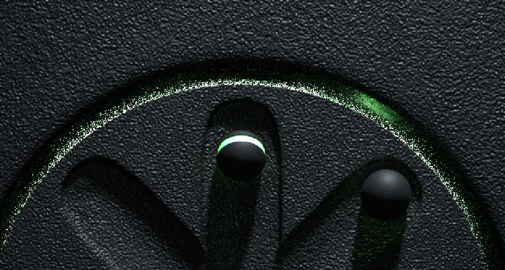
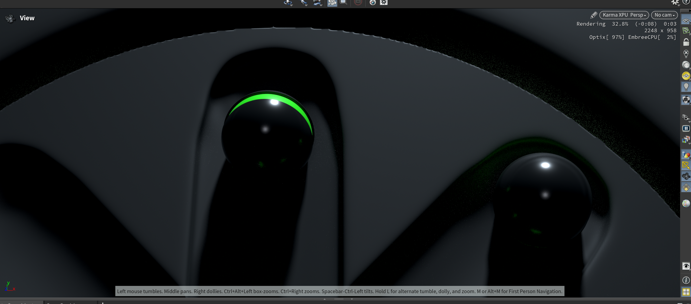
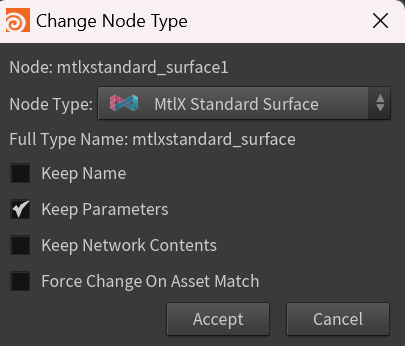
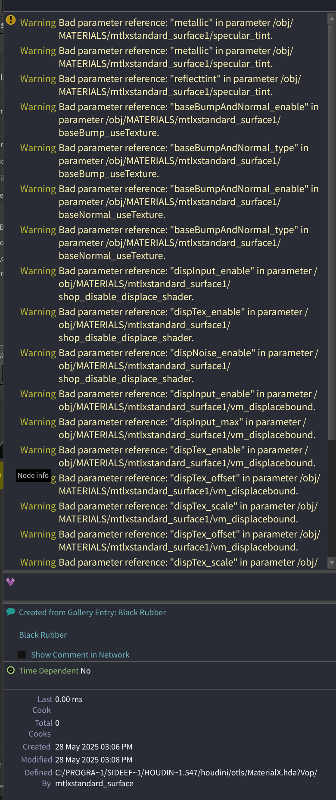

我在跟教程的时候，发现principal shader节点再用Solaris的karma渲染的时候会出现概率性的材质丢失；并且有的材质节点的channels不再会被渲染出来（比如粗糙度，法线映射）



Mantra渲染

  
Karma渲染

很明显材质贴图出现了部分参数的丢失，并且整个球都变得圆润起来了（其实一开始的球甚至全是绿色，也就是再obj的group分组材质分配节点不再会被渲染）

结合Karma可以调用gpu进行渲染 mantra的光线追踪和噪点都十分难绷的情况下，切换为Karma工作流显得迫在眉睫，但是我很多节点都用到了材质分配节点啊！我要怎么改？

问了一下claude，它是这么回答的：

这是从Mantra切换到Karma时的常见问题。材质丢失的原因和解决方法：

## 主要原因
### 1. **材质节点不兼容**
+ Mantra使用**VOP网络**和**Principled Shader**
+ Karma使用**MaterialX**和**USD材质**
+ 某些Mantra特有的节点在Karma中不支持

### 2. **自动转换局限**
+ Houdini会尝试自动转换，但不是100%完整
+ 复杂的材质网络可能转换不完全

## 解决方法
### **方法1：使用Material Builder**
```plain
1. 在Material Builder中重新构建材质
2. 使用Karma兼容的节点
3. 主要使用 mtlxstandard_surface 节点
```

### **方法2：检查Material Network**
+ 在Solaris中添加**Material Library**节点
+ 确保材质正确分配给几何体

### **方法3：手动转换**
```plain
1. 创建新的Material Builder
2. 使用 mtlxstandard_surface 替代 principled shader
3. 重新连接贴图和参数
```

### **方法4：使用Karma Material**
+ 直接使用Karma专用的材质节点
+ 避免使用Mantra特有的材质

## 推荐工作流程
为了避免材质丢失，建议从项目开始就使用**MaterialX标准**，这样在Mantra和Karma之间切换时兼容性更好。

你具体丢失了哪种类型的材质？我可以提供更针对性的解决方案。


---

MaterialX标准，我在Houdini官网上看了一下：

> <font style="color:rgb(88, 90, 115);">MaterialX是一种开放源代码的标准，用于描述着色网络，旨在跨应用和渲染器之间实现材料的可移植性。通过UsdMaterialX插件，USD（Universal Scene Description）能够导入MaterialX着色器，而Houdini允许用户在VOP中构建MaterialX材质，并自动将其转换为UsdShade节点。尽管存在将VOP节点转换为.mtx文件的脚本，但Solaris主要支持作为USD prim的MaterialX节点。</font>
>

也就是说MaterialX是一个开放源代码的标准，**可以描述着色网络，并且被设计成可以在不同的应用程序和渲染器之间共享**。此外，Karma XPU不会支持传统基于VEX的着色器，由于优异的跨平台性，MaterialX是构建Karma渲染器的未来。

### 那要怎么切换为支持karma的材质？
Karma的材质节点一般是以mtlx开头；比如说mtlxstandard__surface shader；_在这里<font style="color:rgb(44, 44, 54);">“mtlx”是MaterialX的文件扩展名，它是一种用于描述着色网络的开放源代码标准。在Solaris中，用户可以创建纯MaterialX材质或Karma中心化的材质。而Karma只支持体积材质，不支持表面和体积材质同时存在于同一个prim上。此外，Compositing节点也不受Karma支持。</font>

直接重命名方法**不可行**，因为节点类型不同，参数结构也不一样。但有几种批量替换的方法：

## <font style="color:rgb(44, 44, 54);">推荐方法</font>
### **方法1：再Material Network中使用Type Properties批量替换**
```plain
1. 选中所有principled节点
2. 右键 → Change Type → mtlxstandard_surface
3. Houdini会尝试自动映射相似参数
```



### Mark小知识：parameter和name在材质节点之间的区别：
#### 1. **在 OBJ 级（比如 **`/obj/geo1`**）使用 material 节点分配材质时**
##### **Material 节点分配材质的机制**
+ Material 节点要求你**指定一个材质路径**，比如 `/mat/test_mat` 或 `/shop/my_shader`。
+ 你可以为不同 primitive 或 group 分配不同的材质路径。
+ 这里的“路径”其实就是**材质节点的名字或其路径**。

---

#### 2. **“Name”和“Parameter”在这里的含义**
#### **Keep Name**
+ 指的是材质节点本身在网络树中的节点名称，比如 `test_mat`。
+ Material 节点分配材质时，是**通过路径或名字找到材质节点**，并将材质“指派”给几何体。

#### **Keep Parameters**
+ 指的是**材质节点上的参数值**（比如颜色、roughness、贴图路径等）。
+ 这些参数决定了材质的具体外观。

---

#### 3. **答案总结**
#### **你在 OBJ 里用 material 节点分配材质时——**
+ **起决定作用的是“材质节点的名字/路径”**  
（即你在 material 节点里填的 `/mat/xxx`，这里的 xxx 是材质节点的名字）
+ 当你切换材质类型时，如果**材质节点的名字没有变**，material 节点仍然能找到并分配它。
+ 如果你只保留了参数，但节点名字变了，material 节点找不到那个名字就**不会分配成功**。

#### **换句话说：**
+ **Material 节点分配材质时，主要靠“名字/路径”起作用。**
+ “参数”决定了材质本身的内容（外观），如果没有参数，材质就用默认值渲染。

---

#### **图示理解**
| 影响对象 | 现实例子 |
| --- | --- |
| **Name**（节点名、路径） | `/mat/test_mat` 这个路径 |
| **Parameters**（参数值） | `Base Color = 红色`、`Roughness=0.2` |


+ Material 节点分配时是通过 **路径/名字** 找到材质节点。
+ 节点的**参数**决定材质的最终效果。

#### **结论**
**在 OBJ 层 material 节点分配材质时，**  
**决定绑定是否成功的是“Name”（节点名字/路径）；**  
**而“Parameters”决定最终材质外观。**


### **方法2：使用Python脚本批量替换**
```python
# 在Python Shell中运行
import hou

# 获取当前材质网络
matnet = hou.pwd()  # 确保在material network中

# 找到所有principled节点
principled_nodes = [n for n in matnet.children() if n.type().name() == "principled"]

for node in principled_nodes:
    # 获取节点位置和连接
    pos = node.position()
    
    # 创建新的mtlx节点
    new_node = matnet.createNode("mtlxstandard_surface")
    new_node.setPosition(pos)
    new_node.setName(node.name())
    
    # 复制相似参数（需要手动映射）
    # base_color = node.parm("basecolor").eval()
    # new_node.parm("base_color").set(base_color)
    
    # 复制连接
    # ... 需要详细的连接复制代码
    
    # 删除旧节点
    node.destroy()
```

### **方法3：创建HDA (资产)**
<font style="color:rgb(44, 44, 54);">创建一个包含mtlxstandard_surface的HDA，然后批量替换引用。</font>

## <font style="color:rgb(44, 44, 54);">最实用的方法</font>
**方法1**<font style="color:rgb(44, 44, 54);">是最简单的，Houdini会自动尝试参数映射。但是可能并不会替换完全。比如如下从principal切换为mtlx类型的材质出现报错：</font>



这里其实是参数引用错误，说明从**principled shader转换到mtlxstandard_surface后，参数名称不匹配，换句话说，也可以认为是Channels出现了不匹配的情况。**

#### **方法1：清理无效引用**
1. 选中mtlxstandard_surface节点
2. 右键 → **Channels and Keyframes** → **Delete Channels**
3. 选择删除所有无效的参数引用

#### **方法2：手动修复参数映射**
主要的参数名称对应关系：

複製

```plain
principled → mtlxstandard_surface
metallic → metalness
reflectint → specular (需要调整数值)
baseBumpAndNormal_* → normal相关参数
dispInput_* → displacement相关参数
```

#### **方法3：重新创建材质(推荐)**
由于转换后问题较多，建议：

1. 创建新的mtlxstandard_surface节点
2. 手动重新连接贴图
3. 重新设置参数值
4. 删除转换后有问题的节点

#### **方法4：使用参数表达式修复**
在有问题的参数中，将引用改为正确的参数名：

+ `metallic` → `metalness`
+ `reflectint` → `specular`

<font style="color:rgb(44, 44, 54);"></font>

