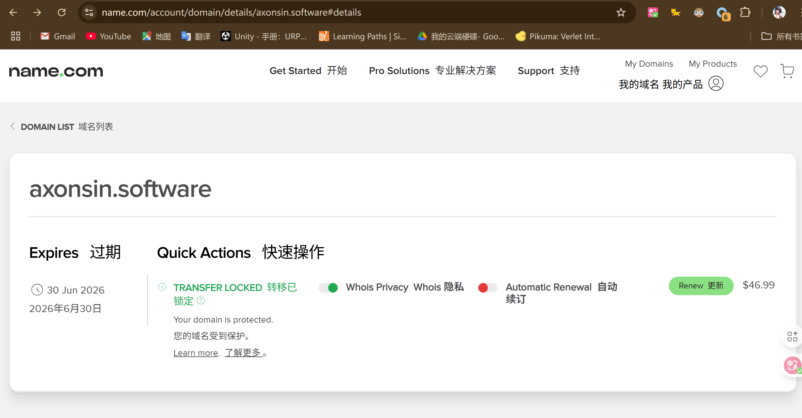
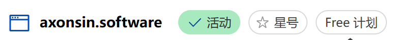
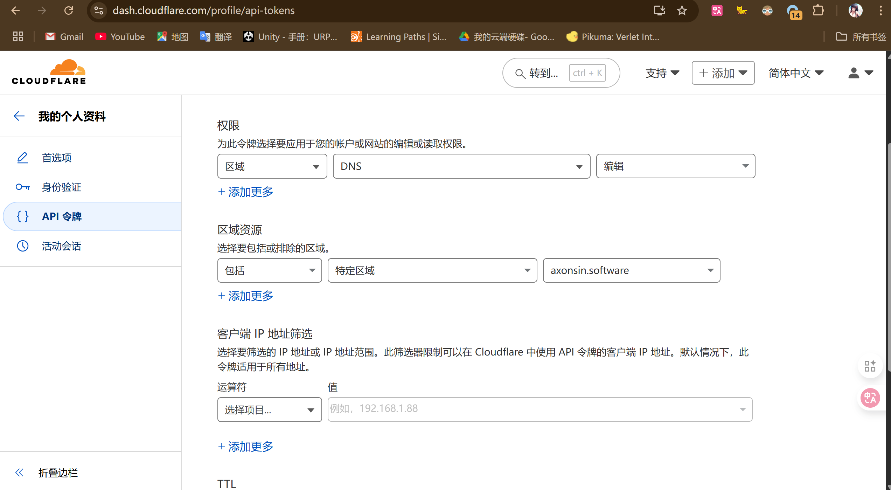
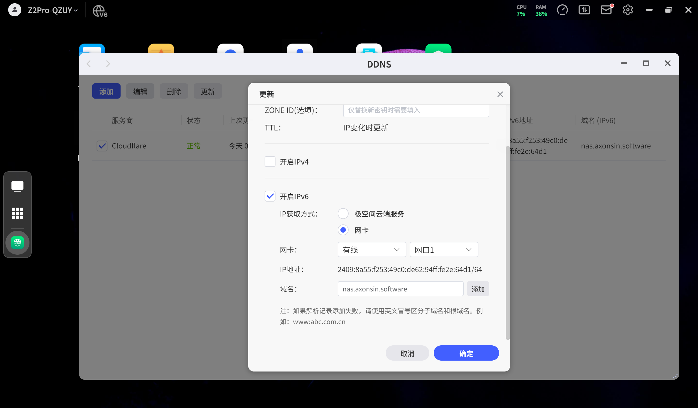
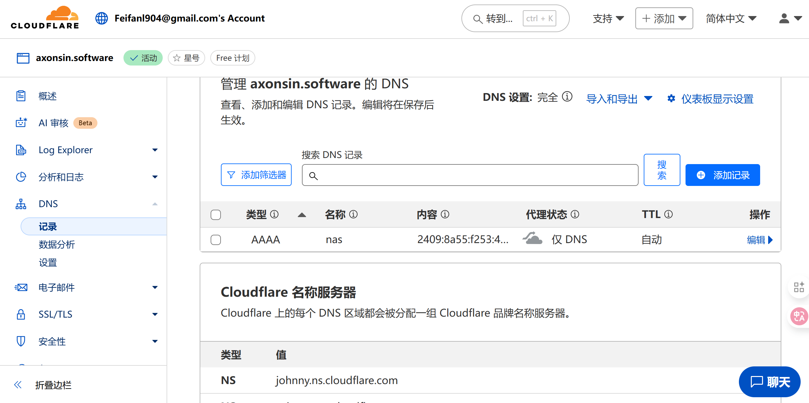
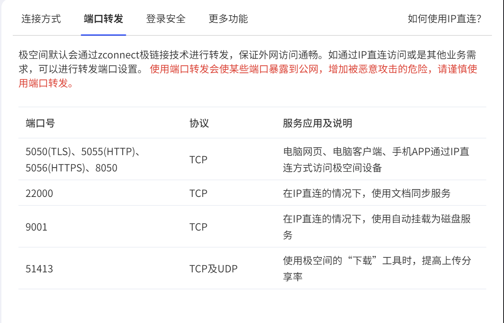
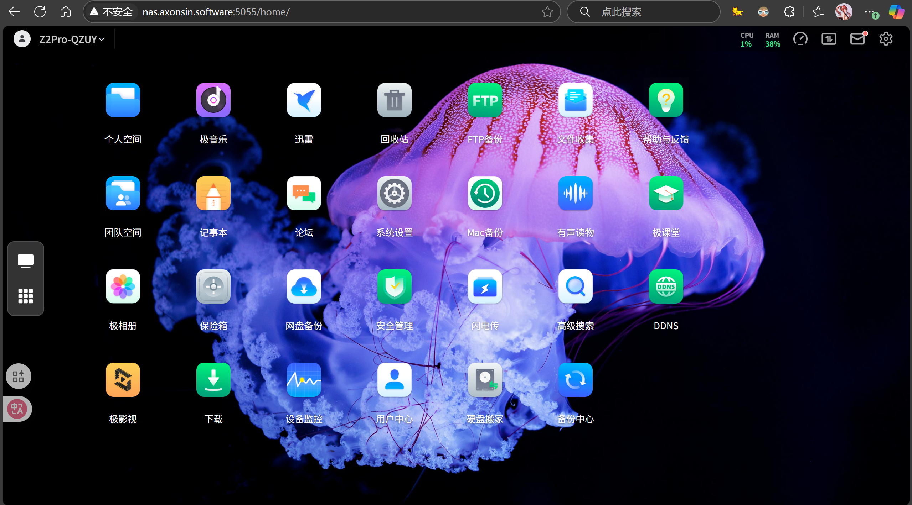

# 关于注册域名
注册域名这一方面我用的是Github Education Pack。里面的name.student可以允许创建一个免费一年的域名。必须**从github education pack详情页点入name网站来激活student pack权限。**

缺点是：

1. 后缀比较抽象，一般后缀是.game;.software;.video等。但是对于实现nas ddns的域名解析也是相当够用的了
2. 需要google pay/visa绑定
3. 续费贼贵（大概十几美刀一年），等一年过去我可能就要换其他域名了。但是无所谓，我统一用cloudflare进行托管

# Name.com配合实现CloudFlare域名托管
对于阿里云亦或是腾讯云，肯定是可以实现自托管的；因为这两家服务提供商都有很广泛的业务；但我是白嫖的，肯定就得请出另一个大善人——cloudflare了！其中的Free套餐也是相当可用的。

这个指南会分为三个主要部分：

1. **Cloudflare 的初始设置**：将您的域名添加到 Cloudflare 并获取 Cloudflare 的域名服务器（NS）地址。
2. **Name.com 的配置**：将 Name.com 的域名服务器（NS）更改为 Cloudflare 的。
3. **极空间 NAS 的 DDNS 设置**：在极空间里配置 DDNS，使其能够自动更新您域名的 IPv6 地址。

---

### **核心概念**
在开始操作前，我们先简单理解一下各个角色的作用：

+ **Name.com**：您域名的“房产证”颁发机构。我们在这里只需要做一件事：告诉它以后域名的地址解析（DNS）工作不要自己管了，全权交给 Cloudflare 处理。
+ **Cloudflare**：一个强大的网络服务平台，我们将使用它免费的 DNS 托管和 DDNS 功能。它会接收来自您家 NAS 的指令，将您的域名指向您家宽带动态分配的 IPv6 地址。
+ **极空间 NAS**：您家里的数据中心。它会监测自己获取到的公网 IPv6 地址，一旦地址发生变化，就会自动通知 Cloudflare 更新。

整个流程是：**极空间 NAS → 通知 Cloudflare → Cloudflare 更新 DNS 记录 → 您通过域名访问 NAS**。

---

### **第一部分：Cloudflare 初始设置**
在这一步，我们将在 Cloudflare 添加您的域名，为后续步骤做准备。

1. **注册 Cloudflare 账户**：
    - 访问 Cloudflare 官网 (`cloudflare.com`)。
    - 点击 "Sign Up"（注册），使用您的邮箱和密码创建一个免费账户。
2. **添加您的域名**：
    - 登录后，点击仪表板上的 "+ Add a domain"（添加域）。 [[1]](https://developers.cloudflare.com/fundamentals/manage-domains/add-site/)
    - 输入您在 Name.com 购买的域名（例如 `yourdomain.com`），然后点击 "Add domain"。 [[2]](https://developers.cloudflare.com/learning-paths/clientless-access/initial-setup/add-site/)
3. **选择套餐**：
    - Cloudflare 会展示不同的套餐计划。对于我们的需求，最下面的 **Free（免费）** 套餐完全足够。 [[3]](https://www.youtube.com/watch?v=PR8iU-L8WcA)
    - 选中 Free 套餐，然后点击 "Continue"（继续）。
4. **检查 DNS 记录**：
    - Cloudflare 会尝试扫描您域名现有的 DNS 记录。因为是新域名，这里很可能是空的，或者只有几条 Name.com 的默认记录。
    - 暂时不用管这些记录，直接点击 "Continue"。
5. **获取 Cloudflare 的域名服务器（NS）地址**：
    - 这是关键一步。Cloudflare 会提示您，需要将您域名的 NS 记录更改为 Cloudflare 提供的地址。 [[4]](https://support.rocketspark.com/hc/en-us/articles/115010441968-How-do-I-set-up-my-website-on-Cloudflare)
    - 您会看到两条 NS 地址，通常是类似 `xxx.ns.cloudflare.com` 和 `yyy.ns.cloudflare.com` 的格式。
    - **请将这两个地址完整地复制下来**，下一步马上会用到。先不要关闭这个页面。

---

### **第二部分：Name.com 配置**
现在，我们需要回到 Name.com，将域名的管理权“委托”给 Cloudflare。

1. **登录 Name.com 账户**：
    - 打开 Name.com 官网并登录。
    - 进入您的 "My Domains"（我的域名）列表。
2. **找到域名服务器设置**：
    - 点击您需要设置的那个域名，进入管理页面。
    - 寻找名为 "Nameservers"（域名服务器）的选项卡或链接。通常它位于 DNS 设置区域。
3. **修改域名服务器**：
    - 系统默认会使用 Name.com 自己的 Nameservers。您需要选择“自定义”或“使用自己的域名服务器”之类的选项。
    - 删除掉原有的 Name.com 的 NS 地址。
    - 将上一步从 Cloudflare 复制的两条 NS 地址，分别粘贴到输入框中。
    - 保存更改。Name.com 可能会有安全提示，确认即可。
4. **等待 DNS 生效**：
    - 域名服务器的更改在全球范围内生效需要一些时间，这个过程称为“DNS 传播”。通常几分钟到几小时即可完成，但官方说法是最长可能需要 24-48 小时。
    - 您可以回到刚才的 Cloudflare 页面，点击 "Done, check nameservers"（完成，检查域名服务器）按钮。Cloudflare 会开始定期检查 NS 是否已指向它。当它检测到更改成功后，会给您发送一封确认邮件，并且您的域名在 Cloudflare 仪表板上会显示为“Active”（有效）状态。
    - 

---

### **第三部分：极空间 NAS 的 DDNS 设置**
当您的域名在 Cloudflare 上激活后，我们就可以配置极空间了。极空间需要一个“密码”（API Token）才能和 Cloudflare 通信。

#### **步骤 A：在 Cloudflare 创建 API Token**
为了安全，我们不使用全局 API 密钥，而是创建一个权限受限的专用 Token。 [[5]](https://www.reddit.com/r/opnsense/comments/1bgdqx0/how_to_set_up_cloudflare_dynamic_dns_ddns_in/)

1. **进入 API Token 页面**：
    - 在 Cloudflare 仪表板右上角，点击您的头像，然后选择 "My Profile"（我的个人资料）。 [[6]](https://cloud-jake.medium.com/dynamic-dns-with-cloudflare-60cf4fe250be)
    - 在左侧菜单中，选择 "API Tokens"（API 令牌）。 [[7]](https://developers.cloudflare.com/fundamentals/api/get-started/create-token/)
2. **创建 Token**：
    - 点击 "Create Token"（创建令牌）。 [[7]](https://developers.cloudflare.com/fundamentals/api/get-started/create-token/)
    - 在模板中找到 "Edit Zone DNS"（编辑区域 DNS）这一项，点击右侧的 "Use template"（使用模板）。 [[5]](https://www.reddit.com/r/opnsense/comments/1bgdqx0/how_to_set_up_cloudflare_dynamic_dns_ddns_in/)
3. **配置 Token 权限**：
    - **Token name**：给这个 Token 起一个容易识别的名字，比如 `Zspace-DDNS`。
    - **Permissions**（权限）：模板已经帮我们选好了 `Zone - DNS - Edit`，这正是我们需要的权限，无需改动。 [[8]](https://community.ui.com/questions/Dynamic-DNS-custom-service-with-Cloudflare-API-how-does-it-work/ed3706ae-8701-4f15-9327-2a52d84f4327)
    - **Zone Resources**（区域资源）：这是最重要的一步，用于限制此 Token 只能管理您指定的域名。 [[5]](https://www.reddit.com/r/opnsense/comments/1bgdqx0/how_to_set_up_cloudflare_dynamic_dns_ddns_in/)
        * 选择 `Include`（包括） -> `Specific zone`（特定区域） -> 然后在下拉菜单中选择您刚刚添加的域名（例如 `yourdomain.com`）。
    - **Client IP Address Filtering / TTL**：这两项保持默认即可。
    - 点击 "Continue to summary"（继续以查看摘要）。
    - 
4. **获取并保存 Token**：
    - 在摘要页面确认信息无误后，点击 "Create Token"。
    - Cloudflare 会生成一长串字符，这就是您的 API Token。**请立即点击旁边的“复制”按钮，并将其保存在一个安全的地方（例如记事本）。这个 Token 只会显示这一次，关闭页面后将无法再次查看。**

#### **步骤 B：在极空间中设置 DDNS**
1. **打开极空间 DDNS 应用**：
    - 登录您的极空间网页端或客户端。
    - 在桌面或应用中心找到并打开 "DDNS" 应用。 [[9]](https://izspace.cn/tutorial/ddns.html)
2. **添加 DDNS 服务**：
    - 点击“添加”或“创建新的 DDNS”。
    - **服务商**：选择 `Cloudflare`。
    - IP地址获取地：**请一定要选择“本地网口获取”，而不是“从极空间服务器获取”。极空间保存的IPv6地址和本地网口的不一致！**
    - 
    - **主机名**：填写您想使用的域名前缀，例如 `nas`、`home` 等。如果您想直接使用主域名，可以尝试填写 `@`。这里我们以 `nas` 为例，那么未来您将通过 `nas.yourdomain.com` 访问。
    - **域名**：选择或填写您的主域名，例如 `yourdomain.com`。
    - **API Token / 密钥**：将刚刚从 Cloudflare 复制并保存的 API Token 粘贴到这里。
    - **IP 地址类型**：**务必选择 **`IPv6`。我选择的是关闭了IPv4，因为我想做的就是P2P。必须确保你的NAS已经被路由器和光猫放行**（即入站出站的端口/IP被允许放行，需要用超管权限。可以叫宽带师傅或者自行破解。我家的光猫配置在这里：**[**https://blog.csdn.net/qq_40709699/article/details/118657782**](https://blog.csdn.net/qq_40709699/article/details/118657782)**  
**[**https://www.right.com.cn/forum/forum.php?mod=viewthread&tid=8236227&highlight=H2.**](https://www.right.com.cn/forum/forum.php?mod=viewthread&tid=8236227&highlight=H2.)**）**。如果选择IPv4大概率会无法访问（因为没有配置穿透）
    - **代理（Proxy）**：这里会有一个开关，对应 Cloudflare 的“小云朵”。
        * **建议首次设置时关闭代理（灰色云朵）**：这会直接将域名解析到您 NAS 的公网 IPv6 地址。这种模式兼容性最好，适合各种服务（如 FTP、SMB 等）。
        * **开启代理（橙色云朵）**：这会隐藏您的真实 IP，并由 Cloudflare 提供 CDN 加速和安全防护。这对于网页访问（HTTP/HTTPS）非常有用，但可能会影响非网页服务的直接连接。可以先在关闭状态下测试成功，再按需开启。
3. **保存并测试**：
    - 保存设置。极空间的 DDNS 服务会立即尝试连接 Cloudflare 并更新一次 IP。
    - 查看 DDNS 列表中的状态，如果显示“成功”或“IP 地址已是最新”，则表示配置成功。

---

### **最后验证**
1. **在 Cloudflare 检查**：回到 Cloudflare 网站，进入您的域名管理页面，点击左侧的 "DNS"。您应该能看到一条新的 **AAAA 记录**，名称是您设置的主机名（如 `nas`），内容是您 NAS 当前的公网 IPv6 地址。
2. **尝试访问** [[7]](https://developers.cloudflare.com/fundamentals/api/get-started/create-token/)：在连接了 IPv6 网络的设备上（例如您的手机使用蜂窝网络），尝试通过 `http://[您的NAS的IPv6地址]:5055` （NAS的实际端口）看是否能访问。如果可以，再尝试通过 `http://nas.yourdomain.com:5055` 访问。比如说我的极空间使用的端口是5055 http;如果两者都能成功，那么恭喜，全部设置完成了！
3. 

至此，您的极空间 NAS 已经成功配置了基于 Cloudflare 的 IPv6 DDNS。无论您家的公网 IPv6 地址如何变化，NAS 都会自动通知 Cloudflare，确保您的域名始终指向正确的位置。

---

Reference:

1. [Add a site · Cloudflare Fundamentals docs](https://developers.cloudflare.com/fundamentals/manage-domains/add-site/)
2. [Add a site · Cloudflare Learning Paths](https://developers.cloudflare.com/learning-paths/clientless-access/initial-setup/add-site/)
3. [How to Add a Website to Cloudflare (Step-by-Step for Beginners) - YouTube](https://www.youtube.com/watch?v=PR8iU-L8WcA)
4. [How do I set up my website on Cloudflare? - Rocketspark](https://support.rocketspark.com/hc/en-us/articles/115010441968-How-do-I-set-up-my-website-on-Cloudflare)
5. [How to set up Cloudflare Dynamic DNS (DDNS) in OPNsense - Reddit](https://www.reddit.com/r/opnsense/comments/1bgdqx0/how_to_set_up_cloudflare_dynamic_dns_ddns_in/)
6. [Dynamic DNS with Cloudflare - Cloud Jake - Medium](https://cloud-jake.medium.com/dynamic-dns-with-cloudflare-60cf4fe250be)
7. [Create API token · Cloudflare Fundamentals docs](https://developers.cloudflare.com/fundamentals/api/get-started/create-token/)
8. [Dynamic DNS (custom service) with Cloudflare API, how does it work? - Ubiquiti Community](https://community.ui.com/questions/Dynamic-DNS-custom-service-with-Cloudflare-API-how-does-it-work/ed3706ae-8701-4f15-9327-2a52d84f4327)
9. [【教程】极空间DDNS使用方法- NAS交流社区](https://izspace.cn/tutorial/ddns.html)
10. [https://zhuanlan.zhihu.com/p/650354462](https://zhuanlan.zhihu.com/p/650354462)
11. [https://blog.csdn.net/qq_40709699/article/details/118657782](https://blog.csdn.net/qq_40709699/article/details/118657782)
12. [https://www.right.com.cn/forum/forum.php?mod=viewthread&tid=8236227&highlight=H2.](https://www.right.com.cn/forum/forum.php?mod=viewthread&tid=8236227&highlight=H2.)

