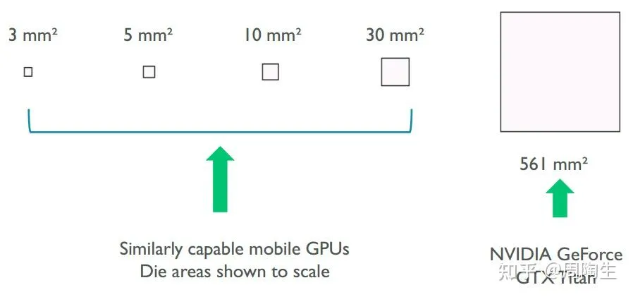
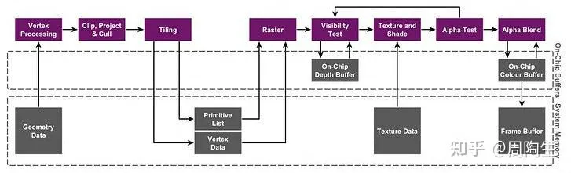
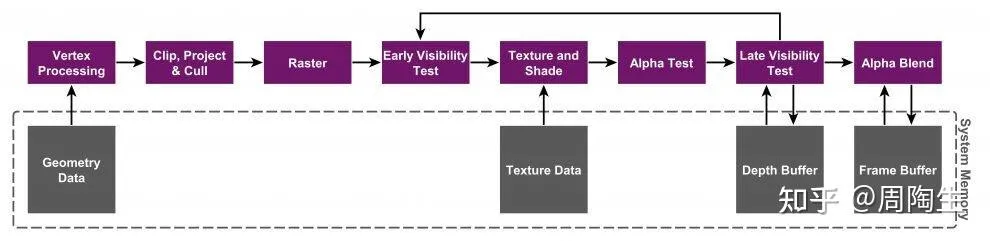

### 写在前面
渲染方案的选择——无论是前向渲染（Forward Rendering）还是延迟渲染（Deferred Rendering）——都与底层硬件架构（如 IMR 和 TBDR）的特性密切相关。这种关联并非绝对的"绑定"，而是基于性能和功耗的权衡。通常，移动端设备多采用 **TBDR** 架构以追求能效，而桌面端 GPU 则长期使用 **IMR** 架构以发挥其强大的原始性能和高带宽优势。# 写在前面
渲染方案的选择——无论是前向渲染（Forward Rendering）还是延迟渲染（Deferred Rendering）——都与底层硬件架构（如 IMR 和 TBDR）的特性密切相关。这种关联并非绝对的“绑定”，而是基于性能和功耗的权衡。通常，移动端设备多采用 **TBDR** 架构以追求能效，而桌面端 GPU 则长期使用 **IMR** 架构以发挥其强大的原始性能和高带宽优势。

### 为什么不同类型设备会采用不同方案？
根本原因在于 **功耗和带宽** 的限制，尤其是在移动端设备上。

正如“底大一级压死人”的比喻，桌面端 GPU 拥有更大的芯片面积、更高的功耗预算（例如，GPU功耗可达数百瓦）和巨大的内存带宽。相比之下，移动端 GPU 的芯片面积、功耗和散热都受到严格限制。因此，移动端 GPU 必须采用更“聪明”的架构来节省宝贵的内存带宽和电力，这就是 **TBDR（Tile-Based Deferred Rendering，分块延迟渲染）** 诞生的核心原因。桌面端则长期采用 **IMR（Immediate Mode Rendering，立即模式渲染）** 架构。

---

### 硬件渲染架构：TBDR vs. IMR
这两种是硬件层面的渲染架构，应用程序无法在两者间切换。

#### **TBDR：Tile-Based Deferred Rendering (分块延迟渲染)**
TBDR 的核心思想是 **“延迟”** 对内存的写入。它将屏幕划分为一个个小方块（Tile），对每个 Tile 进行独立渲染，并将中间结果暂存在 **极快但容量很小** 的 **片上内存（On-Chip Memory）** 中。只有当一个 Tile 完全渲染完毕后，其最终颜色结果才会被一次性写回到系统内存的帧缓冲区（Framebuffer）中。

**TBDR 的渲染流程大致分为两个主要阶段：**

1. **几何处理与分块 (Geometry Processing and Tiling / Binning Pass)**
    - **顶点处理 (Vertex Processing)**：GPU 首先会完整执行一次顶点着色器，处理场景中的所有几何体。
    - **分块 (Tiling)**：一个专门的硬件单元（Tiler）会遍历所有图元（如三角形），确定每个图元覆盖了屏幕上的哪些 Tile。然后，它会为每个 Tile 生成一个该 Tile 内可见的图元列表（Primitive List）。
    - **数据写入主存**：这个包含所有 Tile 的图元列表会被写入 **系统内存**。**这是在渲染像素之前，对系统内存的唯一一次大规模写入**。
2. **光栅化与像素处理 (Rasterization and Pixel Processing)**
    - **逐 Tile 渲染**：GPU 会依次处理每一个 Tile。对于当前处理的 Tile，它会从系统内存中取回对应的图元列表。
    - **加载到片上内存**：该 Tile 的颜色和深度缓冲区（Tile Buffer）会被创建在高速的 **片上内存** 中。
    - **光栅化 (Rasterization)**：将 Tile 内的图元转换为片元（Fragment）。
    - **隐藏面消除 (Hidden Surface Removal, HSR)**：在执行昂贵的像素着色器之前，TBDR 硬件会利用片上深度缓冲区进行深度测试，**完美地剔除所有被遮挡的片元**。这意味着对于每个像素，只有一个片元（最前面的那一个）会被着色，从而极大地减少了 Overdraw（过绘制）。
    - **像素处理 (Pixel/Fragment Shading)**：为通过 HSR 测试的可见片元执行像素着色器，计算最终颜色。
    - **写回主存 (Resolve Pass)**：当一个 Tile 内的所有像素都处理完毕后，最终的颜色数据会从片上内存一次性地写入到系统内存的帧缓冲区中。

**TBDR 的核心优势：**

+ **极低的内存带宽**：由于颜色和深度缓冲位于片上内存，像素读写操作（如深度测试、颜色混合）都在片上高速进行，避免了频繁读写慢速的系统内存，极大地节省了带宽和功耗。
+ **高效的隐藏面消除**：HSR 几乎能完全消除 Overdraw，避免了为不可见的像素执行昂贵的着色计算。
+ **高效的 MSAA**：多重采样抗锯齿（MSAA）的多个样本点也存储在片上内存中，使得解析（Resolve）过程非常高效，带宽成本远低于 IMR。

#### **IMR: Immediate Mode Rendering (立即模式渲染)**

IMR 是一种更直接的渲染方式。它按照图元提交的顺序，**立即** 对其进行处理，并将结果直接写入位于 **系统内存（或桌面端的 VRAM）** 中的最终帧缓冲区。

**IMR 的渲染流程：**

1. **顶点处理 (Vertex Processing)**：与 TBDR 类似，处理顶点数据。
2. **光栅化 (Rasterization)**：将图元转换为片元。
3. **Early-Z 测试**：现代 IMR GPU 会尝试在像素着色前进行深度测试（Early-Z）来剔除部分被遮挡的像素。但由于物体绘制顺序的不确定性，Early-Z **无法保证** 完美消除所有 Overdraw。
4. **像素处理 (Pixel Shading)**：为每个通过测试的片元执行像素着色器。
5. **合并 (Merge/ROP)**：执行深度更新（Late-Z）、颜色混合（Blending）等光栅操作，并将最终颜色写入系统内存的帧缓冲区。

**IMR 的特点：**

+ **高带宽需求**：渲染过程中，深度测试、颜色混合等操作都需要反复读写位于系统内存中的缓冲区，对内存带宽消耗巨大。
+ **Overdraw 问题**：如果物体没有从前到后严格排序，后绘制的物体会覆盖先绘制的物体，导致对被覆盖像素的着色计算被浪费，这就是 Overdraw。
+ **强大的原始算力**：桌面端 GPU 通过极高的时钟频率和巨大的内存带宽来弥补这些效率上的不足，实现“力大砖飞”。

---

### 软件渲染管线与硬件架构的适配
#### **前向渲染 (Forward Rendering)**
+ **流程**：为每个物体，计算所有光源对它的影响，然后渲染。如果一个物体受多个光源影响，它可能需要被渲染多次（Base Pass + Add Pass）。
+ **与 TBDR 的适配**：前向渲染是 TBDR 的 **天作之合**。TBDR 的 HSR 机制可以有效解决前向渲染中因多 Pass 渲染或场景遮挡产生的严重 Overdraw 问题，极大地提升了效率。
+ **与 IMR 的适配**：在前向渲染模式下，IMR 架构会因 Overdraw 而浪费大量计算和带宽，尤其是在多光源场景下。

#### **延迟渲染 (Deferred Rendering)**
+ **流程**： 
    1. **G-Buffer Pass**：首先渲染一遍所有不透明物体，但不计算光照，而是将它们的几何信息（如位置、法线、材质颜色等）输出到多个屏幕大小的缓冲区中，这个集合被称为 **G-Buffer**。
    2. **Lighting Pass**：然后，通过一次全屏处理，读取 G-Buffer 中的信息，为屏幕上的每一个像素计算所有光源的光照总和。
+ **与 IMR 的适配**：延迟渲染是桌面端（IMR）处理海量动态光源的常用方案。因为 IMR 拥有极高的内存带宽，能够承受读写 G-Buffer 所带来的巨大带宽压力。光照计算与场景复杂度解耦，性能只与光源数量和屏幕分辨率相关。
+ **与 TBDR 的适配**： 
    - **“经典”延迟渲染的挑战**：如果将 G-Buffer 存储在 **系统内存** 中，那么在 Lighting Pass 阶段需要为每个像素从系统内存中读取大量数据。这会完全绕过 TBDR 的片上内存优势，导致灾难性的带宽消耗，使其在移动端上不可行。
    - **现代 TBDR 的解决方案**：现代 Arm Mali 等 TBDR GPU 提供了 **像素本地存储（Pixel Local Storage）** 或类似的扩展功能。这允许开发者将 **G-Buffer 也创建在高速的片上内存中**。对于一个 Tile，G-Buffer 的生成和光照计算的读取都可以在片上内存中完成，完全不需要与系统内存发生交互。这种技术被称为 **Tile-Based Deferred Shading**，它使得延迟渲染在移动端同样高效可行。

### 总结
| 特性 | Forward 渲染 | Deferred 渲染 |
| --- | --- | --- |
| **光照计算时机** | 与几何处理同步，逐物体计算光照。 | 先生成G-Buffer存储几何信息，再统一计算光照。 |
| **光源数量性能** | 光源越多，物体被渲染的Pass越多，性能开销与 **物体数 x 光源数** 相关，复杂度高。 | 光照计算与几何解耦，性能主要受 **光源数量和屏幕分辨率** 影响，适合大量动态光源。 |
| **Overdraw优化** | 在IMR上严重，依赖Early-Z。在TBDR上通过HSR可基本消除。 | G-Buffer阶段本身就有Overdraw，但光照阶段每个像素只计算一次，无Overdraw。 |
| **透明物体支持** | 支持，但需要从后往前排序以保证混合正确。 | **不直接支持**。因为G-Buffer通常只存储一个表面的信息。透明物体需要额外使用前向渲染管线来处理。 |
| **后处理兼容性** | 依赖几何数据的后处理（如SSAO）难以实现或效率低。 | **非常适合**。因为G-Buffer中已经包含了进行屏幕空间计算所需的所有几何信息。 |
| **硬件MSAA** | 支持。在TBDR上效率极高。 | 支持。但在IMR上因G-Buffer带宽翻倍而 **非常昂贵**。在TBDR上通过片上G-Buffer可以高效实现。 |
| **带宽与内存占用** | 较低（不产生G-Buffer）。 | **非常高**。G-Buffer本身占用大量内存和带宽。 |
| **适用架构与场景** | **TBDR (移动端)**：天然契合，能效比高。**IMR (桌面端)**：可用，但在多光源下效率低。 | **IMR (桌面端)**：常用方案，利用高带宽处理海量光源。**TBDR (移动端)**：需使用 **Tile-Based Deferred Shading** 技术将G-Buffer存于片上内存，同样高效。 |

### Reference
三星推荐GPU实践：

[https://developer.samsung.com/galaxy-gamedev/resources/articles/gpu-framebuffer.html#Tile-based-rasterization](https://developer.samsung.com/galaxy-gamedev/resources/articles/gpu-framebuffer.html#Tile-based-rasterization)

高通的面向高性能开发应用程序框架建议：

[https://docs.qualcomm.com/bundle/publicresource/topics/80-78185-2/best_practices.html?product=1601111740035277](https://docs.qualcomm.com/bundle/publicresource/topics/80-78185-2/best_practices.html?product=1601111740035277)

Mobile GPU Architecture

[https://bytetech.info/articles/7329802236501393445](https://bytetech.info/articles/7329802236501393445?from=lark_all_search#doxcnSI8i5HF4LSLNxlGO4bXTAh)

ARM Developer Document:

[https://developer.arm.com/documentation/102662/0100/Tile-based-GPUs?lang=en](https://developer.arm.com/documentation/102662/0100/Tile-based-GPUs?lang=en)

TBDR、TBR、IMR三架构之间的区别：

[https://zhuanlan.zhihu.com/p/413922077](https://zhuanlan.zhihu.com/p/413922077)

[https://zhuanlan.zhihu.com/p/390625258](https://zhuanlan.zhihu.com/p/390625258)

