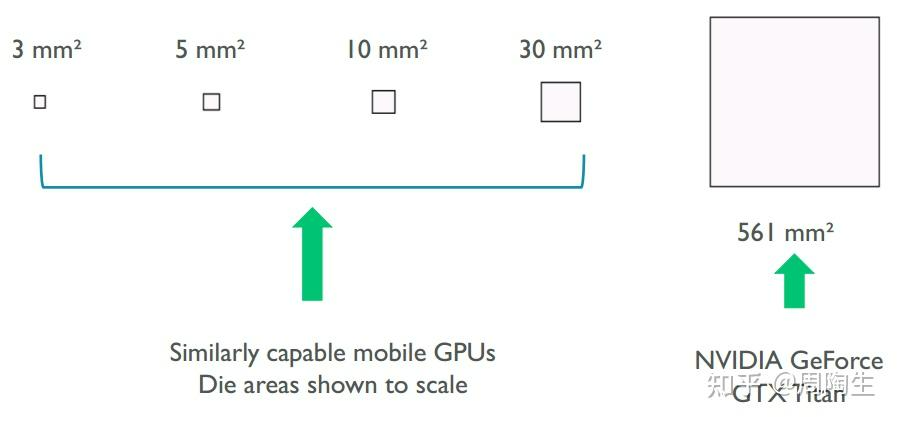
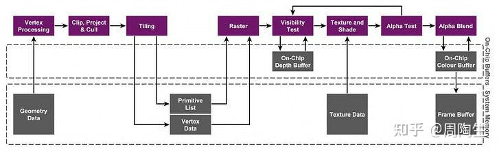
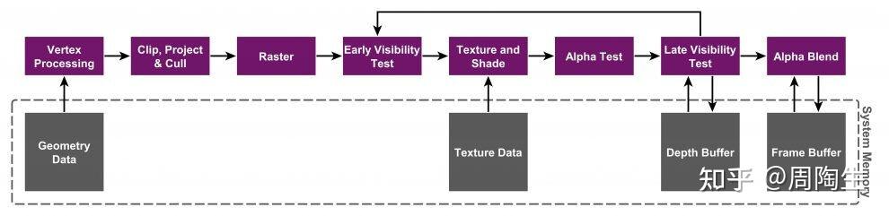
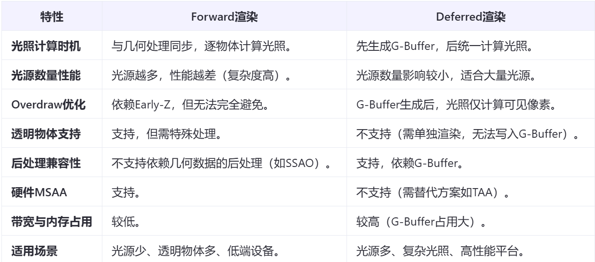

## 写在前面
这两套渲染方案，每一个渲染方案对应的是硬件层面（IMR、TBDR）和软件层面（Foward、Deferred），对应的是目前主流的两套方案：移动端渲染方案和电脑端渲染方案

## 为什么不同类型设备会采用不同方案？
这要从移动端的性能敏感说起。直接上图：



相机也有一句话说的是“底大一级压死人”，这句话同样也可以应用在芯片设计中。（~~光是看着面积就知道很吓人了）~~同时，桌面端直接利用电源供电，仅算上GPU就可以获得高达375W的功率，不仅能在算力上“力大飞砖”，同时同样的功能，桌面端的指标明显要优异于移动端。更别说<font style="color:rgb(44, 44, 54);">芯片面积受限，On-Chip Memory（L1/L2缓存）容量要比桌面端更小（的多）。好的，现在我们知道了手机的算力天生就要比电脑小得多，接下来就先从硬件结构上说明这两个硬件渲染方法：TBDR/IMR。</font>

## <font style="color:rgb(44, 44, 54);">TBDR/IMR</font>
**<font style="color:rgb(44, 44, 54);">隶属于硬件层面的渲染架构，不可以进行两者间的切换。</font>**

### <font style="color:rgb(44, 44, 54);">TBDR： Tile-Based Deferred Rendering </font>
<font style="color:rgb(44, 44, 54);">TBDR大致可以分为三个模块：Binning Pass, Rendering Pass, Resolve Pass.</font>

1. <font style="color:rgb(25, 27, 31);">最上一层：Render Pipeline (渲染管线)  
</font>
2. <font style="color:rgb(25, 27, 31);">中间一层：On-Chip Buffer（a.k.a. 片上内存，Tiled Frame Buffer & Tiled Depth Buffer）  
</font>
3. <font style="color:rgb(25, 27, 31);">最下一层：系统内存，CPU和GPU共享</font>

#### <font style="color:rgb(44, 44, 54);">Binning Pass：</font>
<font style="color:rgb(44, 44, 54);"></font>**<font style="color:rgb(44, 44, 54);">目标</font>**<font style="color:rgb(44, 44, 54);">：将几何数据（顶点、三角形）分配到对应的屏幕小块（Tile）中，为后续渲染做准备。</font>

**<font style="color:rgb(44, 44, 54);">流程步骤</font>**<font style="color:rgb(44, 44, 54);">：</font>

1. **<font style="color:rgb(44, 44, 54);">顶点处理</font>**<font style="color:rgb(44, 44, 54);">：</font>
    - **<font style="color:rgb(44, 44, 54);">顶点着色器</font>**<font style="color:rgb(44, 44, 54);">（Vertex Shader）会接收来自软件层面的顶点数据，处理顶点数据，计算顶点的屏幕坐标（投影到屏幕空间）。</font>
    - **<font style="color:rgb(44, 44, 54);">简化处理</font>**<font style="color:rgb(44, 44, 54);">：部分GPU（如Adreno）可能使用简化版顶点着色器，仅计算顶点位置，忽略纹理坐标、法线等细节（这些在分块阶段不需要）。</font>
2. **<font style="color:rgb(44, 44, 54);">分块分配</font>**<font style="color:rgb(44, 44, 54);">：</font>
    - <font style="color:rgb(44, 44, 54);">将屏幕划分为固定大小的</font><font style="color:rgb(44, 44, 54);"> </font>**<font style="color:rgb(44, 44, 54);">Tile</font>**<font style="color:rgb(44, 44, 54);">（如16x16像素的小方块）。</font>
    - <font style="color:rgb(44, 44, 54);">遍历所有三角形，确定每个三角形覆盖了哪些 Tile。</font>
    - <font style="color:rgb(44, 44, 54);">将覆盖的 Tile 记录到</font><font style="color:rgb(44, 44, 54);"> </font>**<font style="color:rgb(44, 44, 54);">Primitive List</font>**<font style="color:rgb(44, 44, 54);">（图元列表）中，记录每个 Tile 包含哪些三角形。</font>
3. **<font style="color:rgb(44, 44, 54);">数据存储</font>**<font style="color:rgb(44, 44, 54);">：</font>
    - <font style="color:rgb(44, 44, 54);">将每个 Tile 的 Primitive List 和顶点数据写入 </font>**<font style="color:rgb(44, 44, 54);">系统内存(aka. LPDDR)</font>**<font style="color:rgb(44, 44, 54);">。</font>
    - **<font style="color:rgb(44, 44, 54);">关键点</font>**<font style="color:rgb(44, 44, 54);">：分块阶段仅记录几何信息，不进行光栅化或像素着色。</font>

**<font style="color:rgb(44, 44, 54);">参与组件</font>**<font style="color:rgb(44, 44, 54);">：</font>

+ **<font style="color:rgb(44, 44, 54);">Tiler 单元</font>**<font style="color:rgb(44, 44, 54);">：负责将三角形分配到对应的 Tile。</font>
+ **<font style="color:rgb(44, 44, 54);">顶点着色器</font>**<font style="color:rgb(44, 44, 54);">：处理顶点坐标。</font>
+ **<font style="color:rgb(44, 44, 54);">系统内存</font>**<font style="color:rgb(44, 44, 54);">：存储分块后的几何数据（Primitive List）。</font>

#### Rendering Pass:
**<font style="color:rgb(44, 44, 54);">目标</font>**<font style="color:rgb(44, 44, 54);">：逐 Tile 处理几何数据，完成光栅化和像素着色，结果暂存到片上内存（On-Chip Memory）。</font>

**<font style="color:rgb(44, 44, 54);">流程步骤</font>**<font style="color:rgb(44, 44, 54);">：</font>

1. **<font style="color:rgb(44, 44, 54);">Tile 遍历</font>**<font style="color:rgb(44, 44, 54);">：</font>
    - <font style="color:rgb(44, 44, 54);">按顺序处理每个 Tile（如从左到右、从上到下）。</font>
2. **<font style="color:rgb(44, 44, 54);">几何处理</font>**<font style="color:rgb(44, 44, 54);">：</font>
    - **<font style="color:rgb(44, 44, 54);">重新处理顶点</font>**<font style="color:rgb(44, 44, 54);">：读取该 Tile 的 Primitive List，重新执行顶点着色器（这次会完整计算顶点属性，如纹理坐标、法线等）。</font>
    - **<font style="color:rgb(44, 44, 54);">裁剪与剔除</font>**<font style="color:rgb(44, 44, 54);">：进行背面剔除、视锥体剔除等，减少无效三角形。</font>
3. **<font style="color:rgb(44, 44, 54);">光栅化（</font>****<font style="color:rgb(25, 27, 31);">Rasterization）</font>**<font style="color:rgb(44, 44, 54);">：</font>
    - <font style="color:rgb(44, 44, 54);">将三角形转换为该 Tile 内的像素（片元）。</font>
    - **<font style="color:rgb(44, 44, 54);">深度测试（Z-Test）</font>**<font style="color:rgb(44, 44, 54);">：利用 </font>**<font style="color:rgb(44, 44, 54);">HSR（Hidden Surface Removal，隐藏面消除）</font>**<font style="color:rgb(44, 44, 54);"> 或 </font>**<font style="color:rgb(44, 44, 54);">LRZ（Low Resolution Z）</font>**<font style="color:rgb(44, 44, 54);"> 技术，快速剔除被遮挡的片元，减少不必要的像素着色计算。（需要注意的是，虽然我们认为IMR可以“不切实际的进行高强度运算”，但是</font>**<font style="color:rgb(44, 44, 54);">它同样可以采用Early-Z/Pre-Z来进行剔除并减少overdraw</font>**<font style="color:rgb(44, 44, 54);">）</font>
4. **<font style="color:rgb(44, 44, 54);">像素着色</font>**<font style="color:rgb(44, 44, 54);">：</font>
    - <font style="color:rgb(44, 44, 54);">开始执行像素着色器（Fragment Shader），计算每个片元的颜色、光照等。</font>
    - **<font style="color:rgb(44, 44, 54);">结果暂存</font>**<font style="color:rgb(44, 44, 54);">：将处理后的像素数据写入</font><font style="color:rgb(44, 44, 54);"> </font>**<font style="color:rgb(44, 44, 54);">片上内存</font>**<font style="color:rgb(44, 44, 54);">（Tile Buffer）。</font>

**<font style="color:rgb(44, 44, 54);">参与组件</font>**<font style="color:rgb(44, 44, 54);">：</font>

+ **<font style="color:rgb(44, 44, 54);">光栅化引擎</font>**<font style="color:rgb(44, 44, 54);">：将三角形转换为像素。</font>
+ **<font style="color:rgb(44, 44, 54);">像素着色器</font>**<font style="color:rgb(44, 44, 54);">：处理像素颜色和光照。</font>
+ **<font style="color:rgb(44, 44, 54);">HSR/LRZ 单元</font>**<font style="color:rgb(44, 44, 54);">：隐藏面消除，减少过绘制（Overdraw）。</font>
+ **<font style="color:rgb(44, 44, 54);">片上内存</font>**<font style="color:rgb(44, 44, 54);">：临时存储 Tile 的渲染结果（颜色、深度缓冲等）。</font>

#### Resolve Pass：
**<font style="color:rgb(44, 44, 54);">目标</font>**<font style="color:rgb(44, 44, 54);">：将所有 Tile 的渲染结果合并到最终的帧缓冲区（Frame Buffer）。</font>

**<font style="color:rgb(44, 44, 54);">流程步骤</font>**<font style="color:rgb(44, 44, 54);">：</font>

1. **<font style="color:rgb(44, 44, 54);">合并 Tile 数据</font>**<font style="color:rgb(44, 44, 54);">：</font>
    - <font style="color:rgb(44, 44, 54);">将每个 Tile 的 Tile Buffer 内容（颜色、深度等）从片上内存写入系统内存的帧缓冲区Framebuffer。</font>
    - **<font style="color:rgb(44, 44, 54);">多采样抗锯齿（MSAA）</font>**<font style="color:rgb(44, 44, 54);">：如果启用了 MSAA，此时会直接将多个样本点合并为最终像素颜色。这里由于Tile的像素数据直接按块存在于片上内存，极大提高了MSAA的缓存命中率（直接采样点即可而不需要从片外内存读取Framebuffer）。这也是为什么MSAA在低性能移动端的性能损耗会小于TAA。但是，MSAA的每个像素存储多个样本点（如4x MSAA占用4倍显存），在移动端设备中，显存容量有限（如低端设备仅1-2GB），可能导致显存不足或CPU和GPU间的左右脑互搏，带宽竞争。</font>
2. **<font style="color:rgb(44, 44, 54);">清理与提交</font>**<font style="color:rgb(44, 44, 54);">：</font>
    - <font style="color:rgb(44, 44, 54);">清除片上内存中的临时数据（如深度缓冲）。</font>
    - <font style="color:rgb(44, 44, 54);">将完成的帧提交给显示屏。</font>

**<font style="color:rgb(44, 44, 54);">参与组件</font>**<font style="color:rgb(44, 44, 54);">：</font>

+ **<font style="color:rgb(44, 44, 54);">ROP（光栅操作单元）</font>**<font style="color:rgb(44, 44, 54);">：合并 Tile 数据并执行最终的写入操作。</font>
+ **<font style="color:rgb(44, 44, 54);">系统内存DDR</font>**<font style="color:rgb(44, 44, 54);">：存储最终的帧缓冲区。</font>

  
 

### IMR: <font style="color:rgb(25, 27, 31);">Immediate Mode Rendering</font>
<font style="color:rgb(44, 44, 54);">IMR的渲染流程分为以下</font>**<font style="color:rgb(44, 44, 54);">4个核心阶段：Vertex Process, Rasterizer,  Pixel Shading, Merge.</font>**



#### <font style="color:rgb(44, 44, 54);">Vertex Process</font>
**<font style="color:rgb(44, 44, 54);">目标</font>**<font style="color:rgb(44, 44, 54);">：将顶点数据转换为屏幕空间坐标，并执行顶点着色器计算。</font>

**<font style="color:rgb(44, 44, 54);">参与组件</font>**<font style="color:rgb(44, 44, 54);">：</font>

+ **<font style="color:rgb(44, 44, 54);">顶点缓冲区（Vertex Buffer）</font>**<font style="color:rgb(44, 44, 54);">：存储顶点的原始数据（坐标、法线、纹理坐标等）。</font>
+ **<font style="color:rgb(44, 44, 54);">顶点着色器（Vertex Shader, VS）</font>**<font style="color:rgb(44, 44, 54);">：GPU的可编程单元，负责计算顶点的最终位置、颜色、纹理坐标等。</font>
+ **<font style="color:rgb(44, 44, 54);">固定功能单元（Fixed-Function Units）</font>**<font style="color:rgb(44, 44, 54);">：</font>
    - **<font style="color:rgb(44, 44, 54);">顶点属性组装（Vertex Assembly）</font>**<font style="color:rgb(44, 44, 54);">：将顶点数据从内存加载到GPU内部缓存。</font>
    - **<font style="color:rgb(44, 44, 54);">投影变换（Projection Transform）</font>**<font style="color:rgb(44, 44, 54);">：将顶点坐标从模型空间转换为屏幕空间。</font>
+ **<font style="color:rgb(44, 44, 54);">缓存（L1/L2 Cache）</font>**<font style="color:rgb(44, 44, 54);">：减少顶点数据从主存重复读取的延迟。</font>

**<font style="color:rgb(44, 44, 54);">流程</font>**<font style="color:rgb(44, 44, 54);">：</font>

1. <font style="color:rgb(44, 44, 54);">顶点数据从系统内存加载到GPU的顶点缓冲区。</font>
2. <font style="color:rgb(44, 44, 54);">顶点着色器对每个顶点执行计算（如光照、动画变形）。</font>
3. <font style="color:rgb(44, 44, 54);">处理后的顶点数据通过固定功能单元完成投影变换，得到屏幕坐标。</font>

#### **<font style="color:rgb(44, 44, 54);">Rasterization</font>**
**<font style="color:rgb(44, 44, 54);">目标</font>**<font style="color:rgb(44, 44, 54);">：将三角形转换为像素（片元），并进行深度测试（Early-Z）。</font>

**<font style="color:rgb(44, 44, 54);">参与组件</font>**<font style="color:rgb(44, 44, 54);">：</font>

+ **<font style="color:rgb(44, 44, 54);">光栅化单元（Rasterizer）</font>**<font style="color:rgb(44, 44, 54);">：负责将三角形分解为像素级别的片元。</font>
+ **<font style="color:rgb(44, 44, 54);">深度缓冲区（Depth Buffer）</font>**<font style="color:rgb(44, 44, 54);">：存储每个像素的深度值，用于隐藏面消除（Z-Test）。</font>
+ **<font style="color:rgb(44, 44, 54);">裁剪单元（Clipping Unit）</font>**<font style="color:rgb(44, 44, 54);">：剔除超出视口的三角形。</font>

**<font style="color:rgb(44, 44, 54);">流程</font>**<font style="color:rgb(44, 44, 54);">：</font>

1. <font style="color:rgb(44, 44, 54);">光栅化单元将三角形的顶点坐标扩展为覆盖的像素区域。</font>
2. <font style="color:rgb(44, 44, 54);">每个像素生成一个</font>**<font style="color:rgb(44, 44, 54);">片元（Fragment）</font>**<font style="color:rgb(44, 44, 54);">，并计算其深度值。</font>
3. <font style="color:rgb(44, 44, 54);">片元通过Early-Z测试：若深度值小于Depth Buffer中的值，则保留；否则丢弃。</font>
4. <font style="color:rgb(44, 44, 54);">未被丢弃的片元传递给像素着色器处理。</font>

#### Pixel Shadeing
**<font style="color:rgb(44, 44, 54);">目标</font>**<font style="color:rgb(44, 44, 54);">：计算每个片元的最终颜色值。</font>

**<font style="color:rgb(44, 44, 54);">参与组件</font>**<font style="color:rgb(44, 44, 54);">：</font>

+ **<font style="color:rgb(44, 44, 54);">像素着色器（Pixel Shader, PS aka. Fragment Shader, FS）</font>**<font style="color:rgb(44, 44, 54);">：对通过Early-Z的片元执行光照、纹理采样等计算。</font>
+ **<font style="color:rgb(44, 44, 54);">纹理单元（Texture Units）</font>**<font style="color:rgb(44, 44, 54);">：从纹理内存加载纹理数据（如法线贴图、颜色贴图）。</font>
+ **<font style="color:rgb(44, 44, 54);">固定功能插值单元</font>**<font style="color:rgb(44, 44, 54);">：对顶点属性进行插值（如颜色、纹理坐标）。</font>

**<font style="color:rgb(44, 44, 54);">流程</font>**<font style="color:rgb(44, 44, 54);">：</font>

1. <font style="color:rgb(44, 44, 54);">片元通过插值单元获取顶点属性的插值结果（如像素颜色、纹理坐标）。</font>
2. <font style="color:rgb(44, 44, 54);">像素着色器根据插值后的数据、纹理采样结果及光照模型计算最终颜色。</font>
3. <font style="color:rgb(44, 44, 54);">若启用了Alpha测试（Alpha Test），部分片元可能被丢弃。</font>

#### Merger
**<font style="color:rgb(44, 44, 54);">目标</font>**<font style="color:rgb(44, 44, 54);">：将片元颜色写入Frame Buffer，并执行混合（Blending）和深度更新。</font>

**<font style="color:rgb(44, 44, 54);">参与组件</font>**<font style="color:rgb(44, 44, 54);">：</font>

+ **<font style="color:rgb(44, 44, 54);">混合单元（Blending Unit）</font>**<font style="color:rgb(44, 44, 54);">：根据混合方程（如透明度）合并新颜色与已有颜色。</font>
+ **<font style="color:rgb(44, 44, 54);">深度Stencil单元</font>**<font style="color:rgb(44, 44, 54);">：执行Late-Z测试和Stencil Buffer操作。</font>
+ **<font style="color:rgb(44, 44, 54);">Frame Buffer（颜色缓冲区）</font>**<font style="color:rgb(44, 44, 54);">：存储最终像素颜色。</font>
+ **<font style="color:rgb(44, 44, 54);">Depth Buffer</font>**<font style="color:rgb(44, 44, 54);">：存储深度值，用于后续帧的深度测试。</font>

**<font style="color:rgb(44, 44, 54);">流程</font>**<font style="color:rgb(44, 44, 54);">：</font>

1. <font style="color:rgb(44, 44, 54);">通过像素着色的片元进入Late-Z测试（若未通过Early-Z）。</font>
2. <font style="color:rgb(44, 44, 54);">混合单元将新颜色与Frame Buffer中的颜色混合（如透明物体叠加）。</font>
3. <font style="color:rgb(44, 44, 54);">更新Frame Buffer和Depth Buffer，完成像素输出。</font>

#### 电脑端参与的组件：
##### <font style="color:rgb(44, 44, 54);">硬件组件：</font>
1. **<font style="color:rgb(44, 44, 54);">GPU核心模块</font>**<font style="color:rgb(44, 44, 54);">：</font>
    - **<font style="color:rgb(44, 44, 54);">计算单元（Shader Cores）</font>**<font style="color:rgb(44, 44, 54);">：执行顶点着色器、像素着色器。</font>
    - **<font style="color:rgb(44, 44, 54);">光栅化引擎</font>**<font style="color:rgb(44, 44, 54);">：处理光栅化和深度测试。</font>
    - **<font style="color:rgb(44, 44, 54);">内存控制器</font>**<font style="color:rgb(44, 44, 54);">：管理与系统内存的交互。</font>
2. **<font style="color:rgb(44, 44, 54);">缓存结构（片上内存）</font>**<font style="color:rgb(44, 44, 54);">：</font>
    - **<font style="color:rgb(44, 44, 54);">L1/L2 Cache</font>**<font style="color:rgb(44, 44, 54);">：缓存顶点数据和中间结果。</font>
    - **<font style="color:rgb(44, 44, 54);">Texture Cache</font>**<font style="color:rgb(44, 44, 54);">：加速纹理采样。</font>
3. **<font style="color:rgb(44, 44, 54);">显存（VRAM）</font>**<font style="color:rgb(44, 44, 54);">：</font>
    - <font style="color:rgb(44, 44, 54);">存储Frame Buffer、Depth Buffer、纹理等数据。</font>

##### <font style="color:rgb(44, 44, 54);">软件组件：</font>
1. **<font style="color:rgb(44, 44, 54);">图形API</font>**<font style="color:rgb(44, 44, 54);">（如DirectX、OpenGL）：</font>
    - <font style="color:rgb(44, 44, 54);">管理顶点缓冲区、渲染状态（如混合模式、深度测试）。</font>
2. **<font style="color:rgb(44, 44, 54);">驱动程序</font>**<font style="color:rgb(44, 44, 54);">：</font>
    - <font style="color:rgb(44, 44, 54);">将API命令转换为GPU可执行的指令流。</font>
3. **<font style="color:rgb(44, 44, 54);">着色器代码</font>**<font style="color:rgb(44, 44, 54);">：</font>
    - <font style="color:rgb(44, 44, 54);">顶点着色器、像素着色器的可编程逻辑。</font>

### Forward搭配TBDR，而Deferred则会搭配IMR？
这就要说到缺点了。虽然Forward在目标实现接近于IMR（两者的目的都是需要及时渲染），按理来说应该是Forward+IMR。我们来简要过一下两个渲染管线：

#### **<font style="color:rgb(44, 44, 54);">Forward管线流程</font>**
1. **<font style="color:rgb(44, 44, 54);">顶点处理</font>**<font style="color:rgb(44, 44, 54);">：顶点着色器计算顶点坐标、法线等。</font>
2. **<font style="color:rgb(44, 44, 54);">光栅化</font>**<font style="color:rgb(44, 44, 54);">：生成片元并进行Early-Z测试。</font>
3. **<font style="color:rgb(44, 44, 54);">片段处理</font>**<font style="color:rgb(44, 44, 54);">：</font>
    - **<font style="color:rgb(44, 44, 54);">ForwardBase Pass</font>**<font style="color:rgb(44, 44, 54);">：计算主光源（如Directional Light）。</font>
    - **<font style="color:rgb(44, 44, 54);">ForwardAdd Pass</font>**<font style="color:rgb(44, 44, 54);">：为每个附加光源（点光源、聚光灯）单独渲染，叠加光照。</font>
    - <font style="color:rgb(44, 44, 54);">需要注意的是，在URP14中，ForwardAdd Pass被取消，为了简洁化，可以直接调用GetAdditionalLightsCount()。但是底层实现逻辑仍然一致。</font>
+ LightAdd in URP14：

```cpp
#ifdef _ADDITIONAL_LIGHTS
                int additionalLightsCount = GetAdditionalLightsCount();
                for (int i = 0; i < additionalLightsCount; ++i)
                {
                    Light light = GetAdditionalLight(i, input.positionWS);
                    
                    // 简单的Lambert漫反射
                    half3 additionalLambert = CalculateLambert(N, light.direction, light.color, light.distanceAttenuation * light.shadowAttenuation);
                    
                    additionalLightsColor += baseColor.rgb * additionalLambert * _AdditionalLightsIntensity;
                }
#endif
```

4. **<font style="color:rgb(44, 44, 54);">混合与输出</font>**<font style="color:rgb(44, 44, 54);">：将结果写入Frame Buffer。</font>

#### **<font style="color:rgb(44, 44, 54);">Deferred管线流程</font>**
1. **<font style="color:rgb(44, 44, 54);">顶点处理</font>**<font style="color:rgb(44, 44, 54);">：仅计算顶点坐标，不处理光照。</font>
2. **<font style="color:rgb(44, 44, 54);">光栅化</font>**<font style="color:rgb(44, 44, 54);">：开始采集并生成G-Buffer（存储几何数据：位置、法线、颜色、材质属性等）。</font>
3. **<font style="color:rgb(44, 44, 54);">光照Pass</font>**<font style="color:rgb(44, 44, 54);">：遍历屏幕像素，根据G-Buffer数据计算所有光源对像素的影响。在这一阶段， 会在屏幕上逐像素执行光照，</font>**<font style="color:rgb(44, 44, 54);">不再访问场景几何 </font>**<font style="color:rgb(44, 44, 54);">。</font>
4. **<font style="color:rgb(44, 44, 54);">混合与输出</font>**<font style="color:rgb(44, 44, 54);">：将结果写入Frame Buffer。</font>



发现了没有？Deferred管线这里多了一个Gbuffer。这个Gbuffer是什么呢，这是一个会储存在**片外内存（对应桌面端的VRAM，移动端的LPDDR）**的Buffer。

延迟渲染需要将几何属性（如位置、法线、材质参数、颜色等）存储到 Gbuffer的多张渲染目标（Render Targets, RT） 中，例如：

+ Position RT：存储像素的三维位置。
+ Normal RT：存储法线向量。
+ Albedo RT：存储基础颜色。
+ Depth RT：存储深度信息。

虽然deferred在多光源计算的性能消耗明显优于forward管线，那么代价是什么呢？代价是deferred虽然可以一次性解决屏幕的所有物体渲染，不需要逐物体渲染；但是这个条件的前提是**你的Gbuffer可以迅速地从系统内存读取到计算单元中并作计算**。更别说你还没有开启MSAA（4xMSAA=从Gbuffer采样四次，带宽要求直接x4），TAA（从Framebuffer的时域采样，直接*n帧带宽）。

另外，由于Gbuffer不会存储透明物体数据，因为<font style="color:rgb(44, 44, 54);">Deferred渲染的核心是</font>**<font style="color:rgb(44, 44, 54);">几何处理阶段</font>**<font style="color:rgb(44, 44, 54);">（Geometry Pass），将所有不透明物体的几何信息（如位置、法线、材质属性、深度）写入</font>**<font style="color:rgb(44, 44, 54);">G-Buffer</font>**<font style="color:rgb(44, 44, 54);">（多个渲染目标）。</font>

也就是说，如果还要加一个透明处理，就意味着：

1. 可以用加一个Forward管线单独处理，但是这会脱离Gbuffer，导致Deferred的屏幕空间效果不起作用
2. 单独开一个Gbuffer接着渲染。再次从片外内存读写一遍。

### 对比复杂度
最后对比一下算法（由通义生成）：在分析延迟渲染（Gbuffer + IMR）与前向渲染（+ TBDR）的带宽压力差异时，需要从**渲染流程、数据存储方式、架构特性** 三个维度进行对比。

---

#### 1. 延迟渲染（Gbuffer + IMR）的带宽压力来源
##### (1) Gbuffer的存储与传输
+ **Gbuffer的定义**：
    - 延迟渲染需要将几何属性（如位置、法线、材质参数、颜色等）存储到 **多张渲染目标（Render Targets, RT）** 中，例如：
        * **Position RT**：存储像素的三维位置。
        * **Normal RT**：存储法线向量。
        * **Albedo RT**：存储基础颜色。
        * **Depth RT**：存储深度信息。
+ **带宽消耗点**：
    - **初始化阶段**：渲染所有几何体时，必须将所有可见像素的几何属性写入Gbuffer，这需要 **多次系统内存写入**。
    - **光照阶段**：每个光源的计算需要读取Gbuffer中的所有RT数据（如法线、位置、材质），导致 **多次系统内存读取**。
    - **屏幕分辨率越高**，Gbuffer的带宽需求呈线性增长（如1080p屏幕需要约200万像素 × 多个RT通道）。

##### (2) IMR架构的劣势
+ **直接写入系统内存**：
    - 在IMR架构下，Gbuffer的写入和读取均直接通过 **系统内存（VRAM）** 进行，无法利用片上内存暂存中间结果。
    - **频繁的读写操作**：例如，每个光源的计算需读取所有RT数据，带宽压力随光源数量线性增长。
+ **抗锯齿（MSAA）的额外开销**：
    - 若启用MSAA，Gbuffer的每个像素需存储多个样本点的数据（如4x MSAA需4倍存储空间），进一步增加带宽需求。
+ **对于读写速度的刚需：**
    - Gbuffer的显存带宽需求在移动端是致命的（如1080p屏幕下，四张Gbuffer的带宽消耗可达 **2GB/s**，而移动端总带宽仅30GB/s）。
    - 延迟渲染需要 **多张RT**，导致显存带宽成为瓶颈。

#### 2. 前向渲染（+ TBDR）的带宽优化
##### (1) TBDR架构的优势
+ **分块处理与片上内存暂存**：
    - **分块（Tiling）**：将屏幕分割为小Tile，每个Tile的渲染数据（颜色、深度、模板）暂存在 **片上内存（On-Chip Memory）**。
    - **中间结果暂存**：仅在 **解析阶段（Resolve）** 将Tile结果合并到系统内存的Framebuffer，减少频繁写入。
+ **隐藏面消除（HSR/LRZ）**：
    - 提前剔除被遮挡的像素，仅对 **可见像素** 进行纹理采样和光照计算，减少无效带宽消耗。
+ **纹理读取的局部性优化**：
    - 同一Tile内的像素共享纹理数据，片上缓存（如L2缓存）可高效复用，减少系统内存访问。

##### (2) 前向渲染的流程优化
+ **逐Tile处理**：
    - 每个Tile的渲染在片上内存完成，仅需读取 **当前Tile相关的纹理和几何数据**。
    - **无需存储Gbuffer**：颜色和深度数据直接暂存于Tile Buffer，最终合并到Framebuffer。
+ **过绘制（Overdraw）的减少**：
    - HSR/LRZ技术剔除被遮挡像素，减少纹理和着色计算的带宽需求。

##### (3) 知识库依据
+ **知识库[2][5][7]** 强调：
    - TBDR通过 **片上内存** 存储中间数据，仅最终合并时写入系统内存，显著降低带宽。
    - HSR/LRZ技术可将Overdraw降至接近1，减少无效像素的纹理读取。

---

#### 3. 带宽压力对比：延迟渲染 vs 前向渲染
| **维度** | **延迟渲染（Gbuffer + IMR）** | **前向渲染（+ TBDR）** |
| --- | --- | --- |
| **Gbuffer存储需求** | 需存储多张RT（如Position、Normal、Albedo等），带宽随RT数量线性增长。 | 无需Gbuffer，仅存储颜色和深度数据，带宽需求更低。 |
| **系统内存访问频率** | 每个Pass需读取所有RT数据（如每个光源需读取Gbuffer），导致 **高频系统内存访问**。 | 仅最终合并时写入系统内存，中间数据在片上内存处理， **系统内存访问频率低**。 |
| **纹理读取优化** | 纹理数据需多次读取（如每个光源读取Gbuffer），无片上缓存优化。 | 纹理数据通过片上缓存复用，且仅处理可见像素， **带宽消耗显著降低**。 |
| **抗锯齿开销** | MSAA需存储多倍样本数据，Gbuffer带宽压力进一步增加。 | TBDR的 **片上MSAA** 可暂存多样本数据，减少系统内存带宽需求。 |
| **移动设备适用性** | 移动端显存带宽有限，Gbuffer的高带宽需求导致性能瓶颈（如知识库[4]提到的2GB/s vs 30GB/s总带宽）。 | TBDR的优化使其在移动端成为主流，前向渲染与TBDR协同降低带宽压力。 |


---

#### 4. 具体场景示例
##### 场景：1080p屏幕，4光源
+ **延迟渲染（Gbuffer + IMR）**：
    - **Gbuffer带宽**：假设每像素存储4个通道（如Position、Normal、Albedo、Depth），8bit/通道：
        * 单帧带宽 = 1920×1080 × 4通道 × 8bit × 60fps ≈ **2.5GB/s**。
    - **光照阶段带宽**：每个光源需读取Gbuffer数据，4光源总带宽 ≈ **10GB/s**。
+ **前向渲染（+ TBDR）**：
    - **纹理读取**：仅对可见像素进行光照计算，假设Overdraw减少为1，带宽 ≈ 1920×1080 × 4光源 × 0.2（缓存命中） ≈ **0.8GB/s**。
    - **系统内存写入**：仅最终合并时写入Framebuffer，带宽 ≈ **0.5GB/s**。

---

#### 5. 总结：带宽压力差异的核心原因
+ **延迟渲染（Gbuffer + IMR）**：
    - **带宽杀手**：多张RT的存储与高频读写、无片上内存优化导致带宽需求激增。
    - **移动端不友好**：显存带宽有限，Gbuffer的高开销易触发带宽瓶颈。
+ **前向渲染（+ TBDR）**：
    - **带宽优化**：利用片上内存暂存数据、HSR剔除无效像素、纹理缓存复用，显著降低系统内存访问。
    - **移动端首选**：与TBDR架构协同，平衡性能与功耗，适合移动设备的典型场景（少光源、透明物体）。

---

### **类比理解**
+ **延迟渲染（Gbuffer + IMR）**：像快递公司每次配送都要先建一个庞大的中央仓库（Gbuffer），再多次往返取货送货，导致交通拥堵（带宽不足）。
+ **前向渲染（+ TBDR）**：快递员分片区配送（分块），每个片区的货物暂存在本地仓库（片上内存），仅最终合并到中央仓库，减少重复运输。


