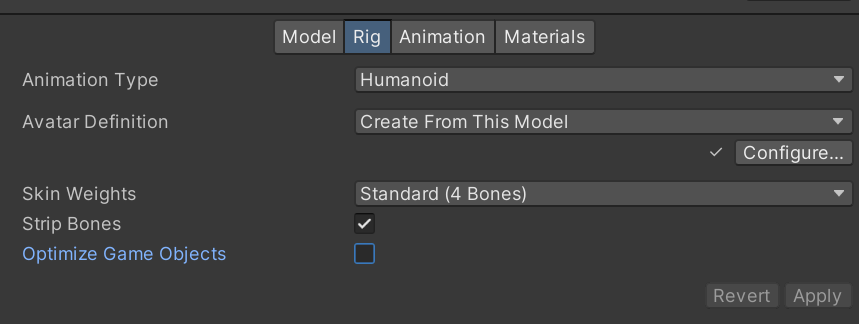
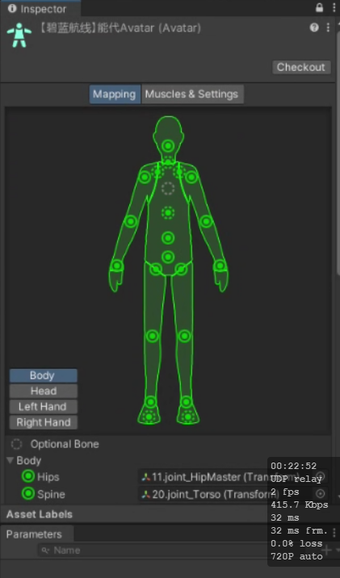
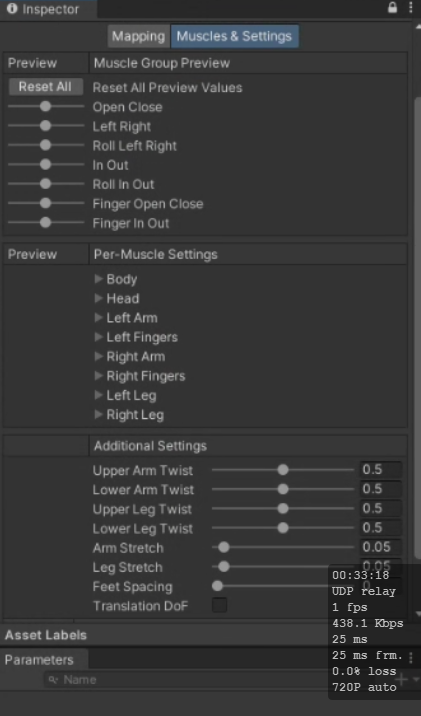

> 前置可选条件：package manager中加入了Animation Rigging（骨骼可视化Bone Renderer）和MMD4Macanim（用于把pmx转换为fbx）
>

在Unity中常常会遇见使用不同角色的动画，也就是Bones Retargeting系统。可以在Project中点击fbx后的Rig分支选项看到目前的状态。



Animation Type：Generic、Humanoid、None、Legacy。

Generic：导入fbx的时候默认继承的选项，也就是不更改任何的骨骼名称，直接使用fbx内的所有骨骼命名；

Legacy：一个比较老的标准，常见于很久以前的Builtin管线，如果不是从老项目挪过来的资源不会使用

Humanoid：重点讲这个东西，这是Retarget的重点。

## Humanoid：
从generic更改为Humanoid后，Unity会尝试根据内部的描述文件逐一进行描述模糊匹配（Postprocessors的描述文件）。


Defination：

1、 Create from this model： 直接使用当前FBX文件里的骨骼结构，自动生成一个新的Avatar（骨骼映射）。  

2、 Copy from other avatar：  用另一个FBX或Prefab中已经创建好的Avatar（骨骼映射）。  优势是可以直接沿用所有骨骼的名字，不需要进行映射， 动画资产更容易批量复用。  


SkinWeights：

这是蒙皮权重的设置，**用来控制每个顶点最多受多少根骨骼影响**。

Standard是表明每个顶点最多有4个骨骼可以参与并控制进行骨骼影响。 顶点权重大于4的，只保留最重要的4个，其余自动舍弃或归零。  

Custom：可以选择并允许你指定“每顶点允许的骨骼数量”，比如2、4、8等（需要在Graphics Settings里自定义）。  但是一般我们只需要选择4个即可。因为大多数GPU对每个顶点可参与变形的骨骼数量是有限制的，4是最常见的上限。

### 这和DCC中的蒙皮有什么区别？
**Unity的Skin Weights设置，决定了建模软件里“每个顶点蒙皮权重”最多有几组能被保留和使用。**

 在Blender、Maya等3D建模/动画软件中，你可以给每个顶点分配任意数量的权重，比如1、2、4、甚至10根骨骼影响一个顶点。  一般来说， 权重越多，顶点变形越平滑，但数据量越大，性能损耗也增加。 也可以自由涂抹、调整每个骨骼对每个顶点的影响比例。  

Unity在导入模型时，会根据你在**Skin Weights**（蒙皮权重）选项里选的最大权重数，对每个顶点**做一次“筛选”**。 

选“4 Bones”，就只保留每个顶点影响最大的4个骨骼的权重，其余全部舍弃（并重新归一化）。

如果你在建模软件里有顶点被5、6、8根骨骼影响，导入到Unity后，只会留下影响最大的4个，其余全部丢弃。

这一步**只发生在导入时**，跟你建模软件里的原始权重关系密切，但会被Unity“削减”到上限如果超过了Unity的设置则会自动只保留对该顶点权重最高的四个骨骼。

选“Custom”可以设置更高（比如8），就会保留更多组权重。但是性能开销会十分美丽


---

引用：

[导入带有人形动画的模型 - Unity 手册](https://docs.unity3d.com/cn/2021.3/Manual/ConfiguringtheAvatar.html#AvatarSetup)

### 
Strip bones

 勾选 **Strip Bones**，Unity会在导入模型时**自动移除所有没有被蒙皮权重（Skin Weights）影响到的骨骼**，即那些对模型变形没有实际作用的骨骼节点不会导入进来。如果原始骨骼里有一些辅助骨、挂点骨、导出时残留的无用骨骼，但这些骨骼没有任何顶点被它们影响（权重为0），勾选这个后这些骨骼会被Unity忽略掉，减少无用数据。  

但是要注意的是，如果我们有一些辅助骨骼（比如说使用辅助骨骼完成武器动画绑定）的时候，就不要勾选这个，这回去掉辅助骨骼。

optimize game objects（ 优化游戏对象 ）

 勾选后，Unity会直接**将骨骼链优化为底层的数据结构**，只保留Mesh和根节点，把大部分骨骼节点从Hierarchy中“隐藏”掉，不再作为GameObject存在。这极大地**减少了场景中的对象数量**，显著提升运行效率。  

### 来自GPT对这个选项的解释：
你的疑问很正常，**Optimize Game Objects** 这个选项确实容易让人迷糊。下面用**最直白的语言**和**实例对比**帮你彻底搞懂它的作用和意义！

---

#### 1. **问题本质：为什么要“优化骨骼对象”？**
在Unity里，导入带骨骼动画的模型时，每一根骨骼通常会生成一个GameObject（带Transform），比如这样一棵骨骼树：

```plain
角色
├── Hips
│   ├── Spine
│   │   ├── Chest
│   │   │   ├── Neck
│   │   │   └── Head
│   │   └── LeftShoulder
│   │       └── LeftArm
│   │           └── ...
...
```

**每一个节点（骨骼）都变成场景里的一个“游戏对象”！（可以在inspector中看到）**

---

#### 2. **这样会有什么问题？**
+ 如果一个角色有50根骨骼，就有50个GameObject。
+ 一个场景有100个角色，就有5000个骨骼对象！
+ Unity在运行时要**每帧同步这些Transform、管理层级、分配内存**，有很大性能开销，特别是在移动端、VR等对性能敏感的场合。

---

#### 3. **什么是“Optimize Game Objects”？**
##### **勾选了它，Unity就不再为每根骨骼生成独立GameObject**。
##### 只保留最重要的根节点和Mesh节点。
##### 骨骼动画的数据结构变成**底层C++层内存里的“骨骼矩阵数组”**，不用Unity的GameObject系统去维护。
##### **Hierarchy视图里看不到骨骼树**了，只有主对象和Mesh。
##### **对比：**
| #### 不勾选Optimize | #### 勾选Optimize |
| --- | --- |
| #### 每个骨骼都是GameObject | #### 只有根节点是GameObject |
| #### 可以脚本随时访问骨骼Transform | #### 大部分骨骼无法直接访问/脚本操作 |
| #### 性能开销大 | #### 性能极高，内存和CPU压力小 |


---

#### 4. **实际例子**
##### **不优化：**
+ 你可以写：`transform.Find("Spine/Chest/Neck/Head")` 直接找到头部骨骼，挂武器、加特效。
+ 但每个角色都要消耗很多GameObject内存，场景多了就卡。

##### **优化后：**
+ 你**没法直接脚本操作骨骼**（因为它们不再是GameObject）。
+ 但同样动画能正常播放，性能大大提升。
+ 适合**大批量NPC、只看动画不用动态操作骨骼的角色**。


#### 5. **如果你还想操作骨骼怎么办？**
Unity有“暴露骨骼”(Expose Transforms)功能：  
你可以指定“需要动态操作的那几个骨骼”在Hierarchy里保留，其余优化掉。


#### 6. **一句话总结**
> **Optimize Game Objects**就是让Unity不为每根骨骼生成GameObject，只在底层“默默执行动画”，这样**能极大提升性能和效率**。如果你只是让角色自动播放动画，不需要挂武器、特效、换装，强烈建议开启它！
>


### 
## 准备妥当后...
便可以开始打开Config对骨骼进行Retarget。



Mapping是进行关键配置的地方，如果有些地方没有出现映射的话需要我们进行手动调整，在这个情况下，模型应该摆出Tpose以方便我们进行骨骼映射。


最下方的两个选项：

Mapping：指定映射方法。分为Clear、Automap、Load/Save。Clear则是直接从头进行分配，清空所有已经映射过的骨骼，从头进行手动分配；Automap则是之前提到过的使用Unity内置的配置文件模糊匹配；Save/Load则是用于模型的批量化处理。

Pose： 主要用于**调整当前骨骼的姿势**，便于正确映射和校准人形骨骼。  分为Reset、Sample pose和Enforce T-pose。

 Sample pose：把骨骼恢复到**导出FBX时的原始绑定姿势**，通常就是建模时的A-Pose或T-Pose，或者动画师在蒙皮时设置的初始姿势。

Enforce T-pose： 把骨骼恢复到**导出FBX时的原始绑定姿势**，通常就是建模时的A-Pose或T-Pose，或者动画师在蒙皮时设置的初始姿势。  有时如果不是T-pose那么自动绑定会出现问题。可以选择这个选项尝试重新自动映射。

Reset：重置姿势。恢复到导入姿势。  


## 还想钳制姿势？
我们知道，即使骨骼映射一直，蒙皮权重相似，但是如果对于跨风格的动画（二次元角色动画重新映射到欧美角色上），很容易出现骨骼运动过于不协调的时候。这就需要config的第二个页面： Muscles & Settings  了。



Muscle Group Preview：这里的“Muscle”指的是Unity Humanoid系统对人形骨架的各个自由度的抽象，比如手臂的上举、下放、前后摆动等。通过拖动这些滑块，你可以**实时预览角色各个大类动作的变形效果**，比如张合嘴巴、左右转头、臂展、收腿等。用来**检测骨骼分配和蒙皮权重是否合理**，比如看张嘴会不会带动到脸部错误部位、转头会不会扭曲等。发现异常可以回到Mapping面板修正骨骼分配，或调整权重。

Per-Muscles Settings： 展开 Body、Head、Left Arm 等子项后，可以**单独调节每一块肌肉的活动范围**（比如手臂能抬多高、脖子能转多远）。  这些滑块可以指定人体骨骼的极限运动值， 让Avatar更适配不同体型的模型（比如胳膊较短/较长、脖子较粗等）  

Additional Settings：

**Upper Arm Twist / Lower Arm Twist**：  
控制手臂扭转时的影响范围，防止手臂旋转时出现“爆炸”或不自然。

**Upper Leg Twist / Lower Leg Twist**：  
控制大腿/小腿扭转的范围与效果。

**Arm Stretch / Leg Stretch**：  
控制手臂、腿部在极限动作时的伸展弹性，防止动画重定向时出现“拉长”或变短的畸形。

**Feet Spacing**：  
控制两脚之间的默认距离，方便站立动作的适配。

**Translation DoF （Translation Degree of Freedom，平移自由度）  **：  
决定骨骼是否允许平移自由度（一般默认关闭）。 平移自由度是**允许某些骨骼节点除了旋转，还可以在空间中移动（平移）**。  但是一般不会出现，如果连骨骼都出现了平移，那么关节会出现非常严重的脱节情况。


