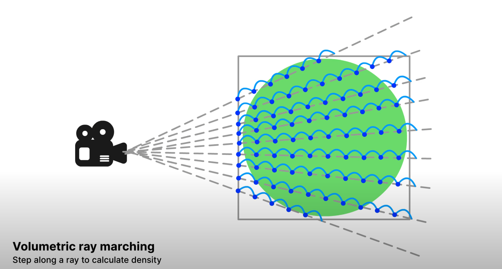
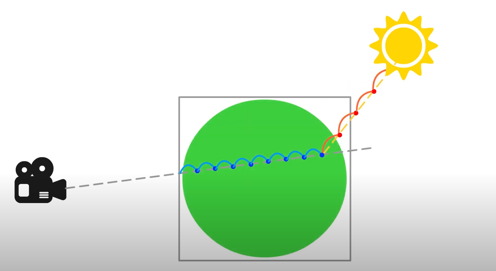

### **Unity中实现体积光的三种方式**
体积光就是让光看起来“有体积”，像是穿过雾气的光柱，或者空气中漂浮着的尘埃被光线照亮的效果。它比普通的光照多了一种在空间中传播的感觉，让游戏画面更有氛围感。

实现体积光的方式有很多，但总的来说可以分为三种：**面片方法**、**屏幕空间方法**和**光线步进方法**。这三种方法从简单到复杂各有优缺点。

---

### **1. 面片方法/粒子特效方法**
这里先讲面片的实现方法。面片方法很好理解，假设你拿着一根手电筒，手电筒打出了一束光柱。我们并不真的去模拟这些光线在空气中传播，而是直接在手电筒前面摆一个锥形的“透明罩子”，让它看上去像光柱一样。这个“罩子”就是一个模型（比如锥体或者圆柱体），通过材质的透明效果让它变得像一束光。

#### **实现思路：**
**对于直接使用模型模拟的情况，可以创建一个几何体**，比如锥体或者一个平面面片。把这个几何体放在光源位置，并让它的方向和光源的方向一致。给几何体加一个材质，材质可以通过渐变纹理让中央部分更亮，边缘更透明。为了更真实，可以再叠加一个噪声纹理，模拟空气中的尘埃。如果光源会动，比如手电筒或者舞台灯光，那么这个几何体也需要随着光源移动和旋转。

还有一个方法比较Trick、就是利用**Unity自带的粒子系统**进行动态体积光的模拟,这个方法比上一个方法更加富有动态上的美感（但是需要配合Bloom效果，意味整个画面需要有所改变），适合作为一个附加项。

#### **优点和缺点**
**优点**：

+ 简单，一个几何体加一个材质/使用粒子就能搞定。
+ 性能开销很小，因为是基于物体的材质或者是引擎自带的粒子系统，非常适合性能敏感的场景，比如移动端游戏。
+ 艺术表现力强，通过调整材质的渐变、纹理、透明度等参数，可以轻松制作出各种风格的光柱效果。

**缺点**：

+ 真实感有限，因为它只是一个几何体，并没有模拟光线与空气的真实交互。
+ 遮挡问题比较明显。如果光柱穿过了场景中的墙壁或者其他物体，它不会被正确遮挡，看起来就很假。
+ 靠近光柱时可能看起来很平面，缺乏立体感。

#### **适用场景**
面片方法特别适合那些对真实感要求不高的场景，比如舞台灯光、探照灯、或者卡通渲染风格的游戏。如果你的项目对性能要求比较高，这种方法并不是最优选择。

#### 参考
#### [https://www.youtube.com/watch?v=kbsd6askiCY&t=195s](https://www.youtube.com/watch?v=kbsd6askiCY&t=195s) Using Particle System
### **2. 屏幕空间方法：光柱和场景的互动**
面片方法的问题在于，它不会考虑光柱和场景中的物体之间的遮挡关系。而屏幕空间方法解决了这个问题。它的核心思想是：我们不在三维空间中画光，而是在屏幕上“画光”。可以理解为，我们直接在屏幕上计算光柱的效果，而不是在场景中放一个几何体。

#### **实现思路**
首先，把光源的位置投影到屏幕上，**确定光柱在屏幕上的范围**。从光源的屏幕位置出发，向外扩散光线。沿着这些光线的方向，我们对屏幕上的像素进行采样。**通过深度缓冲（Depth Buffer），判断光线是否被遮挡**。比如，如果光柱前面有一堵墙，通过深度值可以知道光柱应该被遮挡。计算完光柱的强度和遮挡效果后，把它作为一个后处理效果叠加到最终画面上。

#### **优点和缺点**
**优点**：

+ 动态遮挡效果逼真。比如光柱被墙挡住后，遮挡关系是自动处理的，真实感更好。
+ 可以处理多个光源的体积光效果，比如汽车大灯或者手电筒光柱。
+ 性能开销可以调节，比如可以减少采样点来提升性能。

**缺点**：

+ 它只能处理屏幕上看得见的部分，屏幕外的光柱是无法计算。也就是说如果不出现在屏幕空间则没有体积光。
+ 效果和分辨率密切相关，分辨率越高，计算量越大。
+ 遮挡的精度受限于深度缓冲，如果场景比较复杂，可能会有一些不准确的地方。

#### **适用场景**
屏幕空间方法特别适合那些需要动态光柱效果的场景，比如手电筒、汽车大灯，或者光线穿过窗户洒进房间的画面。它对硬件的要求不算太高，适用于中高端设备。

#### 参考
[https://www.youtube.com/watch?v=vnBfbZeV928](https://www.youtube.com/watch?v=vnBfbZeV928)

### **3. 光线步进方法**
上面两种方法都是“假的”体积光，而光线步进方法则是“真的”体积光。它直接在三维空间中模拟了光线在空气、雾气、烟尘中的传播过程。简单来说，它会从摄像机出发，沿着每一条视线（即屏幕上的每个像素）不断采样，计算光线在这些点上的散射和吸收。

#### **实现思路**
从摄像机出发，沿视线方向，对每条光线进行步进采样（类似于光线追踪）。

每个采样点都会计算光线的强度变化，比如步进一步之后光线在传播中因为散射而变弱，使用数组对当前光线进行记录。

如果采样点被光源照亮，还要计算光线的直接照明效果。

把所有采样点的结果累加起来，得到当前像素的体积光效果。

最后，把体积光效果和场景颜色合成，生成最终画面。

#### **优点和缺点**
**优点**：

+ 真实感爆表！它可以精确模拟光线在体积介质中的散射、吸收和遮挡。
+ 支持动态雾气、烟尘等复杂效果，比如爆炸后的烟雾中透出的一束光。
+ 灵活性极高，可以表现各种复杂的光照效果。

**缺点**：

+ 计算量巨大，**每条光线都需要多次采样（比如说你的步长）**，对性能要求非常高。
+ 实现难度较大，需要对体积渲染和光照模型有深入理解。
+ 对硬件要求高，通常只适合高端设备和次世代游戏。

#### **适用场景**
光线步进方法是高质量渲染的终极选择，适合那些需要表现复杂雾气、烟尘或者动态光线传播的场景，比如次世代游戏、电影级别的渲染效果。如果你追求极致的真实感，并且硬件性能允许，那这就是你的最佳选择。

| 方法 | 优点 | 缺点 | 适用场景 |
| --- | --- | --- | --- |
| 面片方法 | 简单高效，性能占用低 | 真实感不足，无法处理遮挡 | 卡通风格、移动端游戏 |
| 屏幕空间方法 | 动态效果好，可处理遮挡 | 受屏幕限制，分辨率依赖 | 手电筒、大灯等动态光柱 |
| 光线步进方法 | 真实感最高，支持复杂动态光线传播 | 性能开销大，硬件要求高 | 次世代游戏、电影级别渲染 |

---

总的来说，如果性能要求高，可以选择面片方法。如果需要动态效果并且硬件性能允许，屏幕空间方法会是一个很好的平衡。而如果你追求极致的真实感，那就选择光线步进方法。

#### 参考
[https://www.youtube.com/watch?v=0G8CVQZhMXw&t=199s](https://www.youtube.com/watch?v=0G8CVQZhMXw&t=199s)  这采用了houdini生成3D纹理并使用Shadergraph实现Raymarching的效果

[https://www.youtube.com/watch?v=hXYOlXVRRL8&t=570s](https://www.youtube.com/watch?v=hXYOlXVRRL8&t=570s)  上面的省流版

