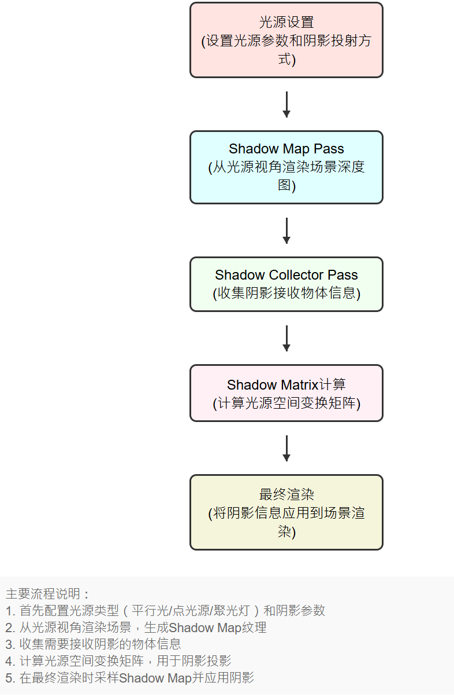
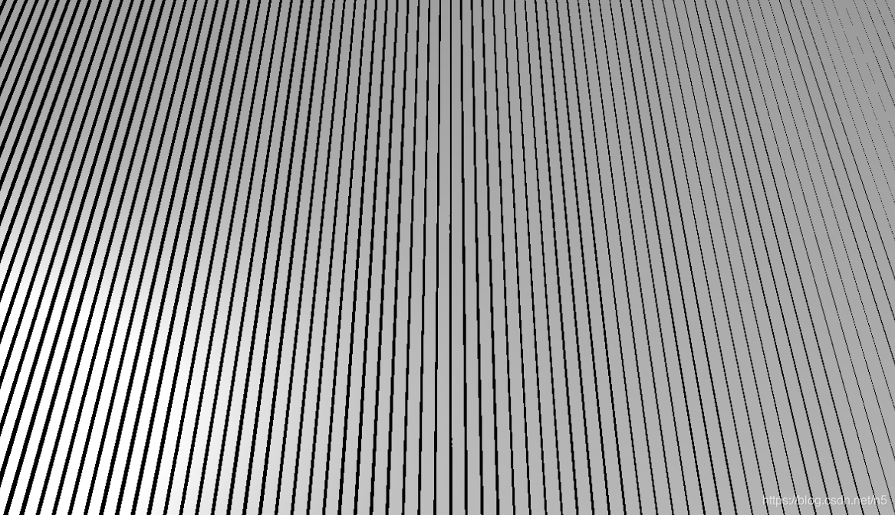

> _<font style="color:rgb(34, 34, 34);background-color:rgb(250, 250, 250);">Investigate how Unity renders shadows.  
用大白话说阴影是如何产生的</font>_
>

阴影的产生来自于两个核心要素：来自摄像机的深度测试、以光源为中心进行shadowmap的产生，最后和摄像机的深度图进行测试比较的过程。

<font style="color:rgb(34, 34, 34);background-color:rgb(250, 250, 250);">有一些技术可以支持实时阴影。每个都有其优点和缺点。 除了Shadowmap技术，还有体积阴影、SSS屏幕空间阴影、Ray Tracing光线追踪阴影、区域光源阴影Area Light Shadow、阴影体Shadow Volumne。Unity使用了当今最常见的技术，那就是</font>**<font style="color:rgb(34, 34, 34);background-color:rgb(250, 250, 250);">阴影贴图</font>**<font style="color:rgb(34, 34, 34);background-color:rgb(250, 250, 250);">。这意味着 Unity 以某种方式将阴影信息存储在纹理中。</font>



在这个例子中，我用的是forward渲染模式，并且用两个pass进行阴影的处理：Foraward Lit Pass;Shadow Caster Pass.Shadow catser pass**仅负责将物体渲染到阴影贴图中，输出不会被显示**；Forward Lit Pass

则不仅处理一般的光照，也会处理并生成阴影。

```cpp
Shader "KelvinvanHoorn/ShadowOutlines"
{
    Properties
    {
    }
    SubShader
    {
        Tags { "RenderType"="Opaque" "RenderPipeline" = "UniversalRenderPipeline"}
        Cull Back

        Pass
        {
            Name "ForwardLit"
            Tags { "LightMode" = "UniversalForward" }

            HLSLPROGRAM
            #pragma vertex vert
            #pragma fragment frag

            #include "Packages/com.unity.render-pipelines.universal/ShaderLibrary/Core.hlsl"

            struct Attributes
            {
                float4 vertex   : POSITION;
                float3 normal   : NORMAL;
            };

            struct Varyings
            {
                float4 posCS        : SV_POSITION;
                float3 posWS        : TEXCOORD0;
                float3 normalWS     : TEXCOORD1;
            };

            Varyings vert(Attributes IN)
            {
                Varyings OUT;
                VertexPositionInputs vertexInput = GetVertexPositionInputs(IN.vertex.xyz);
                OUT.posCS = vertexInput.positionCS;
                OUT.posWS = vertexInput.positionWS;

                VertexNormalInputs normalInput = GetVertexNormalInputs(IN.normal);
                OUT.normalWS = normalInput.normalWS;

                return OUT;
            }

            float4 frag (Varyings IN) : SV_Target
            {
                float3 col = float3(1, 1, 1);

                return float4(col, 1);
            }
            ENDHLSL
        }
        pass
        {
            Name "ShadowCaster"
            Tags{"LightMode" = "ShadowCaster"}

            ZWrite On
            ZTest LEqual
            ColorMask 0

            HLSLPROGRAM

            #include "Packages/com.unity.render-pipelines.universal/ShaderLibrary/Core.hlsl"
            #include "Packages/com.unity.render-pipelines.universal/ShaderLibrary/Lighting.hlsl"

            #pragma vertex vert
            #pragma fragment frag

            struct Attributes
            {
                float4 vertex   : POSITION;
                float3 normal   : NORMAL;
            };

            struct Varyings
            {
                float4 posCS        : SV_POSITION;
            };

            float3 _LightDirection;

            Varyings vert(Attributes IN)
            {
                    Varyings OUT = (Varyings)0;
                    VertexPositionInputs vertexInput = GetVertexPositionInputs(IN.vertex.xyz);
                    float3 posWS = vertexInput.positionWS;

                    VertexNormalInputs normalInput = GetVertexNormalInputs(IN.normal);
                    float3 normalWS = normalInput.normalWS;

                    // Shadow biased ClipSpace position
                    float4 positionCS = TransformWorldToHClip(ApplyShadowBias(posWS, normalWS, _LightDirection));

                    #if UNITY_REVERSED_Z
                        positionCS.z = min(positionCS.z, positionCS.w * UNITY_NEAR_CLIP_VALUE);
                    #else
                        positionCS.z = max(positionCS.z, positionCS.w * UNITY_NEAR_CLIP_VALUE);
                    #endif

                    OUT.posCS = positionCS;

                    return OUT;
            }

            float4 frag (Varyings IN) : SV_Target
            {
                return 0;
            }
            ENDHLSL
        }
    }
}
```

分别拿到Clip Space和World Space下的各个坐标。

### <font style="color:rgb(34, 34, 34);background-color:rgb(250, 250, 250);">光源投影阶段：生成 Shadow Map</font>
<font style="color:rgb(34, 34, 34);background-color:rgb(250, 250, 250);">“当启用定向阴影时，Unity 会根据设置的阴影分辨率生成一个深度贴图（Shadow Map），其分辨率由开发者在质量设置或渲染管线中定义。这个功能由Unity的Light文件支持：</font>

```cpp
#include "Packages/com.unity.render-pipelines.universal/ShaderLibrary/Lighting.hlsl"
```

但是在渲染ShadowMap之前，我们需要先获取ShadowCoord。需要调用TransformWorldToShadowCoord 函数（fragment），并向其传递我们的世界位置。

```cpp
float4 frag (Varyings IN) : SV_Target
{
    float4 shadowCoord = TransformWorldToShadowCoord(IN.posWS);

    float3 col = float3(1, 1, 1);

    return float4(col, 1);
}
```

> ShadowMap和ShadowCoord之间有什么区别？
>
> **ShadowCoord类比于书的页码，**是用来查询的坐标（UV），而**ShadowMap类似于书的内容，**是被查询的数据源（纹理）。  
>

注：这里的ShadowCoord = TransformWorldToShadowCoord可以在vertex部分进行计算，因为frag的量远大于vertex的量，并且vertex之间的计算数据可以共享，<font style="color:rgb(44, 44, 54);">在顶点着色器中计算的结果可以通过插值（interpolation）传递给片段着色器，这样可以在片段着色器中使用这些已经计算好的值，减少了重复计算。</font>**<font style="color:rgb(44, 44, 54);">然而插值会造成精度误差，尤其是纹理和阴影这种需要高精度计算的地方</font>**<font style="color:rgb(44, 44, 54);">。</font>

<font style="color:rgb(34, 34, 34);background-color:rgb(250, 250, 250);">计算完Shadowcoord，就可以为ShadowMap做准备了！ShadowMap渲染整个场景，但仅记录每个片段的深度信息。  GPU 使用该深度信息来判断光线是否能够直接到达场景中的每个片段，从而确定哪些片段位于阴影中 。该数据对应于光源视角下的深度值，它表示光线从光源出发到达片段表面的距离，并存储在光源的</font>**<font style="color:rgb(34, 34, 34);background-color:rgb(250, 250, 250);">投影空间中</font>**<font style="color:rgb(34, 34, 34);background-color:rgb(250, 250, 250);">。深度信息最终存储为 0-1 范围内的值。查看纹理时，附近的纹素显得很暗。纹理像素越远，它就越亮。</font>

```cpp
float4 frag (Varyings IN) : SV_Target
{
    float4 shadowCoord = TransformWorldToShadowCoord(IN.posWS);

    float shadowMap = MainLightRealtimeShadow(shadowCoord);
    
    float3 col = float3(1, 1, 1) * shadowMap;

    return float4(col, 1);
}
```

### <font style="color:rgb(34, 34, 34);background-color:rgb(250, 250, 250);">摄像机渲染阶段：从摄像机视角检测阴影</font>
<font style="color:rgb(34, 34, 34);background-color:rgb(250, 250, 250);">在摄像机渲染阶段，Unity 利用之前从光源视角生成的深度贴图，结合摄像机视角下的像素位置，判断哪些像素位于阴影中。实际上，灯充当了相机的作用。这意味着深度值告诉我们光线在撞击某物之前传播了多远。根据产生的shadowmap，我们可以确定哪些物体被遮挡，哪些物体没有被遮挡。</font>

<font style="color:rgb(34, 34, 34);background-color:rgb(250, 250, 250);">因为我们使用的是定向光（不是点光源），所以他们的相机是正交的。因此，不存在透视投影，并且灯光相机的确切位置并不重要。 Unity 将定位相机，以便它可以看到普通相机视野中的所有对象。</font>

<font style="color:rgb(34, 34, 34);background-color:rgb(250, 250, 250);">在#include上方定义三个关键字，第一个关键字是获取主光源阴影所必需的，另外 2 个关键字用于处理 1.2 节中 URP 资源的设置。在 includes 上方添加以下 3 个突出显示的行。每个multi_compile基本上告诉 Unity 创建 2 个着色器变体，一个是打开的，另一个是关闭的。</font>

```cpp
#pragma multi_compile _ _MAIN_LIGHT_SHADOWS
#pragma multi_compile _ _MAIN_LIGHT_SHADOWS_CASCADE
#pragma multi_compile _ _SHADOWS_SOFT

#include "Packages/com.unity.render-pipelines.universal/ShaderLibrary/Core.hlsl"
#include "Packages/com.unity.render-pipelines.universal/ShaderLibrary/Lighting.hlsl"
```

  
第一行是打开Shadows，可以通过修改Lighting模块下ShadowMap的分辨率获取更高的精度；第二个是CSM阴影；第三个是开启PCF进行阴影的多次采样最后进行加权以获得软阴影。

**对于定向光，Unity 使用级联阴影贴图（Cascaded Shadow Maps, CSM，也就是第二行的compile定义_MAIN_LIGHT_SHADOWS_CASCADE）技术，这个技术可以在Lighting中或者是Settings中的渲染管线中可以修改;CSM会将摄像机视锥体划分为多个区域（级联），每个区域生成独立的阴影贴图。这使得近处物体的阴影更精确，而远处物体的阴影可以使用较低分辨率贴图  **<font style="color:rgb(34, 34, 34);background-color:rgb(250, 250, 250);">。如果要切换到两个级联，则每个灯光的场景将渲染两次。如果没有级联，每个灯光仅渲染一次。当我们观察阴影的质量时，我们就会明白为什么 Unity 会这样做（喜欢我全是锯齿的阴影吗）。</font>

> <font style="color:rgb(34, 34, 34);background-color:rgb(250, 250, 250);">阴影级联（</font>**<font style="color:rgb(34, 34, 34);background-color:rgb(250, 250, 250);">Cascade Shadow Maps, CSM</font>**<font style="color:rgb(34, 34, 34);background-color:rgb(250, 250, 250);">）是一种优化技术，主要用于方向光（如太阳光）的阴影渲染中。它通过将视锥体划分为多个层级或“级联”，每个级分配有不同的分辨率和覆盖范围，从而提高阴影的质量和性能。这种技术解决了传统阴影贴图在大场景中容易出现的问题，比如远处物体的阴影质量差、近处物体的阴影精度不足等。</font>
>

最后还有Shadow Bias和Normal Bias，这两个选项用于抵消Shadow Acne问题，这两个选项最后会应用于**ShadowCaster的vertex处理**。详见

[https://zhuanlan.zhihu.com/p/366555785](https://zhuanlan.zhihu.com/p/366555785)

> <font style="color:rgb(34, 34, 34);background-color:rgb(250, 250, 250);">从相机的角度来看，我们已经拥有场景的深度信息了，并且还从每个灯光的角度获得了这些信息。当然，这些数据存储在不同的剪辑空间中，但我们知道这些空间的相对位置和方向。所以我们可以从一个空间转换到另一个空间。这使我们能够从两个角度比较深度测量结果。从概念上讲，</font>**<u><font style="color:rgb(34, 34, 34);background-color:rgb(250, 250, 250);">我们有两个向量应该在同一点结束。如果他们这样做了，相机和灯光都可以看到该点，因此它会被点亮。如果光线的矢量在到达该点之前结束，则光线被阻挡，这意味着该点被遮挡。</font></u>**
>
> <font style="color:rgb(34, 34, 34);background-color:rgb(250, 250, 250);">Unity 通过渲染覆盖整个视图的单个四边形来创建这些纹理。它使用 </font>_<font style="color:rgb(34, 34, 34);background-color:rgb(250, 250, 250);">Hidden/Internal-ScreenSpaceShadows</font>_<font style="color:rgb(34, 34, 34);background-color:rgb(250, 250, 250);"> 此通道的着色器。每个片段从场景和灯光的深度纹理中进行采样，进行比较，并将最终阴影值渲染到屏幕空间阴影贴图。光照纹理元素设置为 1，阴影纹理元素设置为 0。</font><u><font style="color:rgb(34, 34, 34);background-color:rgb(250, 250, 250);">此时，Unity 还可以执行过滤，以创建软阴影。（软阴影在此时可以进行渲染、虽然unity里是以阴影过渡的方式间接实现的）</font></u>
>

## 使用NdotL阴影提高阴影精度
<font style="color:rgb(34, 34, 34);background-color:rgb(250, 250, 250);">我们还可以通过根据光线方向和物体的法线方向计算阴影并取两个阴影中的最小值来规避阴影精度过低的问题。我们通过在主光源方向和对象法线方向之间取点积来计算表面是否被照亮。此结果通常缩写为 NdotL。然后，我们的</font>**<font style="color:rgb(34, 34, 34);background-color:rgb(250, 250, 250);">最终阴影值就是阴影贴图和 NdotL 的最小值</font>**<font style="color:rgb(34, 34, 34);background-color:rgb(250, 250, 250);">。添加高亮显示的行并更改 col 的值以反映最终的阴影。</font>

```cpp
float4 shadowCoord = TransformWorldToShadowCoord(IN.posWS);
float shadowMap = MainLightRealtimeShadow(shadowCoord);

float NdotL = saturate(dot(_MainLightPosition.xyz, IN.normalWS));

float combinedShadow = min(NdotL, shadowMap);

float3 col = float3(1, 1, 1) * combinedShadow;
```

恭喜你，一个Lambert光照模型就完成了（绷）

最后黑的地方太黑了，可以加一个ShadowMin对0的地方加权一下最后在col加起来：

```cpp
Properties
{
    _ShadowStep ("Shadow step value", Range(0, 1)) = 0.1
    _ShadowMin ("Minimum shadow value", Range(0, 1)) = 0.2
}

...

Varyings vert(Attributes IN)
{}

float _ShadowStep, _ShadowMin;

float4 frag (Varyings IN) : SV_Target
{
    float4 shadowCoord = TransformWorldToShadowCoord(IN.posWS);
    float shadowMap = MainLightRealtimeShadow(shadowCoord);

    float NdotL = saturate(dot(_MainLightPosition.xyz, IN.normalWS));

    float combinedShadow = min(NdotL, shadowMap);
    float shadowValue = saturate( combinedShadow + _ShadowMin);
    //float shadowValue = saturate(step(_ShadowStep, combinedShadow) + _ShadowMin);
    //对于卡通着色器可以用step钳制后加上min，造成明显的二分效果

    float3 col = float3(1, 1, 1) * shadowValue;

    return float4(col, 1);
}
```

### <font style="color:rgb(34, 34, 34);background-color:rgb(250, 250, 250);">渲染之后：对阴影贴图进行采样、Sobel算子</font>
<font style="color:rgb(34, 34, 34);background-color:rgb(250, 250, 250);">渲染的每个片段都会对阴影贴图进行采样。还有最终隐藏在稍后绘制的其他对象后面的片段。因此，这些碎片最终可能会接收到最终隐藏它们的物体的阴影。Framedebugger也可以看到。还可以看到阴影出现在实际投射阴影的对象之前。当然，这些错误仅在渲染帧时才会显现出来。完成后，图像是正确的。</font>

<font style="color:rgb(34, 34, 34);background-color:rgb(250, 250, 250);">说人话就是：在处理阴影贴图（Shadow Maps）时。它指出了一个潜在的问题：</font>**<font style="color:rgb(34, 34, 34);background-color:rgb(250, 250, 250);">即使是在最终图像中看不到的片段（fragments），也会进行阴影贴图的采样。这可能导致阴影先出现，物体之后才被渲染，尽管这些异常只会在帧渲染的过程中短暂出现，最终输出的图像仍然是正确的。</font>**

<font style="color:rgb(34, 34, 34);background-color:rgb(250, 250, 250);">渲染引擎通常按照一定的顺序绘制对象，</font>**<font style="color:rgb(34, 34, 34);background-color:rgb(250, 250, 250);">以深度测试为基底的绘制顺序会先绘制背景或远处的对象，然后逐步绘制前景或近处的对象</font>**<font style="color:rgb(34, 34, 34);background-color:rgb(250, 250, 250);">。然而，阴影计算通常是基于光源视角下的场景深度信息，而不是摄像机视角下的深度信息。因此有可能造成阴影已经被渲染出来，而被遮挡出来的物体没有被渲染。不过只会在非常短的时间出现，总体的场景仍然是正确的。</font>

<font style="color:rgb(34, 34, 34);background-color:rgb(250, 250, 250);"></font>

<font style="color:rgb(34, 34, 34);background-color:rgb(250, 250, 250);">最后的Sobel算子则是进行边缘检测，通过对周边像素的加权得到一个像素的变化趋势。想要做阴影的检测可以用（至于人物我觉得还是法线外扩和后处理居多吧）</font>[https://zhuanlan.zhihu.com/p/40491339](https://zhuanlan.zhihu.com/p/40491339)

### 常见的阴影问题
#### shadow swimming
指的是当物体、阴影或摄像机移动时，阴影会出现不稳定、抖动或“游动”的现象。这种现象主要与实时阴影的计算方式以及深度贴图的精度限制有关。还记得我们说的第二个标题吗？引擎会生成一张从光源视角出发的深度贴图（Shadow Map）来确定场景中哪些像素被遮挡。如果摄像机或者灯光移动，由于shadowmap产生的精度有可能不够高，因此我们看出来计算的阴影就是具有“锯齿”的，并且随着摄像机/灯光的移动而不断抖动。

此外，如果使用级联阴影贴图（CSM）技术，这种技术类似于mipmap技术，根据距离远近切换成为不同精度的阴影。阴影会根据摄像机距离被分割成多个级别。当摄像机移动时，级联边界可能会导致阴影在不同分级之间切换。

#### <font style="color:rgb(34, 34, 34);background-color:rgb(250, 250, 250);">Shadow Acne</font>
实时渲染中另一种常见的阴影伪影问题。它通常表现为物体表面上出现密集的、锯齿状的暗斑或条纹，看起来像一条一条的横白条纹。这种现象主要是由于深度贴图的精度不足或深度值计算误差引起的。


产生Shadow acne的根本原因是**深度值的自相交（Self-Shadowing）**问题。在生成深度贴图时，渲染引擎会从光源视角计算场景中每个像素的深度值（即距离光源的距离）， 再从摄像机视角再将场景中的像素投影到深度贴图中，比较像素的深度值与深度贴图中的值来判断是否被遮挡。  但是阴影图并不是矢量，精度也不是无限的；当渲染分辨率和阴影深度分辨率出现了一定程度的精度误差，就会错误的认为像素被遮挡，进而产生错误的阴影。

还有一个就是**光源的角度也会影响**Acne的严重与否。如上所示，当光投射角度越接近于物体表面的法线，Acne的出现概率就会越高。所以Unity提供了优化的选项：调整 Unity 中的 Bias 和 Normal Bias 参数，可以有效避免深度值冲突问题）。但是调太高会出现没有阴影的问题。



#### <font style="color:rgb(34, 34, 34);background-color:rgb(250, 250, 250);">Anti-Aliasing（抗锯齿）</font>
由于屏幕分辨率的限制，有些高对比度的边缘会显得不平滑，呈现出“锯齿状”或者“阶梯状”的效果。 所以需要抗锯齿。抗锯齿的核心思想是通过平滑颜色过渡来减少锯齿现象。

常见的有SSAA（超采样抗锯齿）、FXAA（快速近似抗锯齿）、SMAA（多重采样抗锯齿）、TAA（时域采样抗锯齿）、DLAA/DLSS（深度学习抗锯齿，需要硬件实现）

[从零开始分解UnityShader阴影，从AutoLight到PCF，从百草园杀到三味书屋 - 哔哩哔哩](https://www.bilibili.com/opus/583246319595473632)

[实时阴影技术（1）Shadow Mapping - KillerAery - 博客园](https://www.cnblogs.com/KillerAery/p/15201310.html)

[【Unity3D】阴影原理及应用 - little_fat_sheep - 博客园](https://www.cnblogs.com/zhyan8/p/17489694.html)

[关于ShadowMap中Shadow acne现象的解释-CSDN博客](https://blog.csdn.net/n5/article/details/115617598)

[Shadow outlines tutorial](https://kelvinvanhoorn.com/2021/11/02/shadow-outlines-tutorial/#shadow-map-sampling)

