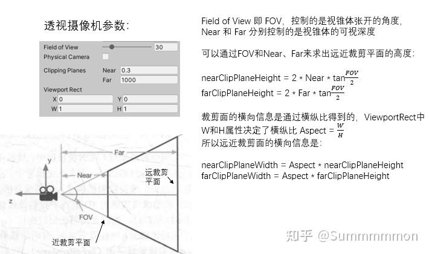
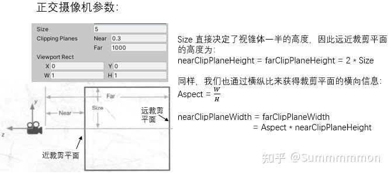
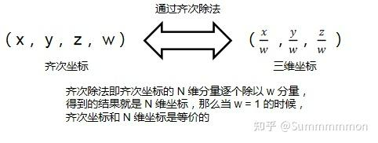
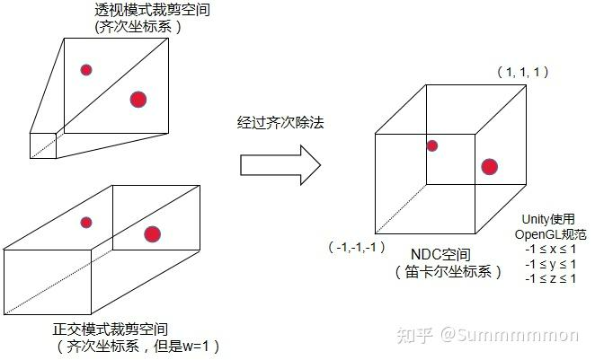
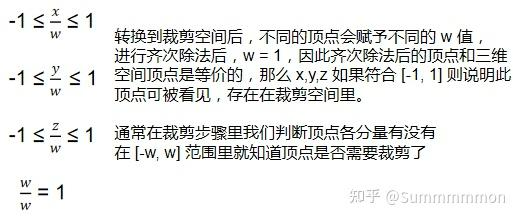

在 Unity 渲染管线里，顶点着色器（vertex）要把模型顶点转换到裁剪空间（clip space）里，然后在屏幕映射步骤顶点才会从裁剪空间映射到电脑屏幕上。

当然，可以注意到，对于摄像机控件，经常会看到“正交模式”和“透视模式”。这两者的视锥体是不同的，正交的视锥体是正方体，透视的视锥体是金字塔形状的锥体，两者在inspector面板中的参数是：

这两个模式的裁剪空间都是由6个面组成的封闭立方体组成，此时还没有变换到NDC坐标。超过这个立方体坐标都不再会被渲染。透视模式的两条平行直线可以相交于一点，但是在传统的笛卡尔xyz坐标系中确实永远不可能实现的，这就是xyzw的第四个分量w的功劳！

在透视摄像机的画面（透视空间）里使用的并不是笛卡尔坐标系，为了描述透视空间，科学家提出了 “ 齐次坐标 ” 的概念：

即，用 N+1 个数来表示 N 维空间中的点或向量，对于三维空间中的点，通常是使用 (x, y, z, w) 来表示三维空间中的点在齐次坐标空间中的位置。三维空间（笛卡尔坐标系）和齐次坐标系之间可以通过齐次除法进行相互转换，科学家定义的规则是：

齐次坐标系的一个功能便是能描述透视空间下的renti对于上面的平行线相交于一点，这个点的齐次坐标便是（x，y，z，0）。因为这个w值转换为一般的三维坐标便是无穷大，但是在齐次坐标系中它又是一个确定的值——这是在一般的笛卡尔坐标系中做不到的。此外，太阳光用的也是这个思路：w设置为0，xyz仅用于表达方向，这就等价于平行光矢量。

第二个功能就是能够描述坐标的位移；对于标准坐标系中，平移、旋转、缩放都需要不同的计算方式，尤其是位移变换，需要向量的加法；但是加法在性能消耗上是大于矩阵乘法的。而齐次坐标系，**所有的仿射变换（包括平移、旋转、缩放等）都可以用一个单一的矩阵乘法来表示**。这意味着复杂的变换序列可以被组合成单个矩阵，简化了变换流程。在视图空间进行设置时（点未作任何矩阵投影变换），

w的值可以区分点和向量：1为点，0为向量。因为向量不需要平移。

裁剪空间（clipspace）中的顶点是用齐次坐标表示的，在屏幕映射阶段里要对裁剪空间的顶点进行一个统一的齐次除法操作，来把顶点从齐次坐标系转换到笛卡尔坐标系的归一化设备坐标（Normalized Device Coordinates, NDC）空间里，经过这一步之后，裁剪空间将会变换到一个立方体内。

OpenGL 和 DirectX 对 NDC 空间的定义有所不同，前者定义 NDC 空间的 xyz 取值范围是 [-1, 1] ，而后者定义 NDC 空间的 xy 取值范围为 [-1, 1]，z 的取值范围为 [0, 1]。而 Unity 选择了 OpenGL 的规范：

  

要进行齐次除法就必须要获得正确的 w 分量，**投影矩阵之前的 w(0和1) 分量并没有齐次除法的用途**。

所以，投影矩阵的**一个作用**就是：**正确计算出从视图空间到透视空间中的顶点的 w 分量**，以便在之后的屏幕映射步骤中进行齐次除法操作，当一个顶点通过透视投影矩阵变换后，其位置会变为齐次坐标形式(x′,y′,z′,w′)。**注意，在裁剪空间这里的w′值并不是视图空间固定的1/0，而是取决于原始顶点的深度（即它离相机的距离）**。具体来说，对于一个位于视图空间中的点(x,y,z)，**经过透视投影矩阵变换后得到的新w'通常是基于该裁剪空间点的z值（深度）计算出来的。**

在裁剪空间中，完成所有必要的裁剪操作之后，为了将这些坐标映射到标准化设备坐标(NDC, Normalized Device Coordinates)空间，需要将齐次坐标除以w′（即进行透视除法：x′′=x′/w′,y′′=y′/w′,z′′=z′/w′）。这一过程使得远处的物体看起来更小，近处的物体看起来更大，从而实现了透视的效果。经过投影矩阵处理之后的顶点，将会给他的 w 分量赋予重要的含义。

投影矩阵的**另一个作用**是：对顶点的位置进行一定的缩放，使得顶点转换到 NDC 空间的范围中，

因为用视锥体的六个面来判断顶点是否在视锥体里，非常麻烦，我们希望用一个矩阵直接转换顶点进我们定义的视锥体里，转换之后，如果 x, y, z 符合条件：

  
 那么就会参与最终的渲染，全片完。

顺带一提，对于正交摄像机的话，他的裁剪空间是一个长方体，拍摄出来的画面是可以用三维坐标来描述的，不需要齐次坐标来描述，所以正交摄像机的投影矩阵对 w 分量没有进行操作（或者理解为正交摄像机的裁剪空间是 w 恒等于 1 的齐次坐标空间）。

