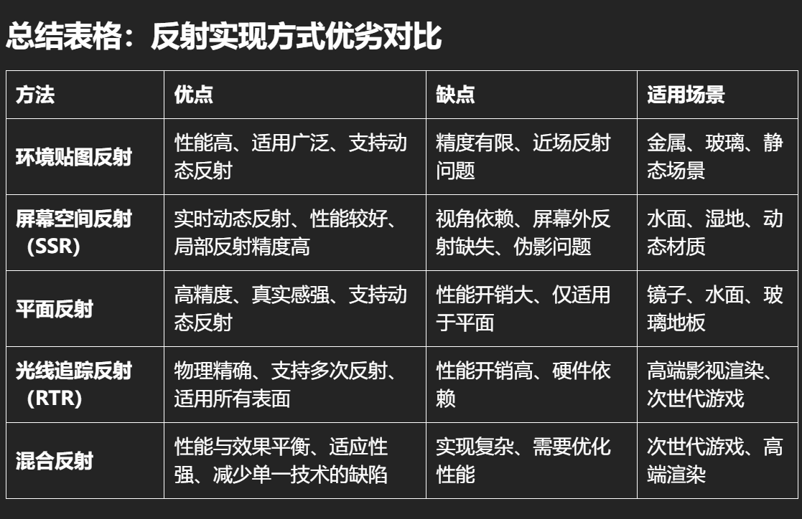

[屏幕空间反射 - Unity 手册](https://docs.unity3d.com/cn/2018.4/Manual/PostProcessing-ScreenSpaceReflection.html#:~:text=%E5%B1%8F%E5%B9%95%E7%A9%BA%E9%97%B4%E5%8F%8D%E5%B0%84%E6%98%AF%E7%94%A8%E4%BA%8E%E9%99%90%E5%88%B6%20%E9%95%9C%E9%9D%A2%E5%8F%8D%E5%B0%84%E5%85%89%20%E6%B3%84%E6%BC%8F%E9%87%8F%E7%9A%84%E7%90%86%E6%83%B3%E6%95%88%E6%9E%9C%E3%80%82%20%E5%B1%8F%E5%B9%95%E7%A9%BA%E9%97%B4%E5%8F%8D%E5%B0%84%20%E6%95%88%E6%9E%9C%E6%9B%B4%E6%B3%A8%E9%87%8D%E6%80%A7%E8%83%BD%E8%80%8C%E9%9D%9E%E8%B4%A8%E9%87%8F%EF%BC%8C%E5%9B%A0%E6%AD%A4%E6%98%AF%E5%9C%A8%E6%9C%80%E6%96%B0%E6%AC%BE%E6%B8%B8%E6%88%8F%E4%B8%BB%E6%9C%BA%E5%92%8C%E6%A1%8C%E9%9D%A2%E8%AE%A1%E7%AE%97%E6%9C%BA%E4%B8%8A%E8%BF%90%E8%A1%8C%E7%9A%84%E9%A1%B9%E7%9B%AE%E7%9A%84%E7%90%86%E6%83%B3%E9%80%89%E6%8B%A9%E3%80%82%20%E6%AD%A4%E6%95%88%E6%9E%9C%E4%B8%8D%E9%80%82%E5%90%88%E7%A7%BB%E5%8A%A8%E7%AB%AF%E5%BC%80%E5%8F%91%E3%80%82,%E7%94%B1%E4%BA%8E%E6%AD%A4%E6%95%88%E6%9E%9C%E4%BE%9D%E8%B5%96%E4%BA%8E%E6%B3%95%E7%BA%BF%20G%20%E7%BC%93%E5%86%B2%E5%8C%BA%20%28Normals%20G-Buffer%29%EF%BC%8C%E5%9B%A0%E6%AD%A4%E4%BB%85%E5%9C%A8%20%E5%BB%B6%E8%BF%9F%E6%B8%B2%E6%9F%93%E8%B7%AF%E5%BE%84%20%E4%B8%AD%E5%8F%AF%E7%94%A8%E3%80%82)

[平面反射探针 (Planar Reflection Probe) | High Definition RP | 10.4.0](https://docs.unity3d.com/cn/Packages/com.unity.render-pipelines.high-definition@10.4/manual/Planar-Reflection-Probe.html)

平面反射探针仅限于HDRP？这么离谱

[Just a moment...](https://docs.blender.org/manual/zh-hans/4.2/render/shader_nodes/shader/glass.html?utm_source=blender-4.2.0#bpy-types-shadernodebsdfglass)

