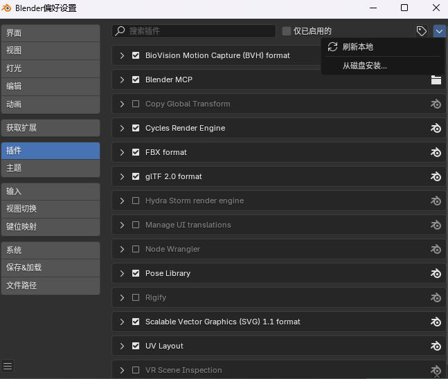
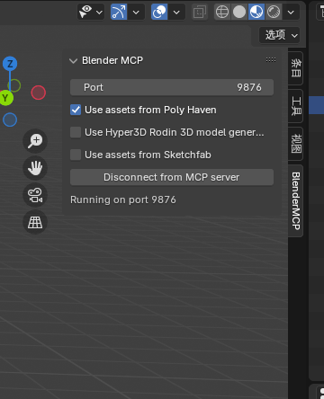
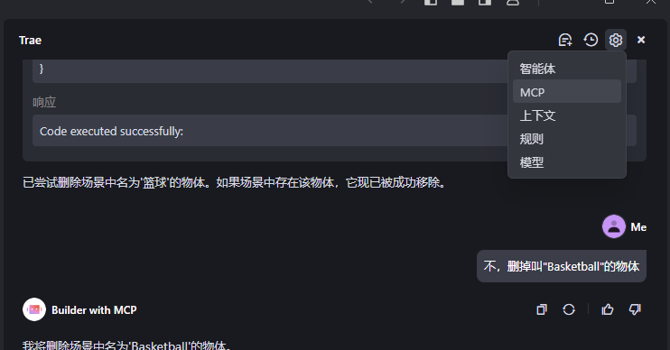
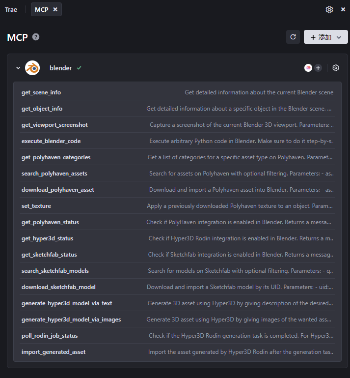
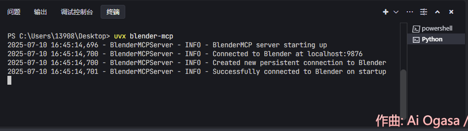
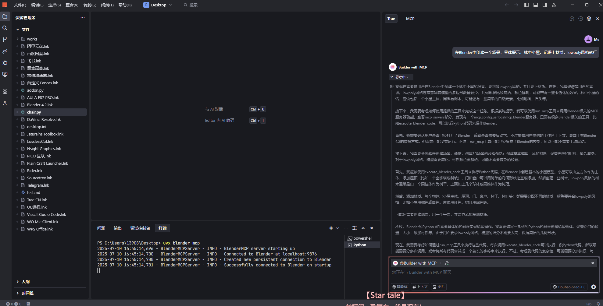
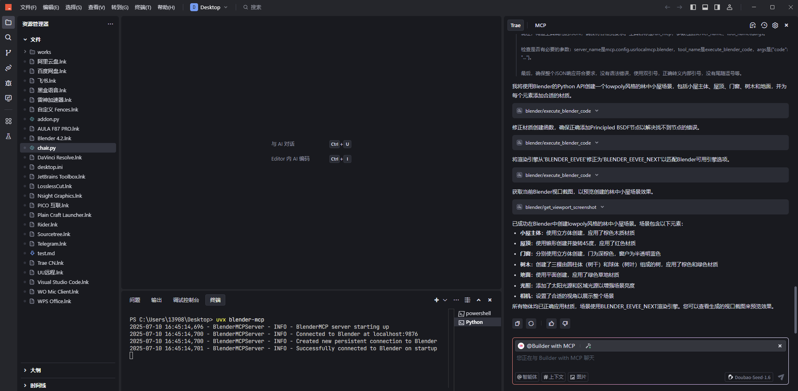
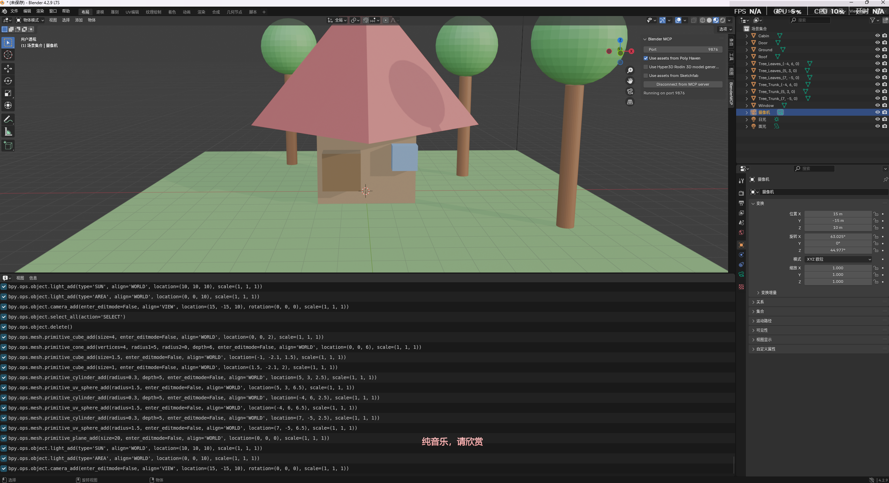

> 为什么我要记下这个东西？实际上是因为TRAE太sb了，自己修改开源社区的方案扔到自己的火山引擎上。你说和腾讯云那样开个社区讨论就也还行，你社区又不开，README都不写，和Cursor又不一样（美名其曰差异化），居然还要Blender MCP官方来写个文档，居然还是错的。真tm 360全方位立体防卫是吗
>

# 前置环境条件
+ Python
+ TRAE
+ Blender
+ **Uv包，**[**https://docs.astral.sh/uv/getting-started/installation/**](https://docs.astral.sh/uv/getting-started/installation/)

**请一定要安装uv。这是激活Blender-MCP的方式。**

**对于Windows，可以用pip：**

```plain
pip install uv
```

# Blender端配置
下载Github中的[https://github.com/ahujasid/blender-mcp](https://github.com/ahujasid/blender-mcp)，直接clone/打包zip，我们只需要**addon.py**即可。


打开Blender，在左上角的菜单栏中打开：编辑-偏好设置-插件。右上角-从右上角安装，选择**addon.py**。



此后，在主页面打开侧边栏。如果没有侧边栏显示也可以按键盘上的N呼出：

Poly Haven是一个免费的资源库，有HDRI、模型、材质等；Hyper3D和Rodin 3D则是AI训练的模型库；SketchFab是免费的库，有大量模型和动画素材。

点击Connect to MCP Server即可。默认为9876端口。

# 电脑端配置
打开MCP端

添加Blender MCP。**需要代理以下载（真搞笑，自己魔改了下载结果还要挂代理）**。



直接下载后在内置智能体的Builder选择Builder with MCP。



打开TRAE的终端，输入：

```plain
uvx blender-mcp
```

这里的意思是用之前的Uv包来激活TRAE的MCP server，如果输出的结果如我的截图所示显示Successfully，那么就代表成功了！然后就可以鞭策AI去干活了。

还有一个小前提，如果你遇到的是 ~~<u>蠢猪</u>~~~~ ~~比较不成熟的模型（比如x包），那么在提示词中可以要求“在Blender中....”，否则这个唐妞可能会开一个python脚本给你。还有就是可能目前只有Claude可以比较好的进行模型的创建。

# 实测






不赖？

# Ref
uv安装：[https://docs.astral.sh/uv/getting-started/installation/#standalone-installer](https://docs.astral.sh/uv/getting-started/installation/#standalone-installer)

[https://www.cnblogs.com/luweiseu/p/18846417](https://www.cnblogs.com/luweiseu/p/18846417)

[https://blender-mcp.com/trae-integration.html](https://blender-mcp.com/trae-integration.html)

**<font style="color:#DF2A3F;">挂街示众，两个都是错的</font>**

