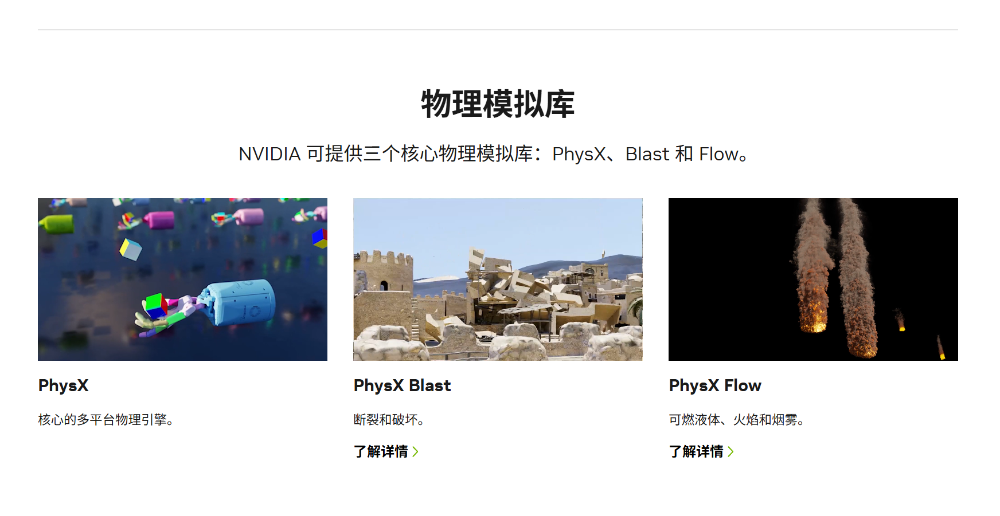

## 引言
这个契机其实是来自于我的一场面试

面试官：来讲一下披风的物理状态是如何实现的？

答：VAT（顶点形变贴图）

面试官：要动态的

答：magica clothes

面试官：我要的是物理算法是如何实现的。

我：。。。？我怎么知道？答：PhysX？

面试官：我要的是物理效果的实现 PhysX、clothes组件本质上也和magica clothes是一种东西

我：。。。。

所以这个文章就诞生了 这次我来讲一下目前常用的物理算法的实现

## Part. 1 我们常见的应用？
如果我们讲引擎的话，那就直接上最常见的引擎：

+ Unity Clothes组件 （默认PhysX）
+ Unreal Engine Chaos Clothes组件（默认PhysX）
+ 3dsMax/Maya PhysX；Bullet
+ Blender： Bullet, MantraFlow
+ Houdini: 多种解算器实现
+ Cinema 4D : <font style="color:rgb(44, 44, 54);">X-Particles、RealFlow、Bullet</font>

<font style="color:rgb(44, 44, 54);">从上面的一些名字我们也了解了个大概，什么，还是不是很具体？那就来看PhysX对于物理模拟的分类：</font>



简单而言，可以分为：

PhysX：

+ **布料和头发：** 以 **基于位置的动力学 (PBD)** 为主流，辅以引导线和约束系统。
+ **刚体：** 以 **基于冲量的解算器** (如顺序冲量) 为主，结合高效的碰撞检测算法。
+ **软体：常用 PBD**和**形状匹配**，对于高精度需求则可能涉及**FEM**。

PhysX Blast：

+ **PCG（Procedural Generation）：** 断裂/破坏模拟  、程序化建筑生成。以**Voronoi碎裂 (Voronoi Fracturing / Shattering)**  为主，使用**FEM**进行辅助应力分析和裂纹扩展的算法集成。可以选择在准备模型文件前完成**预切割/预碎裂 (Pre-fracturing / Pre-shattering)**抑或是**层级破坏 (Hierarchical Destruction / Support Graphs)**分配权重，实现更低的性能损耗和更好的破坏效果。

PhysX Flow：

+ ** Particle Instancing: **  液体、火焰、烟雾 的大批量粒子物理解算。 整个实现基于**网格的流体动力学（欧拉方法）、平流算法 (Advection Algorithms，常用半拉格朗日法 (Semi-Lagrangian Method) 或 MacCormack法 模拟速度场的粒子运动 )  、压力求解 (Pressure Projection / Poisson Equation，使用压力泊松方程求解)  、涡度限制 (Vorticity Confinement)  **以及**燃烧和浮力模型 (Buoyancy Models)  **进行模拟。有时会使用**稀疏网格/自适应网格 (Sparse Grids / Adaptive Grids) 进行性能优化 **


## Part 2. PhysX
这是什么东西啊 我怎么一点都不懂？没事我也不懂（

没关系，下面我们由浅入深了解一下常见的物理算法！

###  质点-弹簧系统 (Mass-Spring Systems):  
这其实是我们最常见的系统，也就是直接由骨骼驱动。经常玩MMD的朋友会知道，MMD模型对于头发、胸部、裙子这种需要物理的地方都会存在骨骼绑定对应物件。 MMD的物理骨骼（Rigid Body/Joint设置）本质上是刚体+约束的组合，但其实在约束算法上并没有什么使用，对于头发和裙子更像是“串联刚体+弹簧约束”，用“物理骨骼”+“刚体”+“约束”来近似实现质点-弹簧系统的效果，与质点-弹簧系统的思想高度一致（而且算法和这个高度类似）。

但是对于强调次世代模型工作流（如Marvelous Designer、Houdini）这种软件，在默认的参数预设中，对于头发抑或是反而没有骨骼绑定。这就是Mass-Spring Systems和有限元方法 (Finite Element Method - FEM)  的区别。有限元是什么在下面会提到。

 质点弹簧系统是最经典和基础的布料和头发模拟方法之一。同时也是Unity magica clothes的核心算法。它将物体（如布料或发束）离散化为一系列质点，这些质点之间通过弹簧连接。弹簧的力（拉伸、弯曲、剪切）根据胡克定律计算，然后通过牛顿第二定律（F=ma）更新质点的位置和速度。  

核心思路是：

+ 每个“骨骼”用一个**质点**表示，拥有位置、速度、质量等。
+ 相邻两质点用“弹簧”连接，弹簧有**弹性系数**、**阻尼**、**原长**。
+ 每帧根据**弹簧力**、**重力**、**阻尼**等计算每个质点的受力与运动。
+ 有需要时加入**碰撞检测**和**约束**。
+ 实现思路：
+ **定义数据结构**：质点、弹簧。
+ **初始化链条**：生成一串质点（用 Transform 表示），并设定它们之间的弹簧。
+ **物理更新**：每帧计算弹簧力和阻尼，更新质点位置。
+ **骨骼绑定**：将计算结果同步到动画骨骼或 Transform。

代码实现：

```csharp
using UnityEngine;
using System.Collections.Generic;

// 质点节点
public class MassPoint
{
    public Transform bone;     // 关联骨骼
    public Vector3 position;   // 当前世界位置
    public Vector3 velocity;   // 当前速度
    public float mass = 1.0f;  // 质量

    public MassPoint(Transform bone, float mass = 1.0f)
    {
        this.bone = bone;
        this.position = bone.position;
        this.velocity = Vector3.zero;
        this.mass = mass;
    }
}

// 弹簧约束
public class Spring
{
    public int pointA, pointB;    // 两端索引
    public float restLength;      // 原长
    public float stiffness;       // 弹性系数
    public float damping;         // 阻尼系数

    public Spring(int a, int b, float restLength, float stiffness, float damping)
    {
        pointA = a;
        pointB = b;
        this.restLength = restLength;
        this.stiffness = stiffness;
        this.damping = damping;
    }
}

// 主组件
public class MassSpringHair : MonoBehaviour
{
    public List<Transform> bones;          // 需要模拟的骨骼链
    public float stiffness = 500f;         // 弹性
    public float damping = 2f;             // 阻尼
    public float mass = 0.02f;             // 质量
    public Vector3 gravity = new Vector3(0, -9.81f, 0);

    private List<MassPoint> points;
    private List<Spring> springs;

    void Start()
    {
        Init();
    }

    void Init()
    {
        points = new List<MassPoint>();
        springs = new List<Spring>();

        // 创建质点
        foreach (var bone in bones)
            points.Add(new MassPoint(bone, mass));

        // 创建弹簧（相邻骨骼之间）
        for (int i = 0; i < bones.Count - 1; i++)
        {
            float restLen = Vector3.Distance(bones[i].position, bones[i+1].position);
            springs.Add(new Spring(i, i+1, restLen, stiffness, damping));
        }
    }

    void FixedUpdate()
    {
        float dt = Time.fixedDeltaTime;

        // 1. 力学积分（仅对非根节点）
        for (int i = 1; i < points.Count; i++)
        {
            var p = points[i];
            // 重力
            Vector3 force = gravity * p.mass;
            // 弹簧力（与前一节点）
            var s = springs[i-1];
            var pA = points[s.pointA];
            var pB = points[s.pointB];
            Vector3 dir = pB.position - pA.position;
            float dist = dir.magnitude;
            dir.Normalize();
            // 弹簧胡克定律
            Vector3 springForce = -s.stiffness * (dist - s.restLength) * dir;
            // 阻尼
            Vector3 relativeVel = pB.velocity - pA.velocity;
            Vector3 dampingForce = -s.damping * Vector3.Dot(relativeVel, dir) * dir;

            force += springForce + dampingForce;

            // 更新速度和位置
            p.velocity += force / p.mass * dt;
            p.position += p.velocity * dt;
        }

        // 2. 根节点跟随动画骨骼
        points[0].position = bones[0].position;
        points[0].velocity = Vector3.zero;

        // 3. 同步所有骨骼
        for (int i = 0; i < points.Count; i++)
            bones[i].position = points[i].position;
    }
}
```

---


###  约束动力学 (Constraint Dynamics)  
<font style="color:rgb(44, 44, 54);">约束动力学(Constraint Dynamics)是物理引擎和机器人控制系统中处理复杂约束关系的核心技术，它能够在存在各种几何和运动学约束条件下，准确高效地计算物体运动状态。约束动力学存在两种主要实现方法：基于位置的PBD算法和隐式约束力算法。</font>

#### <font style="color:rgb(44, 44, 54);"> （约束动力学分支）基于位置的动力学 Position Based Dynamics (RBD)</font>
<font style="color:rgb(44, 44, 54);">Position-Based Dynamics（PBD）是一种基于位置约束的物理模拟算法，核心是</font>**<font style="color:rgb(44, 44, 54);">约束满足</font>**<font style="color:rgb(44, 44, 54);">（Constraint Satisfaction），即通过调整物体的位置来满足特定的物理约束条件（如距离约束、碰撞约束、面积约束等）。广泛应用于实时动态系统模拟（如布料、软体、流体等）。与上个算法，使用基于力或冲量的动力学方法不同，PBD通过直接操作物体的位置来满足物理约束，从而避免了数值积分中的不稳定性问题。不仅支持大量的并行计算，而且可以支持多种约束类型（碰撞约束、布料约束、流体约束）</font>

**<font style="color:rgb(44, 44, 54);">注意：PBD属于下面的约束动力学的一个分支</font>**

**基本流程**

1. <font style="color:rgb(44, 44, 54);">对每个点应用外力（如重力），计算临时新位置（预测位置）。</font>
2. <font style="color:rgb(44, 44, 54);">对所有约束（弹簧、体积、碰撞等）进行多次迭代，直接“拉回/推开”点的位置，使其满足约束。</font>
3. <font style="color:rgb(44, 44, 54);">用修正后的位置更新速度，再同步到渲染模型或骨骼。</font>

**<font style="color:rgb(44, 44, 54);">Ref</font>**<font style="color:rgb(44, 44, 54);">：</font>

[https://matthias-research.github.io/pages/publications/posBasedDyn.pdf](https://matthias-research.github.io/pages/publications/posBasedDyn.pdf)

[https://www.cs.cmu.edu/~baraff/sigcourse/](https://www.cs.cmu.edu/~baraff/sigcourse/)

#### （约束动力学分支）隐式约束力算法
<font style="color:rgb(44, 44, 54);">隐式约束力算法通过直接求解约束力来确保约束条件得到满足。这类算法通常基于拉格朗日乘子法或线性互补问题(LCP)求解框架，适合处理刚性约束和复杂接触问题。</font>

<font style="color:rgb(44, 44, 54);">什么是隐式？</font>

+ **显式（Explicit）**<font style="color:rgb(44, 44, 54);">：  
</font><font style="color:rgb(44, 44, 54);">直接用当前的力和状态，计算下一帧的位置和速度。例如欧拉显式积分，适合小步长、低刚性的模拟。</font>
+ **隐式（Implicit）**<font style="color:rgb(44, 44, 54);">：  
</font><font style="color:rgb(44, 44, 54);">用</font>**下一帧的状态**<font style="color:rgb(44, 44, 54);">（未知）来计算力和速度，通常需要解方程组。适合高刚性或大步长的系统，更加稳定。</font>

**<font style="color:rgb(44, 44, 54);">约束条件整合</font>**<font style="color:rgb(44, 44, 54);">：将不同类型的约束(如等值约束、接触约束、摩擦约束)整合到统一的求解框架中。</font>

+ <font style="color:rgb(44, 44, 54);">在模拟带有</font>**约束**<font style="color:rgb(44, 44, 54);">（如距离、体积、弯曲、碰撞等）的系统时，</font>**隐式约束力算法**<font style="color:rgb(44, 44, 54);">指的是：  
</font>**在积分过程中，把约束力以隐式方式耦合进整体动力学方程，一起求解。**
+ <font style="color:rgb(44, 44, 54);">这样做的好处是：即使约束很强、弹簧很硬，系统依然不会“爆炸”，不会因为步长过大而数值发散。  
</font>

###  有限元方法 (Finite Element Method - FEM)  
 FEM 是一种更精确但也更复杂的模拟方法。它将物体划分为更小的单元（例如三角形或四面体），并在这些单元上定义形变能量。通过最小化总能量来求解物体的平衡状态或动态行为。  

+ **优点：** 物理上非常精确，能够模拟复杂的材料属性和形变。 
+ **缺点：** 计算量巨大，通常不适用于实时游戏，更多用于离线渲染或需要高精度模拟的场合。
+ **应用：** 高精度布料模拟、肌肉模拟等

###  链式结构/骨骼动力学 (Chain/Skeletal Dynamics)  
对于头发或一些垂坠的饰品，可以将其简化为一系列通过关节连接的刚性链条或骨骼。通过计算关节的旋转和父子骨骼的传递运动来模拟动态效果。通常会结合IK（反向动力学）或物理方法（如PBD）来驱动这些链条。

+ **优点：** 相对简单，计算效率较高，容易与角色骨骼动画系统集成。
+ **缺点：** 对于大面积的布料模拟效果有限，更适合模拟线状或带状结构。
+ **应用：** 马尾辫、长发、飘带、项链等。

###  Verlet积分 (Verlet Integration):  


+ Verlet 积分是一种数值积分方法，常用于模拟粒子系统。它的特点是不直接存储速度，而是根据当前位置、前一时刻位置和加速度来推算下一时刻的位置。
+ **优点：** 计算简单，稳定性较好，能耗散较小，适合约束多的系统。
+ **缺点：** 引入阻尼等效果可能不如其他方法直观。
+ **应用：** 布料模拟、绳索、毛发、粒子系统等。
+ **实现细节：** Verlet 积分的核心是存储当前位置和先前位置，速度由这两个位置的差异隐含给出。


