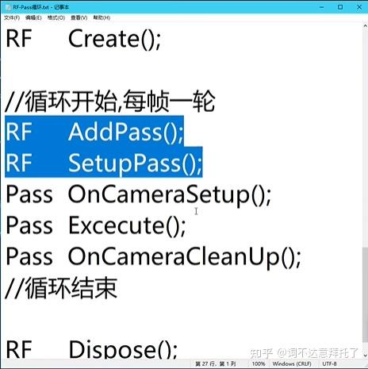

因为在有些时候一般的Shader做不到一些东西，比如说提取深度图或者法线图计算，当然你可以写C#脚本来在每次的Update中获取，但是每次要进行修改的时候就只能在C#和Shader之间来回切换，但是邮电不美观（因为每次都要进行声明-传递-接收），更恼火的是用**C#脚本不能指定在某个渲染顺序进行渲染，也就是说你要每次在最后的工序进行渲染，而某些效果是不能在最后的时候才渲染 （如体积光和光线步进）。  **

主播主播，你的C#脚本还是太吃操作了，有没有更简单（大嘘）的方法来实现这些高级功能呢？

有的兄弟有的，RenderFeature可以获取渲染中的深度图、法线图和ShadowMap，甚至可以指定插入到某个渲染顺序进行处理。

> 在Unity使用Scriptable Render Pipeline时，渲染顺序通常是从**开始帧的资源准备和初始化工作**，接着进行**环境预计算**如阴影贴图和光照探针的更新，**随后渲染不透明物体**并根据深度排序优化性能，之后**渲染天空盒**，再接着**按距离从后往前渲染透明物体**以确保正确的透明效果，然后**应用包括色调映射、景深等后期处理**效果增强画面质量，**最后渲染用户界面**确保其位于最上层并在完成最终帧输出前进行结束帧处理以清理资源准备下一帧。
>

可以插入到上面的任意一个顺序并还能进行进一步的细分，其实就是将SRP进行抽象化并集成为了一个api

## RenderFeature的主要结构
一个完整的RenderFeature可以由下面的部分组成：

1. RenderFeature
2. RenderPass
3. ShaderPass（可选，这里就是正常的Shader）

补充：Unity**自带的Add RenderFeature会给你一些可用的框架**，比如说全局屏幕效果。这是你可以将一般的Shader拖进去都行，采用的数据块是_Blit。

### RenderFeature主要框架
```csharp
RenderFeature : ScriptableRendererFeature
{
    RenderPass renderpass;  //声明RenderPass
    Create();   //实例化renderpass,设置渲染顺序等操作
    AddRenderPasses();   //将上一步实例化的renderpass添加进渲染管道使用
}

```

+ 继承 `ScriptableRendererFeature` 并实现 `Create()` 和 `AddRenderPasses()` 方法。
+ 在 `Create()` 中初始化需要的资源和渲染逻辑。
+ 在 `AddRenderPasses()` 中将自定义的 `ScriptableRenderPass` 注册到渲染器队列中。

### RenderPass主要框架
RenderPass后面有一个Pass，可以联想到Shader里面也有Pass。RenderPass就是连接Shader的一个东西。可以理解为具体操作。

```csharp
RenderPass : ScriptableRenderPass
{

        RenderPassEvent(...)  //指定渲染的顺序
        Config(...) //可选，指定配置渲染目标（Render Target）和深度缓冲区
        Execute(...)    //使用上一个函数准备的参数进行具体的操作
        FrameCleanup(...) //释放临时渲染目标
            //下面还可以写一些自定义函数，用于对应的调用情况
    }
```

+ ** **`**RenderPassEvent**`：指定这个 Render Pass 应该插入到渲染流程的哪个阶段。  
+ config如果你需要渲染到一张自定义纹理而不是直接到屏幕，就可以在这里设置渲染目标。
+ Execute：核心的操作，对于计算部分都在这里开始
+ Frame CleanUp：清理内存以防内存泄漏



> <font style="color:rgb(83, 88, 97);">这里来个形象点的比喻，就拿蟹堡王的运作方式来举例，可以把我们当做是顾客，前台就是章鱼哥，后台（RenderPass，Shader）就是RenderPass ------ 我们在前台点餐（设置参数），章鱼哥（RenderFeature）就告诉海绵宝宝（RenderPass，Shader）做几个汉堡，该放什么酱等。可以这样理解。</font>
>

## <font style="color:rgb(83, 88, 97);">示例代码（这里用的是RenderFeature和Shader的结合）</font>
这里以我自己做的模仿openAI发布会上的像素化LED广告牌Shader来示例。目的是抓取camera的渲染并输出到纹理，转交给Shader后再将Shader处理过的纹理返回到相机渲染中。

RenderFeature部分

```csharp
using UnityEngine;
using UnityEngine.Rendering;
using UnityEngine.Rendering.Universal;

public class PixelizeRenderFeature : ScriptableRendererFeature
{
    [System.Serializable]
    public class Settings
    {
        [Header("General Settings")]
        [Range(0, 1)]
        public float mixAmount = 0.5f;
        
        [Header("Image Settings")]
        [Range(2, 512)]
        public float pixelResolutionX = 16f;
        [Range(2, 512)]
        public float pixelResolutionY = 16f;
        public bool customresolution = false;       
        [Header("Circle Settings")]
        [Range(0.01f, 0.5f)]
        public float circleRadius = 0.4f;
        [Range(0.001f, 0.1f)]
        public float edgeSharpness = 0.01f;
        
        // Circle UV缩放
        [Range(2,512)]
        public float uvScaleX = 2.0f;
        [Range(2,512)]
        public float uvScaleY = 2.0f;
        public bool linkUVScales = false;
        public Vector2 circleOffset = new Vector2(0.5f, 0.5f);
        public Color circleColor = Color.white;
        public Color backgroundColor = Color.black;
        
        [Header("GrayScale Settings")]
        public bool enableGrayscale = false;
        public Color shadowColor = new Color(0.2f, 0.3f, 0.5f, 1f);
        public Color highlightColor = new Color(0.9f, 0.7f, 0.4f, 1f);
        [Range(0.1f, 5f)]
        public float contrast = 1f;
        
        [Header("Sync Settings")]
        public bool adaptToScreenRatio = false;
    }

    // 在Inspector中公开设置
    public Settings settings = new Settings();
    
    class SDFCircleRenderPass : ScriptableRenderPass
    {
        private Material _material;
        private RenderTargetHandle tempTexture;
        private Settings settings;

        public SDFCircleRenderPass(Settings settings)
        {
            this.settings = settings;
            tempTexture.Init("_TempSDFCircleRT");
        }

        // 只接受材质
        public void Setup(Material material)
        {
            this._material = material;
        }

        public override void Execute(ScriptableRenderContext context, ref RenderingData renderingData)
        {
            if (_material == null)
                return;

            // 从renderingData获取相机颜色目标
            var cameraColorTarget = renderingData.cameraData.renderer.cameraColorTarget;

            CommandBuffer cmd = CommandBufferPool.Get("Custom/TiledSDFCirclesAdvanced");
            
            _material.SetFloat("_MixAmount", settings.mixAmount);
            _material.SetFloat("_PixelResolutionX", settings.pixelResolutionX);
            _material.SetFloat("_PixelResolutionY", settings.pixelResolutionY);
            _material.SetFloat("_LinkResolutions", settings.customresolution ? 1.0f : 0.0f);
            _material.SetFloat("_CircleRadius", settings.circleRadius);
            _material.SetFloat("_EdgeSharpness", settings.edgeSharpness);
            _material.SetFloat("_UVScaleX", settings.uvScaleX);
            _material.SetFloat("_UVScaleY", settings.uvScaleY);
            _material.SetFloat("_LinkUVScales", settings.linkUVScales ? 1.0f : 0.0f);
            _material.SetVector("_CircleOffset", settings.circleOffset);
            _material.SetColor("_CircleColor", settings.circleColor);
            _material.SetColor("_BackgroundColor", settings.backgroundColor);
            _material.SetInt("_EnableGrayscale", settings.enableGrayscale ? 1 : 0);
            _material.SetColor("_ShadowColor", settings.shadowColor);
            _material.SetColor("_HighlightColor", settings.highlightColor);
            _material.SetFloat("_Contrast", settings.contrast);
            // byd字符串查找怎么你了（生气）
            

            RenderTextureDescriptor descriptor = renderingData.cameraData.cameraTargetDescriptor;
            cmd.GetTemporaryRT(tempTexture.id, descriptor);

            // 使用cameraColorTarget替代_source
            cmd.Blit(cameraColorTarget, tempTexture.Identifier(), _material);
            cmd.Blit(tempTexture.Identifier(), cameraColorTarget);
        
            context.ExecuteCommandBuffer(cmd);
            CommandBufferPool.Release(cmd);
            
            //Here is Debug
            Debug.Log($"Setting parameters: (Tip in l108)circleRadius={settings.circleRadius}");
        }


        public override void FrameCleanup(CommandBuffer cmd)
        {
            cmd.ReleaseTemporaryRT(tempTexture.id);
        }
    }

    private SDFCircleRenderPass _renderPass;
    private Material _material;

    public override void Create()
    {
        // 加载着色器并创建材质
        Shader shader = Shader.Find("Custom/TiledSDFCirclesAdvanced");
        if (shader == null)
        {
            Debug.LogError("无法找到SDF圆形后处理着色器!");
            return;
        }
        
        _material = new Material(shader);
        
        // 创建渲染通道
        _renderPass = new SDFCircleRenderPass(settings);
        
        // 设置渲染事件时机 - 在后处理之前
        _renderPass.renderPassEvent = RenderPassEvent.BeforeRenderingPostProcessing;
    }

    public override void AddRenderPasses(ScriptableRenderer renderer, ref RenderingData renderingData)
    {
        if (_material == null)
            return;
        
        // 只传递材质，不传递相机颜色目标
        _renderPass.Setup(_material);
        renderer.EnqueuePass(_renderPass);
    }
    
    protected override void Dispose(bool disposing)
    {
        if (disposing && _material != null)
        {
            CoreUtils.Destroy(_material);
        }
    }
}
```

Shader部分：

```cpp
Shader "Custom/TiledSDFCirclesAdvanced"
{
    Properties
    {
        [Header(GeneralSettings)]
        _MixAmount ("MixAmount(Image&Circle)", Range(0, 1)) = 0.5//混合量
        
        [Header(ImageSettings)]
        _MainTex ("Texture", 2D) = "white" {}
        [Toggle] _LinkResolutions ("Open Custom X/Y Resolutions", Float) = 0 // 链接XY分辨率的开关
        _PixelResolutionX ("Pixel Resolution (X)", Range(2,512)) = 16
        _PixelResolutionY ("Pixel Resolution Y", Range(2,512)) = 16
        
        
        [Header((I recommend Pixel Resolution is same with UV Scale))]
        
        [Header(CircleSettings)]
        _CircleRadius ("Circle Radius", Range(0.01, 0.5)) = 0.4
        _EdgeSharpness ("Edge Sharpness", Range(0.001, 0.1)) = 0.01
        _UVScaleX ("UV Scale X", Range(1, 512)) = 2.0
        _UVScaleY ("UV Scale Y", Range(1, 512)) = 2.0
        [Toggle] _LinkUVScales ("Link UV X/Y", Float) = 1
        _CircleOffset ("Circle Offset", Vector) = (0.5, 0.5, 0, 0)
        _CircleColor ("Circle Color", Color) = (1,1,1,1)
        _BackgroundColor ("Background Color", Color) = (0,0,0,1)
        
        [Header(GrayScaleSettings)]
        [Toggle] _EnableGrayscale ("Enable Grayscale", Float) = 0//灰度开关控制
        _ShadowColor ("Shadow Color", Color) = (0.2, 0.3, 0.5, 1.0)//阴影色
        _HighlightColor ("Highlight Color", Color) = (0.9, 0.7, 0.4, 1.0)//高光色
        _Contrast ("Contrast", Range(0.1, 5)) = 1.0//对比度
    }
    SubShader
    {
        Tags { "RenderType"="Opaque" "Cull"="Off" "ZWrite"="Off" "ZTest"="Always" }
        LOD 100

        Pass
        {
            HLSLPROGRAM
            #pragma vertex vert
            #pragma fragment frag
            #include "UnityCG.cginc"
            #include "GrayScale.hlsl"

            struct appdata
            {
                float4 vertex : POSITION;
                float2 uv2 : TEXCOORD1;
                float2 uv : TEXCOORD0;
            };

            struct v2f
            {
                float2 uv : TEXCOORD0;
                float2 uv2 : TEXCOORD1;
                float4 vertex : SV_POSITION;
            };

            sampler2D _MainTex;
            float _PixelResolution;
            float _CircleRadius;
            float _EdgeSharpness;
            float _UVScaleX;
            float _UVScaleY;
            float2 _CircleOffset;
            float4 _CircleColor;
            float4 _BackgroundColor;
            float _MixAmount;
            float _EnableGrayscale;
            float4 _ShadowColor;
            float4 _HighlightColor;
            float _Contrast;
            float _LinkResolutions;
            float _PixelResolutionX;
            float _PixelResolutionY;
            float _LinkUVScales;


            v2f vert (appdata v)
            {
                v2f o;
                o.vertex = UnityObjectToClipPos(v.vertex);
                o.uv = v.uv;
                o.uv2 = v.uv2;
                return o;
            }

            fixed4 frag (v2f i) : SV_Target
            {
                //像素化部分
               // 原始 UV 坐标
                float2 uv = i.uv;
                // 计算像素化UV - 使用独立的X和Y分辨率
                float2 pixelResolution = float2(_PixelResolutionX, _PixelResolutionY);
                // 如果链接分辨率开关打开，则使用X分辨率
                if (_LinkResolutions < 0.5) {
                    pixelResolution.y = pixelResolution.x;
                }
                float2 pixelatedUV = floor(uv * pixelResolution) / pixelResolution;
                // 使用修改后的 UV 坐标从纹理中采样
                fixed4 col0 = tex2D(_MainTex, pixelatedUV);
                if(_EnableGrayscale > 0.5)
                {
                    float grayscale = GrayscaleStandard(col0.rgb);
                    float4 tintedGrayscale = GrayscaleDuotone(
                    grayscale,
                    _ShadowColor,  // 阴影色(冷色调)
                    _HighlightColor,  // 高光色(暖色调)
                    0.5                          // 中点
                    );
                    tintedGrayscale.rgb = pow(tintedGrayscale.rgb,_Contrast);
                    col0 = tintedGrayscale;
                }

                 //Circles部分
                 // 计算Circle的UV缩放
                float2 uvScale = float2(_UVScaleX, _UVScaleY);
                if (_LinkUVScales < 0.5)
                {
                    uvScale.y = uvScale.x;
                }
                
                // 应用UV缩放和偏移
                float2 scaledUV = i.uv * uvScale;
                float2 tiledUV = frac(scaledUV);
                // 以指定偏移为中心
                float2 centeredUV = tiledUV - _CircleOffset;
                // 计算到圆心的距离
                float distance = length(centeredUV);
                // 平滑边缘的SDF圆
                float circle = smoothstep(_CircleRadius + _EdgeSharpness, _CircleRadius - _EdgeSharpness, distance);
                // 混合颜色
                fixed4 col1 = lerp(_BackgroundColor, _CircleColor, circle);
                fixed4 finalColor = lerp(col0, col1, _MixAmount);
                return finalColor;
            }
            ENDHLSL
        }
    }
}
```

Shader在RenderFeature的联动引用原理是从缓存区Blit中获取这个Shader的名字，我还以为有多高大上呢原来就是找索引啊（难绷）

注：Rider在使用在缓存池进行字符串索引的时候会提示“字符串搜索的方式低效”，如果有更高效的办法就是从缓存区里获取ID，替换掉字符串。


