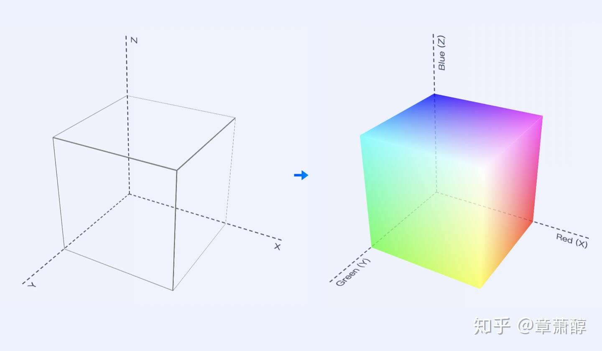
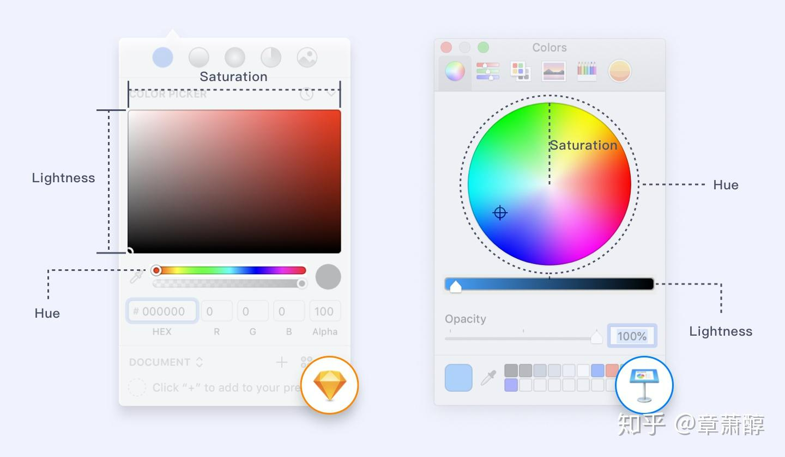
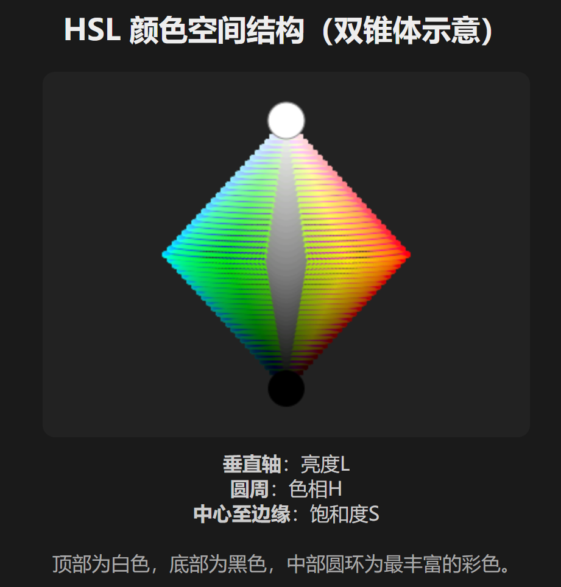
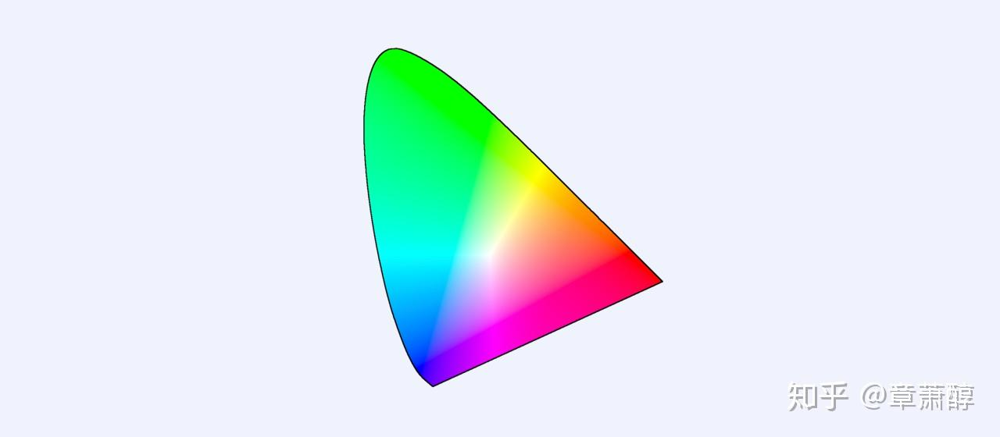
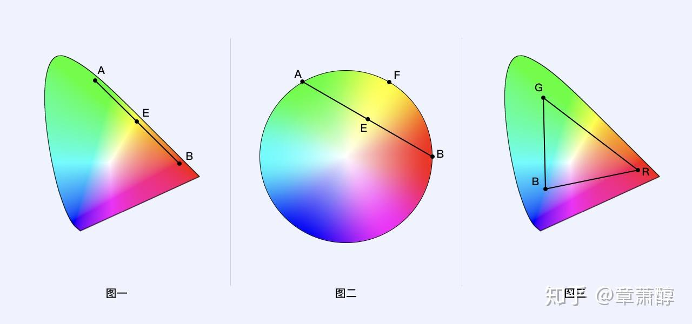
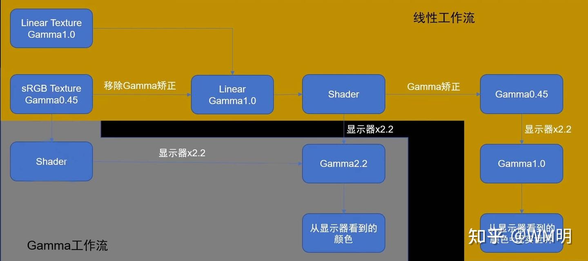

# 引言
这是我偶然在Houdini的时候在导出的时候遇到的问题，Houdini为了更加可定制化的工作流直接采用了exr作为输出；但是exr文件在ps里面打开后的效果和达芬奇的效果完全不一致，恰好当时色彩空间也是我的心头之痛，而且几乎没有从图形学上解释色彩的文章，比较深的也只是讲到了色度图；因此打算写这篇文章。

# 色彩的表示
我们都知道，在选择颜色的时候，不同的软件有不同的办法来调整颜色。如果我们把三原色R,G,B来表示为坐标系的三个数据，就可以得到科研中常用于色彩分析的三维空间：



当然，这是计算机领域的表示法，艺术家们需要一个更加直观的表示方法，于是除了简单的RGB直接相加，另一种表示方法HSL应运而生，<font style="color:rgb(44, 44, 54);">HSL模型可以更直观地反映了人类对颜色的感知方式，</font>直接利用Hue(色相),Saturation(饱和度),Lightness(明度）表示。我们Ps中的选色盘和选色图都是基于这个标准。



但其实HSL并不是最终发送给计算机的，计算机最后还是用RGB来进行色彩的表示。因为实际上RGB的数据结构只有(x,y,z)，即colorRGB = vec3(x,y,z)。也就是说，这个数值实际上只能直接表示Hue和Saturation，而Lightness则是用RGB进行一套公式转换出来的；在一些shader中，比如要进行亮度阈值计算，就会直接提取RGB来算出Lightness，再套亮度判断。

另外HSL和RGB之间是可以无损转换的，虽然两者的表示方法不一致(HSL:0~360°,0~100%,0~100%;RGB **8bit**:0-255，如果都取int则<font style="color:rgb(25, 27, 31);">360x101x101=3672360（360万色）和256x256x256=16777216 （1670万色），</font>**<font style="color:rgb(25, 27, 31);">亦可以用16进制表示:#000000~#FFFFFF，一个FF表示为2的8次幂255</font>**)，**HSL 色轮的某些组合（特别是高亮度或低饱和度）会收敛到白色、灰色、黑色**，导致一些 HSL 组合映射到相同的 RGB 值；但是理论上，在算法下只要表达的精度够高，两者之间仍然是可以进行色彩转换的。

有一个理论是说HSL能够表达的色彩要少于RGB，这个说法属于是理所当然的认为HSL认为为整数/一位小数了，**我在色轮中给你看到一位小数 != 这个颜色的实际HSL值。**除此以外，HSL有一个特点就是因为引入了Lightness，那么Lightness约接近于0/1，那么颜色重合度越高（因为越接近于白色和黑色）

因此HSL的色彩坐标图更加接近于双锥体，和上图的RGB三维坐标图作为对比：

+ **H（Hue，色相）**：绕圆周旋转，360°，代表颜色种类。
+ **S（Saturation，饱和度）**：从中心（灰色）到边缘（最纯色）。
+ **L（Lightness，亮度）**：从底部（黑）到顶部（白），中间是最大纯度。




并且现代计算机为了进行图层叠加或者混合（也就是alpha test、alpha clipping等等和透明度有关的计算），会引入一个新的量Alpha，也会使用colorRGBA = vec4(x,y,z,a)，不过至于引入alpha之后色彩要如何叠加表示我就先不讲了，这里///又是一个大坑...

## 扩展：CIE色度图
<font style="color:rgb(25, 27, 31);">实际上，rgb(255, 0, 0) 或者 #FF0000 这样的色值参数，仅仅只是告诉计算机显示设备：请你展示纯红色，不掺杂一点蓝也不掺杂一点绿的纯红色。此时，显示设备会尽自己的全力去显示一个 100% 饱和度的纯红色，但不同的显示设备，他们的展示效果是不同的，其中某些显示设备的红色看起来可能会比另外一些更鲜艳（比如手机屏幕看起来比电脑屏色彩艳丽）。这就带来了一个问题：RGB 色值的表现是基于显示设备的，不同的显示设备对 RGB 的表达能力有所不同，虽然他们接受到的色值参数是一致的，但呈现出来的颜色的视觉感受却并不相同，换言之就是他们并没有展示出相同的颜色，那到底哪个红色才是准确的呢？</font>

<font style="color:rgb(25, 27, 31);">实际上这个问题早在 1931 年就得到了解决，为了定义一种与设备无关的颜色模型，让色彩能够脱离设备而准确定义，1931 年国际照明委员会（CIE）的色彩科学家们在 </font>[<font style="color:rgb(9, 64, 142);">RGB 模型</font>](https://zhida.zhihu.com/search?content_id=114846309&content_type=Article&match_order=1&q=RGB+%E6%A8%A1%E5%9E%8B&zhida_source=entity)<font style="color:rgb(25, 27, 31);">基础上，通过数学的方法推导出了理论的 RGB 三基色，并以此创建了一个标准的色彩系统。而这一色彩系统的常见展示方式，就是 CIE 色度图（CIE chromaticity diagram）（如下图），我们之后所讨论的色彩空间往往都是基于这个色度图去展示的。</font>



<font style="color:rgb(25, 27, 31);">为什么 CIE 色度图会长这个样子，一个看起来没什么规则的奇怪三角形，之前的圆形色盘不是更美观吗？事实上这个形状是通过数学计算得来的，之所以计算结果长这样，其中一个重要规则是 “</font>[<font style="color:rgb(9, 64, 142);">感知均匀性</font>](https://zhida.zhihu.com/search?content_id=114846309&content_type=Article&match_order=1&q=%E6%84%9F%E7%9F%A5%E5%9D%87%E5%8C%80%E6%80%A7&zhida_source=entity)<font style="color:rgb(25, 27, 31);">（perceptual uniformity）”，说人话就是这个形状更容易表现色彩之间的关系。还是没明白？没关系，我们举个例子:</font>

<font style="color:rgb(25, 27, 31);">比如图一中，如果 A 点（绿色） 和 B 点（红色）两个点的颜色等比例混合，那么得到的新的颜色黄色一定在 A 点和 B 点连线的中点 E 点上，反观（图二）在圆形色盘（非感知均匀性图形）上去连接纯绿色 A 和纯红色 B 两个点，他们的中点 E 并不是纯黄色，纯黄色在圆周 F 点上；换言之，如果 A 点和 B 点两个颜色通过任意比例混合，那么得到的新的颜色也必然在 A B 两点的连线上。也就是说，（图三）R G B 三个点的颜色通过任意比例混合，他们所表现出来的新颜色也必然在这个三角范围内。</font>

<font style="color:rgb(25, 27, 31);">这里要声明一下，除了几何上的追求，还有一个就是生物学上对于感知的特点：</font>

+ **CIE 色度图**<font style="color:rgb(25, 27, 31);">（如 </font>**<font style="color:rgb(25, 27, 31);">CIE 1931 xy 色度图</font>**<font style="color:rgb(25, 27, 31);">，最常见的显示器色域可视化，除了1931还有很多版本，比如说1960UCS系列、1976系列、CIECAM系列）的边界是根据人眼对颜色的实际感知和混合结果、而不是简单的几何规则推算出来的。</font>
+ <font style="color:rgb(25, 27, 31);">它追求的是“感知均匀性”——即色彩空间的距离对应人眼感知的色差，空间中距离相等的两点，人的感知色差也尽量相等。</font>
+ <font style="color:rgb(25, 27, 31);">红色和绿色在这两个色彩空间中差异最大，也就是说如果采用蓝色调作为界面主色的话，在不同的色彩空间设备上差异会小一些，相反，采用红色和绿色，表现差异会比较大，越是饱和度高的红、绿色，差异越明显。</font>



### 为什么都是红色，相同的数值（如P3，sRGB都是0~255的RGB表示），在CIE的坐标映射却不同？
**sRGB、P3等色彩空间的红绿蓝基色的CIE xy坐标**，其实是由其标准定义直接给出的，来源于它们的物理“基色光”的CIE 1931 xy色度坐标。~~**（直接去CIE委员会查坐标就行了）   还有P3和sRGB其实用的数据共通只是显示器协议**~~

换而言之，每个RGB色彩空间（比如sRGB、P3、AdobeRGB）都规定了其R、G、B三基色的CIE xyY坐标（通常Y=1，因为y代表亮度，这个已经不是我们色域考虑的范围），再加上白点（D65等），这样就能唯一确定该空间的全部色域。  

# 色彩的数据结构
**色深（bit depth）在数据结构上如何体现**，其实就是图像文件、帧缓冲、内存等如何“用多少比特来存每个像素/通道的颜色值”。

## 1. **单个像素的数据结构**
### **A. 8bit色深的RGB图片（最常见）**
+ 每个像素有3个通道（R、G、B），每个通道用8位（1字节）。
+ **每个通道能表达0~255（256种）数值。**
+ 一个像素一共占3字节（24位）。
+ 数据排列方式通常是交错（R, G, B, R, G, B...）。

**示例（像素值）：**

| R | G | B |
| --- | --- | --- |
| 78 | 129 | 255 |


**二进制数据：**

```plain
01001110 10000001 11111111
```


### **B. 10bit、12bit色深的RGB图片（高端显示/渲染/视频）**
+ 每通道用10位或12位，能表示1024或4096级。
+ 数据排列： 
    - 常见存储方式是16位对齐（即每通道用16位，但高位有效，低位补0）。
    - 也有“打包存储”：比如30位图像（R10G10B10A2），4字节打包3个10bit加2bit alpha。

**示例（10bit每通道）：**

| R | G | B |
| --- | --- | --- |
| 278 | 800 | 1023 |


**二进制数据（打包方式，举例）：**

```plain
000100010110 1100100000 1111111111
```


### **C. 16bit、32bit色深（高精度浮点）**
+ 每通道用16位无符号整数（0~65535），或者32位float（如OpenEXR格式）。
+ 用于HDR渲染、科学图像、电影特效等。


## 2. **整个图像的数据结构**
以**2x2像素RGB 8bit**图片为例：

| | | |
| --- | --- | --- |
| (R0,G0,B0) | (R1,G1,B1) | |
| (R2,G2,B2) | (R3,G3,B3) | |


内存中数据排列（交错存储）：

```plain
R0 G0 B0 R1 G1 B1 R2 G2 B2 R3 G3 B3
```

总共需要2×2×3=12字节。


## 3. **色深在文件格式中的表现**
+ **PNG**：支持8bit和16bit色深（每通道）。
+ **JPEG**：大多数只支持8bit（有部分高端JPEG支持12bit）。
+ **TIFF**：支持8/16/32bit，甚至浮点数。
+ **OpenEXR**：支持16bit半精度浮点、32bit浮点、高端影视通用。
+ **BMP**：8/16/24/32bit，各种排列。
+ **Raw（相机底片）**：常见12bit、14bit、16bit，通常是单通道bayer阵列。


## 4. **显卡/显示器/操作系统的色深支持**
+ **帧缓冲**（**framebuffer**）**可以是24bit（8bit×3）、30bit（10bit×3）、36bit等。**
+ **HDMI、DisplayPort**等接口支持10bit、12bit输出（取决于显示器和显卡）。
+ **显示器**也分8bit、10bit、12bit面板。


**色深在数据结构上，就是每个颜色通道用多少位来存储。8bit每通道就是1字节，10bit/12bit通常用16位对齐，16bit/32bit直接用高精度数值。色深越高，单像素占用空间越大，能表达的颜色级数越多。**

# 色彩的传输


## 1. **基本流程概述**
1. **应用输出 RGB 数值（通常是 sRGB 空间，gamma 编码）**
2. **操作系统或图形驱动进行色彩空间转换（如 sRGB → P3/Rec.2020/显示器色彩空间）**
3. **进行 gamma/degamma 处理（线性化和显示端编码）**
4. **发送到显示器，显示器解读并显示实际的光学颜色**

---

## 2. **详细流程分解**
### **A. 应用程序输出（一般为 sRGB）**
+ 图片、网页、视频等，通常以 sRGB 编码的 RGB 数值输出。
+ 这些数值是**经过 gamma 编码的**（非线性，适合存储和人的感知）。

### **B. 操作系统/色彩管理系统处理**
#### 1）**degamma：sRGB → 线性空间（Linear RGB）**
+ 首先，把 sRGB 的 gamma 编码 RGB 数值“解码”为**线性光强度**。
+ 这一步叫**degamma**或**gamma解码**。
+ 公式如下（sRGB为例）：

```plain
如果 C_srgb <= 0.04045:
    C_linear = C_srgb / 12.92
否则:
    C_linear = ((C_srgb + 0.055) / 1.055) ^ 2.4
```

其中 C_srgb ∈ [0,1]。

gamma和degamma<font style="color:rgb(44, 44, 54);">是描述 </font>**<font style="color:rgb(44, 44, 54);">亮度信号与显示亮度之间非线性关系</font>**<font style="color:rgb(44, 44, 54);"> 的关键参数。它通过调整输入信号（如数字图像中的RGB值）与输出亮度之间的映射关系。</font>

<font style="color:rgb(44, 44, 54);">但其实gamma设计的初衷是为了适配CRT显示器，CRT显示器的特性就是亮度不随电压的变化而线性变化。因此在传输到显示器之前还要做一遍gamma，也就是gamma2.2（sRGB标准）.反过来，还有gamma0.45（用于degamma恢复到线性响应）。因为现在的显示器已经可以基本做到</font>**<font style="color:rgb(44, 44, 54);">线性的亮度显示</font>**<font style="color:rgb(44, 44, 54);">，而现代操作系统仍然保持gamma工作流（即从主机端输出到显示器端仍然是</font>**<font style="color:rgb(44, 44, 54);">被gamma后</font>**<font style="color:rgb(44, 44, 54);">的色彩数据），因此显示器端要做一遍degamma。</font>

#### 2）**色彩空间变换（色域映射）**
+ 把线性 sRGB 转换为显示器的色彩空间（比如显示器是 P3、Rec.709、Rec.2020、AdobeRGB等）。
+ 这一步通过**矩阵变换**完成：  
`线性sRGB → 线性显示器RGB`
+ 变换用的是不同空间的基色矩阵（色度坐标）和白点适配。

#### 3）**gamma 编码**
+ 线性显示器 RGB 需要“重新编码”（gamma），以适配显示器的电子特性和人眼感知。
+ 比如普通 SDR 显示器用 sRGB gamma，HDR 显示器用 PQ（ST2084）、HLG等。
+ 这一步叫**gamma编码**或**EOTF（Electro-Optical Transfer Function）**。

常见 gamma 编码（以 sRGB 为例）：

```plain
如果 C_linear <= 0.0031308:
    C_display = C_linear * 12.92
否则:
    C_display = 1.055 * (C_linear ^ (1/2.4)) - 0.055
```

#### 4）**Dithering/Bit-depth 降位**
+ 有时候还会做抖动处理，以便更好地显示低位深色彩。

### **C. 信号传输到显示器**
+ 最终的 RGB 数值（已编码，适配显示器色域和 gamma）通过 HDMI/DP 等传给显示器。
+ 显示器解读信号，发光显示。

## 3. **流程图简化**
```plain
[应用输出(sRGB, gamma编码)]
          |
degamma，先统一转换为线性空间计算
（Windows因为软件支持不同，由系统收集应用显示后统一在系统层WCS/DWM转换）
（iOS系列则在架构设计之初就会启用全局色彩管理，即：在构建应用时苹果就已经嵌入色彩转换引擎ColorSync）
          ↓
[framebuffer上所有出现的应用都将遍历以上两步，将所有色彩空间转为线性空间]
          |
色彩空间变换（如果有不同色域出现在屏幕上则在这一步进行统一的色彩重映射）
          ↓
统一gamma压缩，将数据传输到显示器
          |
显示器接收到gamma后的色彩
          ↓
[显示器RGB, degamma编码]
          |
显示器显示
```



## 4. **实际例子**
+ 用 Photoshop 打开一张 sRGB 图片，在 P3 屏幕上查看： 
    1. Photoshop 输出 sRGB (gamma编码)
    2. 操作系统 degamma → 线性sRGB
    3. 线性sRGB → 线性P3（色彩空间变换）
    4. gamma编码 → P3 gamma（或保持线性，视显示器而定）
    5. 输出到显示器，正确显示原色

## 5. **补充说明**
+ **色彩空间管理**（ICC Profile）：操作系统和应用程序要正确读取、嵌入、转换色彩空间信息（profile），否则会色偏。
+ **未管理流程**：如果没有色彩管理（很多PC默认如此），sRGB数值直接发到P3或其他色域显示器，会导致“溢色”或“错误显示”。

## 6. **关键词解释**
+ **gamma**：一种将线性光强度非线性编码为接近人眼感知的数值的数学函数。
+ **degamma**：将非线性数值还原为线性光强度。
+ **色彩空间变换**：不同色域之间的RGB值变换。
+ **EOTF/OETF**：光电/电光转移函数，描述信号和实际亮度的关系。

操作系统的色彩管理流程，会先把应用输出的 gamma 编码 RGB 数值“degamma”成线性空间，再做色彩空间变换，最后重新 gamma 编码后输出到显示器，确保在不同色域和显示特性下，色彩能准确还原。

## Tips：从主机到显示器会传输什么数据？
主机通过**显卡**（GPU）把帧缓冲区里的像素数据输出到显示器，主要包括：

1. **像素 RGB 数值流**
    - 每个像素的 RGB（或 YCbCr，也称为YUV我们的采集卡经常使用。<font style="color:rgb(44, 44, 54);">Y（亮度）、Cb（蓝色色度）、Cr（红色色度）</font>）数值，通常是 8bit/10bit/12bit，色彩空间、gamma 编码方式由上下文决定。
2. **信号格式**
    - 比如 HDMI、DisplayPort、DVI、USB-C Alt Mode 等。
    - 协议规定了分辨率、刷新率、色深、色彩格式（RGB/YCbCr）、压缩方式等。
3. **同步信号**
    - 时序信号（VSync、HSync、DE），确保图像正确显示。
4. **部分元数据**
    - 比如 HDR 标记、色度子采样信息、颜色量化范围（全/限幅）等。

### **1. EDID（显示器能力描述）**
+ **EDID**（Extended Display Identification Data）是显示器通过 I²C 通道（DDC/CI）向主机报告“我能支持什么”的标准协议。
+ 包含：
    - 支持的分辨率、刷新率、色深、色彩格式
    - 支持的色域（如 sRGB、AdobeRGB、P3、BT.2020）、色度坐标
    - 支持的 HDR 标准（如 HDR10、Dolby Vision）、EOTF（Gamma/PQ/HLG 等）

#### **主机读取EDID流程**
+ 操作系统启动/显示设备热插拔时，显卡读取显示器 EDID 信息
+ 操作系统/驱动据此列出分辨率、刷新率、色深、色域等选项
+ 部分操作系统会自动根据 EDID 选择合适的色彩输出（如 macOS 优先输出 P3）

### **2. 色域握手的历史和现状**
+ **传统 SDR 环境（sRGB 时代）**：
    - 大多数显示器只支持 sRGB，EDID 并不强调色域
    - 主机默认以 sRGB 方式输出，广色域显示器通常手动切换模式
+ **现代广色域/高端显示器**：
    - EDID 里会声明 P3、AdobeRGB、Rec.2020 等支持情况
    - 新版 HDMI/DP 协议和 VESA DisplayID 标准允许更细致的色度坐标、色域声明
    - 主机可以据此自动优化输出

### **3. HDR 和高级色域的元数据**
+ 当启用 HDR 或 BT.2020 色域时，主机不仅通过 EDID 得知显示器能力，**还会在视频流里插入 HDR 元数据（如 EOTF、色域主色点、白点等），显示器据此调整显示模式**。
+ 比如 Windows 11、macOS、部分 Linux 桌面环境都已支持 HDR 色域和 EOTF 自动协商。

### **4. 实际操作流程**
1. **主机读取显示器 EDID/DisplayID，了解其支持的分辨率、色深、色域等能力**
2. **主机/操作系统选择合适的输出配置：**
    - 比如输出 P3 10bit，或 sRGB 8bit，或 HDR BT.2020 10bit
3. **（可选）操作系统/专业软件做色彩空间变换，把内容适配到目标色域**
4. **主机编码好信号，通过 HDMI/DP 发送到显示器**
5. **显示器根据输入信号和自身设置，选择合适的显示模式（有的能自动切换色域/模式）**

# 为什么Gamma如今还存在？
~~其实就是船大难调头了你不可能在已经成熟的市场重新定义一个完全线性的显示流~~

以前Gamma的存在是因为CRT显示器的亮度并不随电压的变化而均匀变化；因此在传输视频信号给显示器的时候，主机端就要做一遍Gamma2.2（Linear to sRGB），使主机的输出Gamma视频能和CRT的显示劣势相抵消。

虽然现代显示屏已经实现了将视频信号几乎以线性亮度显示出来，但是因此还要说到Gamma的另一个特性——暗部的低压缩。

## 人眼的非线性感知
其实这是在使用Gamma抵消CRT显示器显示缺陷的副产物——Gamma矫正会使暗部的灰阶被拉伸，而亮部的灰阶会被压缩。

但是<font style="color:rgb(44, 44, 54);">人眼对亮度的感知是非线性的：</font>**<font style="color:rgb(44, 44, 54);">在暗部区域，人眼对亮度变化的敏感度更高</font>**<font style="color:rgb(44, 44, 54);">，而在亮部区域，亮度变化对人眼的影响会减弱。</font>

RGB的每个通道（红、绿、蓝）的取值范围为0到255，这表示每个颜色通道有256个灰阶（0到255共256个值）。如果用人眼的范围感知打比方则有：

+ **暗部敏感**：在暗部区域，亮度的微小变化（如从1到2）会显著影响视觉感知。  
+ **亮部迟钝**：在亮部区域，亮度的大幅变化（如从200到255）对视觉感知的影响较小。

**Gamma校正的补偿作用**：  

+ 通过非线性映射，Gamma校正将更多灰阶分配到人眼敏感的暗部区域。例如，将256个灰阶中的一部分（如前100个灰阶）用于暗部，而仅用少量灰阶（如后50个灰阶）覆盖亮部。这样，在有限的256个灰阶中，暗部能呈现更丰富的细节。

用数学方式来表达Gamma的灰阶拉伸作用的话，有：

假设Gamma值为2.2（常见标准），输入线性亮度值为 ，输出Gamma编码值为 ：  


**暗部**：  

假设线性亮度 （10%亮度），则Gamma编码值为：


在Gamma空间中，0.1的亮度被映射到像素值91，而非线性空间中的0.1亮度对应像素值25.5（25.5 × 0.1 = 2.55）。显然，Gamma空间中暗部的灰阶被拉伸了。

**亮部**：  

线性亮度 （90%亮度），Gamma编码值为：


在Gamma空间中，0.9的亮度仅映射到像素值242，而非线性空间中的0.9亮度对应像素值229.5。亮部的灰阶被压缩了。

## 带宽的压缩
我们知道<font style="color:rgb(44, 44, 54);">通过非线性映射（如Gamma值2.2），将暗部灰阶拉伸，亮部灰阶压缩(我们用sRGB 8bit来做比方，即灰阶由RGB加权后。但这个压缩的gamma具体的色阶分配是多少？又压缩了多少？</font>

假设图像为8位通道（256级灰阶），亮度范围为0-1（0=黑，1=白）：

| **亮度区间** | **未使用Gamma校正（线性）** | **使用Gamma校正（Gamma=2.2）** |
| --- | --- | --- |
| **暗部（0-0.2）** | 占256级中的51级（0-51） | 占256级中的约150级（0-150） |
| **中灰（0.2-0.5）** | 占256级中的76级（52-127） | 占256级中的约80级（151-230） |
| **亮部（0.5-1.0）** | 占256级中的129级（128-255） | 占256级中的约26级（231-256） |


而实际上我们日常的显示几乎是高灰阶为主的，比如我们平时的浏览器；**人们对高灰阶的感知并不明显，经过gamma压缩后高灰阶的数据量也被减少了，这也就变相减少了主机到显示器的数据传输量。**

其实这个做法也和摄影圈“**向右曝光**”的思路一致：因为人眼对于暗部细节更加敏感，所以向右曝光至少不会产生欠曝（因为曝光过低导致暗部拉不回来的叫法），**保留暗部细节>保留亮部细节。这句话用在Gamma的作用也同样适用**。


# ICC配置文件——文件的自身色彩声明
如果我们在打开一个图像文件的时候，在查看元数据的时候可以看到这一行：

 <photoshop:ICCProfile>sRGB IEC61966-2.1 (线性 RGB 配置文件)</photoshop:ICCProfile>

这就是嵌入到文件中的ICC Profile，用于告诉系统要如何处理这个色域/degamma的数值。

其实一般情况下ICC配置文件并没有什么用，**因为大家都是约定俗成的使用sRGB**，包括所有网站的图像压缩都会自动转换成为sRGB格式，有用的情况是在高色域显示器进行创作编辑时可以直接读取并且直接渲染到屏幕上。

## ICC数据结构
当一个图像文件嵌入了 **ICC Profile（ICC配置文件）** 时，该文件中会包含以下关键数据，用于描述图像的色彩特性并确保跨设备的颜色一致性：

### **1. 设备描述文本（Device Description）**
+ **内容**：
    - **设备类型**：说明该ICC配置文件是为哪种设备设计的（如显示器、打印机、扫描仪等）。
    - **制造商信息**：记录配置文件的创建者或设备制造商。
    - **创建时间**：配置文件生成的时间戳。
    - **校准条件**：例如显示器的白点色温（如D65）、亮度、环境光条件等。
+ **作用**：帮助用户和软件识别配置文件的来源及适用性。

---

### **2. 颜色空间与色域信息**
+ **内容**：
    - **色彩空间**：描述图像数据所基于的色彩空间（如 sRGB、Adobe RGB、ProPhoto RGB 等）。
    - **色域（Color Gamut）**：通过 **CIE XYZ 或 Lab** 坐标表示设备或图像能再现的颜色范围。
    - **白点（White Point）**：定义设备的白色参考值（如 D65 表示色温 6500K）。
    - **Gamma 曲线**：描述设备对亮度的响应关系（如 sRGB 的 Gamma=2.2）。
+ **作用**：确保图像在不同设备上以相同的色彩空间和色域呈现。

---

### **3. 颜色转换规则**
+ **内容**：
    - **设备到 PCS 的转换**：将设备色彩空间（如 RGB）转换为标准色彩空间（如 CIE XYZ 或 Lab）。
    - **PCS 到设备的转换**：将标准色彩空间转换回目标设备色彩空间（如 CMYK）。
    - **颜色转换表（LUT）**：通过表格形式存储输入值到输出值的映射关系（如 3D LUT 或 1D LUT）。
+ **作用**：实现图像颜色在不同设备间的精确转换。

---

### **4. 渲染意图（Rendering Intent）**
+ **内容**：
    - **Perceptual（感知意图）**：保持颜色之间的视觉关系，适合图像和照片。
    - **Relative Colorimetric（相对色度意图）**：保留可再现的颜色，超出目标色域的颜色裁剪或替换。
    - **Absolute Colorimetric（绝对色度意图）**：严格匹配白点，用于特定行业（如医疗影像）。
    - **Saturation（饱和度意图）**：优先保持颜色的鲜艳度，适合图表和图形。
+ **作用**：定义颜色转换时的策略，处理色域不匹配的问题。

---

### **5. 校准数据**
+ **内容**：
    - **校准测量值**：通过专业校色工具（如 Datacolor Spyder）测量设备的色彩特性后生成。
    - **3D LUT（查找表）**：高级配置文件可能包含 3D LUT，直接定义输入 RGB 值到输出 RGB 值的映射关系。
+ **作用**：确保图像颜色在设备上准确再现（如显示器校准后的颜色校正）。

---

### **6. 特定设备信息**
+ **内容**：
    - **输入设备**：如扫描仪或数码相机的色彩捕捉能力（如色深、动态范围）。
    - **输出设备**：如打印机的墨水特性（如光泽纸与哑光纸的色差）。
    - **显示设备**：如显示器的亮度、对比度、色域覆盖范围。
+ **作用**：描述设备的物理特性，确保颜色在设备间传递的一致性。

---

### **7. 标准化格式与兼容性**
+ **内容**：
    - **ICC 标准格式**：遵循 ICC 于 1995 年制定的规范（ICC.1:2001-12）。
    - **文件扩展名**：通常为 `.icc` 或 `.icm`（Windows）。
+ **作用**：确保跨平台（Windows、macOS）和跨设备（RGB、CMYK、扫描仪等）的通用性。

---

### **8. 示例：嵌入的 ICC Profile 数据**
假设一个图像文件嵌入了 **sRGB IEC61966-2.1** 配置文件：

+ **色域**：sRGB 标准色域（覆盖约 35% 的 NTSC 色域）。
+ **白点**：D65（6500K 色温）。
+ **Gamma 曲线**：Gamma=2.2。
+ **用途**：广泛用于网页、电子设备，默认支持所有浏览器和操作系统。

---

### **9. 嵌入 ICC Profile 的实际作用**
+ **确保颜色一致性**：嵌入的 ICC Profile 会告诉软件（如 Photoshop、浏览器）图像数据基于哪种色彩空间，从而在不同设备上正确解释颜色。
+ **避免色差**：例如，若图像基于 Adobe RGB 色域，而显示器仅支持 sRGB，嵌入的 ICC Profile 会提示软件进行色域转换，避免颜色失真。
+ **支持专业工作流**：摄影师、设计师通过嵌入 ICC Profile，确保图像从拍摄到打印的全链路颜色一致。

---

### **10. 常见嵌入场景**
| **文件类型** | **是否支持嵌入 ICC Profile** | **典型用途** |
| --- | --- | --- |
| **PSD** | ✅ | 专业设计、摄影后期 |
| **TIFF** | ✅ | 高精度图像存储 |
| **JPEG** | ✅（部分压缩可能丢失数据） | 网络图片、社交媒体 |
| **PNG** | ✅ | 无损压缩图像 |


---

### **总结**
嵌入的 ICC Profile 包含了 **设备色彩特性描述、颜色转换规则、渲染意图、校准数据** 等核心信息。它通过标准化格式（如 `.icc`）确保图像在不同设备（显示器、打印机、扫描仪）之间传递时，颜色表现一致，是专业设计、摄影和印刷领域不可或缺的工具。


# Windows屏幕的多软件色彩管理
在Windows，由于没有苹果的强制标准，~~所有人都可以插上一脚 ~~不同软件对于色彩理解有不同的显示方法。这就要聊到我们高贵的渲染管线了

一般来说，Framebuffer（储存于显存）desktop的一般是24位RGB+8位Alpha通道，合计32位深度，也就是说我们传统的8bit。当然可以自适应改善成为40位（4x10bit）、48位（4x12bit）。

但是在Windows中，**CPU在提交渲染信息给GPU之前，WDDM会查询所有在屏幕中的软件渲染API是否有声明这个软件的色彩空间**。具体也就是在DirectX中写出：

```plain
DXGI_COLOR_SPACE_TYPE colorSpace = DXGI_COLOR_SPACE_RGB_FULL_G22_NONE_P709; // sRGB
swapChain->SetColorSpace1(colorSpace);
```

+ **支持的色彩空间类型**：
    - `DXGI_COLOR_SPACE_RGB_FULL_G22_NONE_P709`（sRGB）
    - `DXGI_COLOR_SPACE_RGB_STUDIO_G22_NONE_P709`（Adobe RGB）
    - `DXGI_COLOR_SPACE_RGB_FULL_G10_NONE_P709`（DCI-P3）
    - `DXGI_COLOR_SPACE_YCBCR709`（BT.709）
    - `DXGI_COLOR_SPACE_YCBCR601`（BT.601）
    - `DXGI_COLOR_SPACE_RGB_FULL_G2084_NONE_P2020`（HDR10 / BT.2020）
+ **DWM 的处理流程**：
    1. **应用声明色彩空间**：通过 `SetColorSpace1` 告知 DWM 输出的色彩空间（如 HDR10）。
    2. **DWM 合成阶段**：
        * 将应用输出的色彩空间转换为 **CCCS（规范合成色彩空间）**（scRGB + FP16 线性伽马）。
        * 再将 CCCS 转换为显示器的物理色彩空间（如 BT.2020 或 ST.2084）。
    3. **最终输出**：通过 GPU 显式控制显示器的色彩输出，确保颜色准确性。

#### **(2) 实际效果**
+ **HDR 应用**：如果应用声明为 HDR10（`DXGI_COLOR_SPACE_RGB_FULL_G2084_NONE_P2020`），DWM 会启用 HDR 模式，使用 ST.2084 EOTF 进行转换。
+ **SDR 应用**：如果应用声明为 sRGB，DWM 会使用 sRGB 伽马（Gamma=2.2）进行合成。

### **在应用内实现色彩空间转换（Bypass DWM）**
如果希望完全绕过 DWM 的色彩管理，应用可以在自身内部实现完整的色彩空间转换逻辑，并直接输出到显示器。

#### **全屏独占模式（Full-Screen Exclusive Mode）**
+ **原理**：
    - 应用通过 DirectX 的 **全屏独占模式** 直接控制显示器，绕过 DWM 的合成阶段。
    - 此模式下，应用可以完全控制帧缓冲区的色彩空间和输出格式。

#### 这对吗？
**实则不然**。这个说法在历史上**部分正确**，但现在已经**基本过时**了。

**传统全屏模式（Exclusive Fullscreen）的确实情况：**  
在Windows 7/8时代，独占全屏模式确实可以绕过很多系统层面的处理：

```cpp
// 传统的独占全屏
DXGI_SWAP_CHAIN_DESC desc = {};
desc.Windowed = FALSE;  // 独占全屏
desc.SwapEffect = DXGI_SWAP_EFFECT_DISCARD;
```

此时应用直接控制显示器，DWM被绕过，色彩管理也相对简单。

**现代情况的变化：**  
从Windows 10开始，为了能支持未来的HDR显示器，并且适配新的Dither功能等新技术（比如我们常说的显示器8抖10，8bit用dithering升格到10bit），情况发生了重大变化：

1. **Fullscreen Optimizations**: 即使是"全屏"应用，系统也可能将其作为全屏窗口运行，仍然通过DWM处理
2. **DWM色彩管理增强**: 现代DWM有更完善的色彩管理，即使在全屏模式下也会参与色彩处理
3. **HDR和Wide Color支持**: 系统需要在全屏模式下也能正确处理HDR/WCG内容

**专业应用的实际做法：**  
现代专业软件更依赖于：

+ 正确的DirectX DXGI色彩空间声明
+ 与系统色彩管理的协作而非对抗
+ 硬件级的校色bypass（通过显卡驱动扩展）

所以简单的"开全屏就能bypass色彩管理"这种说法现在并不可靠，特别是对于需要精确色彩的专业应用。

# 扩展：HDR
| 特性 | SDR | HDR |
| --- | --- | --- |
| **峰值亮度** | 100-400 nits | 400-10,000+ nits |
| **位深度** | 8位 (偶尔10位) | 10位/12位 |
| **色彩空间** | Rec.709 (sRGB) | Rec.2020 (DCI-P3) |
| **传递函数** | Gamma 2.4 | PQ (SMPTE ST 2084) / HLG |
| **动态范围** | ~6-7档光圈 | 10-14档光圈 |
| **对比度** | 1,000:1 - 5,000:1 | 100,000:1 - 1,000,000:1 |
| **编码方式** | 相对编码 | PQ:绝对编码 / HLG:相对编码 |
| **显示器握手** | 无需握手，手动调节亮度 | 需要EDID信息交换 |
| **色调映射** | 不需要 | 需要Tone mapping |
| **向后兼容** | N/A | HDR显示器可显示SDR内容(HLG编码) |
| **文件大小** | 相对较小 | 更大 (更高位深度) |
| **制作成本** | 较低 | 较高 (需要HDR监视器等) |
| **主要标准** | Rec.709，约等于sRGB<br/>AdobeRGB, Display-P3(iOS) | Rec.2020,DCI-P3(色域标准)<br/>HDR10, HDR10+, Dolby Vision |
| **广播应用** | 传统电视广播 | 新一代广播 (HLG主导) |
| **流媒体** | 通用支持 | Netflix, YouTube等支持 |
| **游戏支持** | 全平台支持 | PS5, Xbox Series, PC支持 |
| **显示设备要求** | 普通显示器 | 支持HDR的显示器/电视 |


**关键差异总结**：

+ HDR最大优势是亮度范围和色彩表现力
+ SDR更成熟，兼容性更好
+ HDR需要完整的端到端支持链条
+ 两者可以共存，HDR设备通常向下兼容SDR


除了HDR和SDR在数据结构上还有几个关键区别：

**位深度差异**：SDR通常使用8位或10位编码，而HDR一般需要10位或12位来表示更大的动态范围。更高的位深度允许HDR存储更多的亮度级别，避免在高动态范围下出现色带问题。

**色彩空间**：SDR主要使用Rec.709色彩空间，而HDR使用更广的色彩空间如Rec.2020，能够表示更丰富的颜色。

**传递函数**：这是最核心的区别。SDR使用Gamma 2.4编码，而HDR使用PQ（SMPTE ST 2084）或HLG（Hybrid Log-Gamma）编码。

关于编码实现：

**Gamma编码**：SDR的Gamma 2.4是一个简单的幂函数，将线性光信号压缩到0-1范围。公式大致是 V = L^(1/2.4)，其中L是线性亮度值。

**PQ编码**：PQ是感知量化器，专门为人眼视觉系统设计。它使用复杂的数学函数将0到10000 nits的亮度范围映射到0-1的编码值。PQ曲线基于人眼对不同亮度的敏感度，在暗部分配更多编码值，亮部相对较少。

**HLG编码**：HLG结合了传统Gamma和对数编码的优势。在低亮度区域使用类似Gamma的平方根函数，在高亮度区域切换到对数编码。这种混合方式既保持了与SDR的向后兼容性，又能处理高动态范围内容。

PQ是绝对编码，每个编码值对应固定的物理亮度；而HLG是相对编码，需要根据显示设备的峰值亮度来解释编码值。这使得HLG在广播应用中更加实用。

# 扩展：LutsLUT（Look-Up Table）完全解析：从原理到GPU实现
## 什么是LUT？
LUT（Look-Up Table，查找表）是色彩处理中的核心工具，本质上是一个**三维色彩映射表**。它将输入的RGB值直接映射到输出的RGB值，实现快速而精确的色彩变换。

```plain
基本流程：输入RGB → LUT查表 → 输出RGB
```

## LUT的数据结构
以常见的32×32×32 LUT为例：

### 逻辑结构
+ **维度**：R、G、B三个维度，每维32个采样点
+ **总容量**：32 × 32 × 32 = 32,768个预设映射点
+ **数据内容**：每个格子存储 输入(R,G,B) → 输出(R',G',B') 的映射关系
+ **文件大小**：通常几百KB

### 工作原理
```plain
输入处理：8位输入(0-255) → 缩放到LUT坐标(0-31)
例如：RGB(128,64,192) → LUT坐标(16,8,24)

查表映射：LUT[16][8][24] = (新R值, 新G值, 新B值)
```

## GPU中的实现
虽然逻辑上是三维结构，但在GPU中有更巧妙的实现方式：

### 存储方式：2D纹理数组
32×32×32的LUT实际存储为**32张32×32的2D纹理**：

```plain
Blue=0  → 第1张32×32纹理
Blue=1  → 第2张32×32纹理
...
Blue=31 → 第32张32×32纹理
```

### 查找过程
**第一步：B值确定纹理层**

```plain
输入RGB(R=128, G=64, B=192)
B值192 → 缩放到0-31 → B_index = 24
选择第24层纹理
```

**第二步：RG值作为UV坐标**

```plain
R值128 → 缩放到0-1 → U = 0.502
G值64  → 缩放到0-1 → V = 0.251
在第24层纹理的UV(0.502, 0.251)位置采样
```

**第三步：三线性插值**  
为确保平滑过渡，需要在相邻B层间插值：

```glsl
// GLSL着色器实现
vec3 applyLUT(vec3 inputColor) {
    float b_index = inputColor.b * 31.0;
    int b_floor = int(b_index);
    int b_ceil = b_floor + 1;
    float b_weight = fract(b_index);
    
    vec2 uv = inputColor.rg;
    vec3 color1 = texture(lutTexture, vec3(uv, b_floor)).rgb;
    vec3 color2 = texture(lutTexture, vec3(uv, b_ceil)).rgb;
    
    return mix(color1, color2, b_weight);
}
```

当然，三线性插值同样可以在R和G（即UV采样中）实现。

## LUT的实际应用
### 电影调色
+ **原始素材**：平淡的原始RGB值
+ **LUT处理**：增强对比度、调整色温、营造氛围
+ **结果**：具有电影级视觉效果的画面

### HDR到SDR的色调映射
```plain
输入：HDR (R=1024, G=512, B=256) [超出SDR范围]
LUT处理：智能压缩到SDR范围，保持视觉层次
输出：(R=240, G=180, B=120) [适合SDR显示]
```

### 色彩空间转换
将不同色彩标准间的复杂转换预计算并存储在LUT中，实现实时转换。

## LUT的优势与限制
### 优势
1. **处理速度快** - 直接查表，无需实时复杂计算
2. **精确度高** - 可以实现任意复杂的非线性调整
3. **结果一致** - 同样输入永远得到相同输出
4. **硬件友好** - GPU纹理采样天然适合LUT查找
5. **易于分发** - 调色师可以将复杂的调色方案打包成LUT文件

### 限制
1. **精度限制** - 32×32×32只有32,768个采样点，可能产生色彩断层。但是可以进行改进，或者使用双线性/三线性插值算法
2. **文件大小** - 更高精度的LUT（如64×64×64）占用更多存储空间
3. **单向映射** - LUT变换通常不可逆
4. **内存占用** - 需要将整个LUT作为纹理加载到显存中


---

# 扩展：色度取样/**色度子采样**（Chroma Subsampling）技术
## YUV色彩空间基础
首先需要理解视频通常使用**YUV色彩空间**而非RGB：

+ **Y**：亮度信息（Luma），人眼最敏感
+ **U/V**：色度信息（Chroma），人眼相对不敏感
+ 为什么不用RGB？这和视频格式的bitrate有关。详见VBR/CBR技术。听说现在Av1格式用到了更强的

## 子采样格式解析
### 4:4:4（无子采样）
```plain
Y Y Y Y    U U U U    V V V V
完整保留所有像素的色度信息
文件大小：最大，质量最好
```

### 4:2:2（水平子采样）
```plain
Y Y Y Y    U   U      V   V
水平方向每2个像素共享1个色度样本
文件大小：比4:4:4小33%
```

### 4:2:0（水平+垂直子采样）
```plain
Y Y Y Y    U           V
Y Y Y Y    
每4个像素（2×2块）共享1个色度样本
文件大小：比4:4:4小50%
```

## 实际应用场景
| 格式 | 应用场景 | 文件大小 | 质量 |
| --- | --- | --- | --- |
| **4:4:4** | 专业后期制作、无损存储 | 最大 | 最高 |
| **4:2:2** | 专业摄像、直播推流 | 中等 | 高 |
| **4:2:0** | 消费级录制、网络视频 | 最小 | 良好 |


## 为什么这样做？
### 人眼视觉特性
+ 人眼对**亮度变化**非常敏感
+ 对**色彩变化**相对不敏感
+ 利用这个特性可以在几乎不影响观感的情况下大幅压缩

### 实际效果对比
```plain
4K视频1小时存储空间：
4:4:4 → ~200GB
4:2:2 → ~130GB  
4:2:0 → ~100GB
```

## 各厂商的支持情况
### 手机厂商
+ **iPhone 14 Pro**：支持4:2:2 ProRes录制
+ **三星S23 Ultra**：支持4:2:0录制（消费级）
+ **索尼Xperia**：专业模式支持4:2:2

### 专业设备
+ **RED相机**：支持4:4:4 RAW
+ **BlackMagic**：4:2:2 ProRes为主
+ **佳能/索尼专业摄像机**：4:2:2标准

## 选择建议
**选择4:2:0**：

+ 日常录制、社交分享
+ 存储空间有限
+ 网络传输需求

**选择4:2:2**：

+ 专业视频制作
+ 需要后期调色
+ 绿幕抠像等专业需求

**选择4:4:4**：

+ 无损存储要求
+ 极致后期处理
+ 存储空间充足

**总结**：这些数字直接关系到视频质量和文件大小的平衡。厂商提供不同选项让用户根据需求选择最适合的录制格式。

# Ref：
[在高/标准动态范围显示器上将 DirectX 与高级颜色配合使用 - Win32 apps](https://learn.microsoft.com/zh-cn/windows/win32/direct3darticles/high-dynamic-range)

[什么是 Windows 中的 HDR？ - Microsoft 支持](https://support.microsoft.com/zh-cn/windows/%E4%BB%80%E4%B9%88%E6%98%AF-windows-%E4%B8%AD%E7%9A%84-hdr-f5fbf5cb-149d-4a0d-8be1-9ed78c68d3b4)

[在 Windows 中更改屏幕亮度和颜色 - Microsoft 支持](https://support.microsoft.com/zh-cn/windows/%E5%9C%A8-windows-%E4%B8%AD%E6%9B%B4%E6%94%B9%E5%B1%8F%E5%B9%95%E4%BA%AE%E5%BA%A6%E5%92%8C%E9%A2%9C%E8%89%B2-3f67a2f2-5c65-ceca-778b-5858fc007041)

D-Gamut白皮书

[https://dl.djicdn.com/downloads/zenmuse+x7/20171010/D-Log_D-Gamut_Whitepaper.pdf](https://dl.djicdn.com/downloads/zenmuse+x7/20171010/D-Log_D-Gamut_Whitepaper.pdf)

Nikon N-Log技术规格解读

[https://zhuanlan.zhihu.com/p/492611718](https://zhuanlan.zhihu.com/p/492611718)

Windows的色彩管理问题

[https://www.zhihu.com/question/416078246](https://www.zhihu.com/question/416078246)

Gamma和Linear空间

[https://zhuanlan.zhihu.com/p/492870542](https://zhuanlan.zhihu.com/p/492870542)

What is NaN?

[https://zhuanlan.zhihu.com/p/655239364](https://zhuanlan.zhihu.com/p/655239364)

如何理解色度取样？

[https://zhuanlan.zhihu.com/p/41530371](https://zhuanlan.zhihu.com/p/41530371)


    - 


