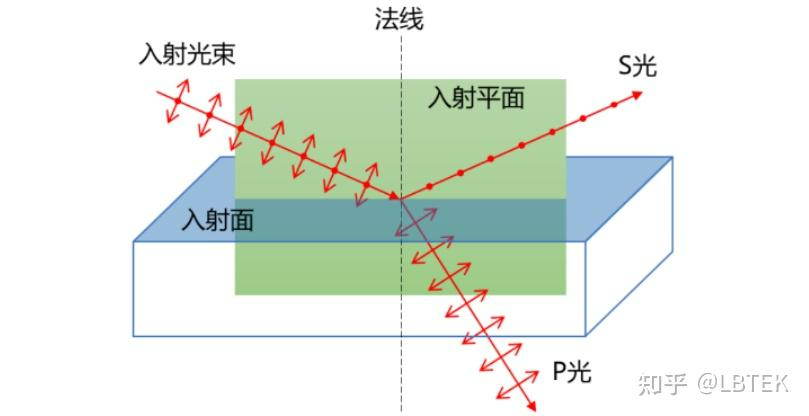
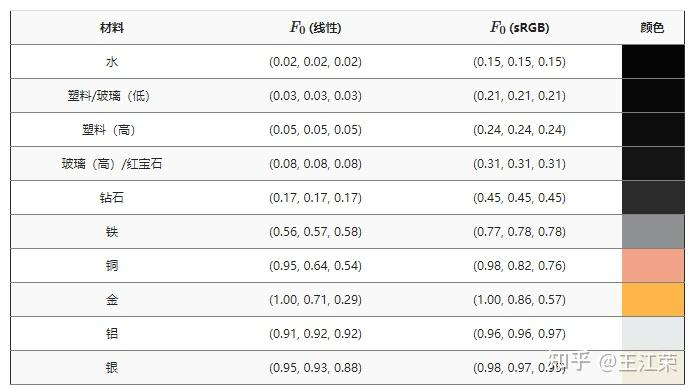

比较有名的Schink近似式。本身的计算式并不难，就是描述光在两个介质中反射光强度和折射光强度的规律。

> 菲涅尔方程（Fresnel equations），也称为菲涅尔条件，是描述光在两种不同介质界面处反射和折射行为的一组公式。这些方程由法国物理学家奥古斯丁·让·菲涅耳于19世纪初提出，主要用于计算入射光、反射光和折射光之间的振幅比。根据光的偏振状态，菲涅尔方程分为两种情况：平行偏振光（s偏振或TE模式）和垂直偏振光（p偏振或TM模式）。
>

### 菲涅尔方程的基本形式
对于从介质1（折射率为(n_1)）以角度(\theta_1)入射到介质2（折射率为(n_2)）的平面波，其反射率(R)和透射率(T)可以通过以下方程计算：

#### 对于s偏振光：


#### 对于p偏振光：
其中，是折射角，遵循斯涅尔定律（Snell's law）: 

反射率(R)可以由反射系数的模**平方**给出，即R=|r|<sup>2</sup>

### 什么是P光、什么是S光？
**<font style="color:rgb(25, 27, 31);">P光和S光是针对光的入射反射和折射来说的，此时，将入射光与反射光/折射光所在的平面定义为参考面，S光和P光分别为偏振方向垂直以及平行于该参考面的线偏振光</font>**<font style="color:rgb(25, 27, 31);">。</font>

<font style="color:rgb(25, 27, 31);">举例而言，如下图所示，一束光照射到入射面上，形成反射和折射，将入射光束与法线所形成的平面定义为入射平面。P光（德文Parallel的首字母，意为平行的）是偏振方向与入射平面平行的光，而S光（德文Senkrecht的首字母，意为竖直的）是偏振方向与入射平面垂直的光。</font>



## Schlink近似
但是在图形学中，**一般不会使用这种p光和s光的表达式**，用于估算光在介质界面发生反射时的反射系数的一种简化公式，特别适用于计算机图形学中的光线追踪算法。

<font style="color:rgb(44, 44, 54);">对于s偏振光和p偏振光，Schlick近似可以将p光和s光的反射率统一表达为：</font>


用代码可以表示为：

```cpp
vec3 fresnelSchlick(float cosTheta, vec3 R0)
{
    return R0 + (1.0 - R0) * pow(1.0 - cosTheta, 5.0);
}
```

<font style="color:rgb(44, 44, 54);">其中：</font>

+ <font style="color:rgb(44, 44, 54);">是在给定入射角</font>_<font style="color:rgb(44, 44, 54);">θ</font>_<font style="color:rgb(44, 44, 54);">下的反射率。</font>
+ <font style="color:rgb(44, 44, 54);">是当光垂直入射（即</font>_<font style="color:rgb(44, 44, 54);">θ</font>_<font style="color:rgb(44, 44, 54);">=0）时的反射率，可以通过两种介质的折射率n1和n2计算得出：</font>
+ <font style="color:rgb(44, 44, 54);">cos⁡θ是入射角的余弦值。</font>

利用这个特点可以制作外发光。

> 引用：[https://zhuanlan.zhihu.com/p/375746359](https://zhuanlan.zhihu.com/p/375746359)
>

