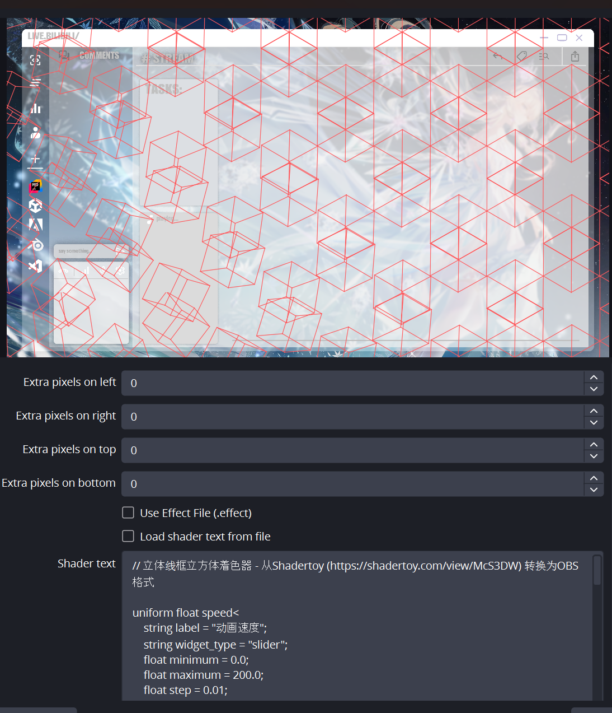
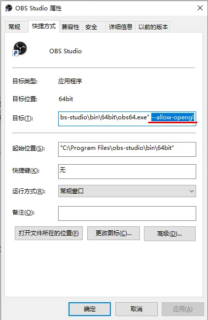
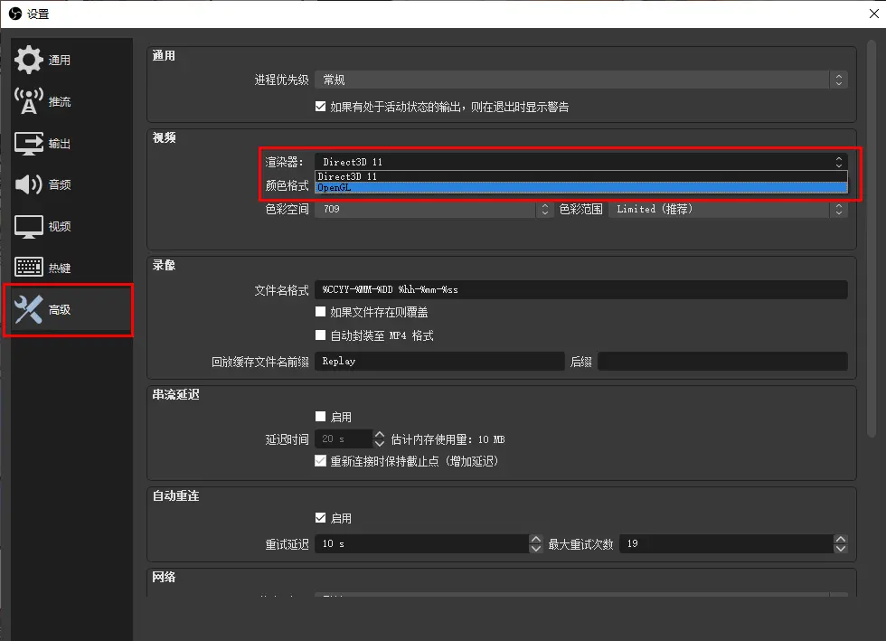

OBS ShaderFilter是一个可以使用HLSL/GLSL对图层进行处理的插件，而且内部会有很多OBS原生并不会带有的滤镜，比如box模糊和一堆搞怪滤镜。[https://obsproject.com/forum/resources/obs-shaderfilter.1736/](https://obsproject.com/forum/resources/obs-shaderfilter.1736/)

直接下载exe文件，可以直接锁定到OBS目录并安装，还是很方便的。

## 使用方法
安装后，对某个图层右键——滤镜——＋User Defined Filter。在这里你可以选择使用effect文件、还是shader文件、亦或是直接自行输入hlsl。

当然我自己的话比较熟悉HLSL，对于HLSL的一些函数比较眼熟，所以我偏向于直接用HLSL。当然用OpenGL也不是不行，要在快捷方式和高级设置中稍微改一下即可。

### 如何让OBS启用OpenGL渲染？
因为程序会优先启动微软的DirectX渲染，也就是hlsl，但是如果偏要使用OpenGL也是可以的。

**<font style="color:rgb(24, 25, 28);">Step1. 增加 --allow-opengl 启动参数，选中</font>****<font style="color:rgb(255, 101, 78);">OBS快捷方式</font>****<font style="color:rgb(24, 25, 28);">，在目标后面增加</font>****<font style="color:rgb(255, 101, 78);"> --allow-opengl</font>**



**<font style="color:rgb(24, 25, 28);">Step2. 设置中进行切换</font>**

<font style="color:rgb(24, 25, 28);">进入obs设置界面，在 高级-视频-渲染器 中切换到OpenGL，</font>**<font style="color:rgb(255, 101, 78);">切换应用设置之后需要重启</font>**<font style="color:rgb(24, 25, 28);">！</font>



## 关于OBS和ShaderToy一些系统变量的变换
ShaderToy会有这些基础变量：

+ iTime：时间
+ iResolution：屏幕分辨率

OBS（hlsl）则会有这些变量：

+ `elapsed_time`：OBS的时间变量
+  uv_size  ：uv大小

同时由于语言不同，一些运算函数也会有所不同。比如HLSL需要使用`fract()`和`fract2()`函数实现GLSL的`mod()`计算。

最后奉上一个我自己转换的shader；

```cpp
// 立体线框立方体着色器 - 从Shadertoy (https://shadertoy.com/view/McS3DW) 转换为OBS格式

uniform float speed<
    string label = "动画速度";
    string widget_type = "slider";
    float minimum = 0.0;
    float maximum = 200.0;
    float step = 0.01;
> = 100.0;

uniform float thickness<
    string label = "线条粗细";
    string widget_type = "slider";
    float minimum = 0.1;
    float maximum = 50.0;
    float step = 0.1;
> = 15.0;

uniform float scale<
    string label = "图案缩放";
    string widget_type = "slider";
    float minimum = 1.0;
    float maximum = 50.0;
    float step = 0.1;
> = 10.0;

uniform float4 line_color<
    string label = "线条颜色";
    string widget_type = "color";
> = {1.0, 1.0, 1.0, 1.0};

uniform float opacity<
    string label = "整体不透明度";
    string widget_type = "slider";
    float minimum = 0.0;
    float maximum = 1.0;
    float step = 0.01;
> = 1.0;

// 辅助函数
float fract(float v){
    return v - floor(v);
}

float2 fract2(float2 v){
    return float2(v.x - floor(v.x), v.y - floor(v.y));
}

// 计算点到线段的距离
float segment(float2 p, float2 a, float2 b) {
    p -= a;
    b -= a;
    return length(p - b * clamp(dot(p, b) / dot(b, b), 0.0, 1.0));
}

// 旋转函数
float2 rotate(float2 p, float a) {
    float c = cos(a);
    float s = sin(a);
    return float2(p.x * c - p.y * s, p.x * s + p.y * c);
}

// 使用旋转变换3D点（现在接受旋转值作为参数，而不是使用全局变量）
float2 T(float3 p, float rotation) {
    p.xy = rotate(p.xy, -rotation);
    p.xz = rotate(p.xz, 0.785); // 约45度
    p.yz = rotate(p.yz, -0.625); // 约-36度
    
    return p.xy;
}

float4 mainImage(VertData v_in) : TARGET {
    // 采样背景图像
    float4 originalColor = image.Sample(textureSampler, v_in.uv);
    
    float2 R = uv_size;
    float2 u = v_in.uv;
    u.y = 1.0 - u.y; // 翻转Y坐标以匹配Shadertoy
    u = u * R; // 从0-1范围转换为像素坐标
    
    // 计算图案坐标
    float2 X, U = scale * u / R.y;
    float2 M = float2(2.0, 2.3); // 平铺大小
    float2 I = floor(U/M)*M;
    float2 J;
    
    // 计算平铺模数
    U = fract2(U/M)*M;
    
    // 初始无线条
    float lineIntensity = 0.0;
    
    // 绘制2x2网格中的四个瓦片
    for (int k = 0; k < 4; k++) {
        X = float2(k % 2, k / 2) * M;
        J = I + X;
        
        // 偏移每隔一个瓦片以增加视觉效果
        if (int((J.x / M.x) + (J.y / M.y)) % 2 > 0) X.y += 1.15;
        
        // 计算时间依赖的旋转（现在作为局部变量）
        float adjustedTime = elapsed_time * speed / 100.0;
        float t_rotation = tanh(-0.2 * (J.x + J.y) + fract(2.0 * adjustedTime / 10.0) * 10.0 - 1.6) * 0.785;
        
        // 绘制立方体的六个部分（共12条线）
        for (float a = 0.0; a < 6.0; a += 1.57) { // 每约90度
            float3 A = float3(cos(a), sin(a), 0.7);
            float3 B = float3(-A.y, A.x, 0.7);
            
            // 绘制立方体边缘的线条，将旋转值作为参数传递
            lineIntensity += smoothstep(thickness/R.y, 0.0, segment(U-X, T(A, t_rotation), T(B, t_rotation)));
            lineIntensity += smoothstep(thickness/R.y, 0.0, segment(U-X, T(A, t_rotation), T(A * float3(1.0, 1.0, -1.0), t_rotation)));
            
            // 镜像点用于立方体背面
            A.z = -A.z; 
            B.z = -B.z;
            lineIntensity += smoothstep(thickness/R.y, 0.0, segment(U-X, T(A, t_rotation), T(B, t_rotation)));
        }
    }
    
    // 限制值避免线条重叠区域过亮
    lineIntensity = min(lineIntensity, 1.0);
    
    // 应用线条颜色并与原始图像混合
    float4 finalColor = float4(
        lerp(originalColor.rgb, line_color.rgb, lineIntensity * opacity),
        originalColor.a
    );
    
    return finalColor;
}
```

